<h1 style="text-align: center;">计算机网络实验报告</h1>

<p style="text-align: center;">2152354 张恺瑞</p>

<h2 style="text-align: center;">目录</h2>

[TOC]

## 1. 进程运行原理实验

<h3>[实验时间]</h3>

2023.9.13 第一周周三7-8节

<h3>[实验目的]</h3>

操作系统的任务管理器提供了用户计算机上正在运行的程序和进程的相关信息，也显示了最常用的度量进程性能的单位。 

本实验将在任务管理器中使用监视计算机性能的关键指示器、快速查看正在运行的程序的状态、或者终止已停止响应的程序。除此之外还可使用多个参数评估干在运行的进程的活动、观察显示 CPU 和内存使用情况的图形和数据。 

通过一系列操作，加强对网络相关进程的理解，熟悉任务管理器的操作，对进程进行一些开启、删除操作。 

<h3>[实验原理]</h3>

与任务管理器相关的主要指令： 

1. Tasklist 命令：用于显示运行在本地或远程计符机上的所有 任务的应用程序和服务列表，可以监控用户的操作。
2. Taskkill 命令：用于结束一个或多个任务或进程。可以根据进程 ID 或图像名来结束进程。 
3. Tskill 命令：功能同 Taskkill 命令，用于结束一个或多个进程。

<h3>[实验设备]</h3>

Win11主机

<h3>[实验内容]</h3>

1. 在任务管理器中显示进程：启动并进入 Windows桌面，单击 Ctrl+Alt+Del 键，选择“任务管理器”，或者右键单点击任务栏，在快捷菜单打开“任务管理器”命令， 或者通过命令 `TASKMGR` 打开“任务管理器”窗口。 

2. 进程管理操作：在 CMD 界面，通过 `tasklist`、`taskkill`、`tskill` 及相应的程序命令对进程进行管理。其中 Taskkill 可以通过多种方式杀死进程，可以通过进程 PID 杀死，也可通过进程名称杀死进程。 

   1. 使用 `tasklist` 显示正在执行的进程： 
      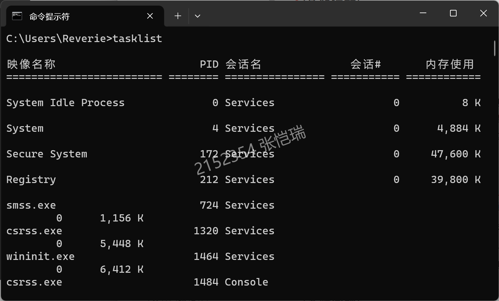
   2. 使用 `taskkill` 杀死进程： 
      我们可以在任务管理器中查看到notepad的PID为26400，如下所示：
      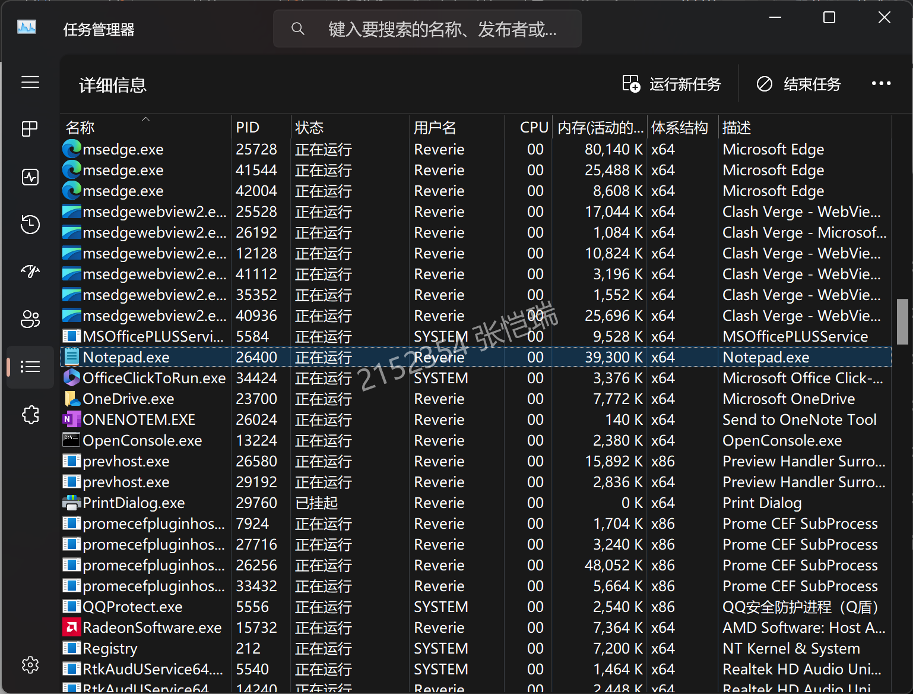
      输入`TASKKILL /PID 26400`即可终止进程：
      
   3. 命令行打开任务管理器：
      通过命令行指令`TASKMGR`，我们成功打开了任务管理器：
      

3. 尝试通过界面打开记事本、写字板、word、画图、计算器等五个应用程序，并通过界面和命令显示和关闭其中几个应用程序。 

   通过命令行，如notepad、write等，可以打开一系列软件，如下所示：
   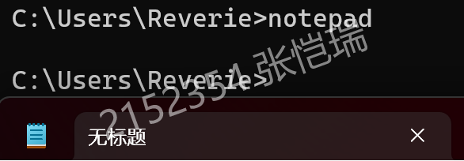
   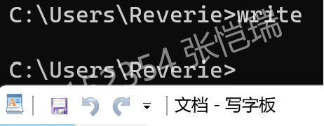

<h3>[实验总结]</h3>

在实验过程中，首先我们学习了如何打开任务管理器，并在其中查看当前正在运行的进程。接下来，通过使用命令行工具，我们进一步了解了如何查看进程列表（`tasklist`），以及如何结束指定的进程（使用`taskkill`或`tskill`命令）。进行杀死进程操作时有些时候不能杀死进程，很有可能是因为该进程与一些其他进程相关联必须先杀死其他进程才能杀死该进程，或者该进程为系统服务，设定为不能被杀死。 

通过实验，我们了解到任务管理器不仅可以提供进程的详细信息，包括CPU和内存的使用情况，还可以对这些进程进行管理操作。例如，我们可以结束那些不再响应或者不需要的进程，以释放系统资源。

实验中还涉及到了命令行启动应用程序的操作，这提供了一个不同于图形界面的启动应用程序的方法。我们通过实践学会了如何在不同的环境下进行任务管理，并且掌握了命令行操作的基本技巧。

## 2. 网络端口地址实验

<h3>[实验时间]</h3>

2023.9.13 第一周周三7-8节

<h3>[实验目的]</h3>

通过访问不同端口，测试什么情况下网络端口可以访问，什么情况下网络端口不能访问。 

<h3>[实验原理]</h3>

端口：访问主机上的某一进程的标识符，通过端口实现了计算机之间进程的通信。当我们访问不同主页时，实际上是我们计算机上的浏览器这一进程访问不同主页的服务器（一台计算机)上的 Web 服务器进程。而这些运行的进程我们把它们叫做网络进程。 

网络进程与一般进程具有基本相同的属性，唯一不同的特性是网络进程而要开启一到多个传输端口号。这些端口号就是所谓的网络端口地址。 

端口号的划分： 

| 端口号     | 端口类型   | 端口功能                   |
| ---------- | ---------- | -------------------------- |
| 0~1023     | 系统端口   | 只有系统特许的进程才能使用 |
| 1024~65535 | 用户端口   |                            |
| 1024~5000  | 临时端口   | 供一般应用程序进行通讯     |
| 5001~65535 | 服务器端口 | 用于给用户自定义端口       |

常用的 TCP,UDP 相关端口号： 

DHCP：服务器端的端口号是 67； 客户机端的端口号是 68； 

POP3：POP3 接收协议，POP3 客户端使用 SMTP 向服务器发送邮件。POP3使用的端口号是 110； 

SMTP：端口号是 25，SMTP 真正关心的不是邮件如何被传送，而只关心邮件是否能顺利到达目的地； 

Telnet：端口号 23 测试端口号，可以使用 telnet 命令来测试端口号是否正常打开还是关闭； 

FTP： FTP 使用的端口号是 20 和 21。20 端口用于数据传输，21 端口用于控制信息的传输，控制信息和数据能够同时传输，这是 FTP 的特殊之处。 

TFTP：端口号 69，使用 UDP 的连接 TFTP（Trivial File Transfer Protocol,简单文件传输协议）是 TCP/IP 协议族中的一个用来在客户机与服务器之间进行简单文件传输的协议，提供不复杂、开销不大的

文件传输服务。 

UDP 53 端口：DNS 域名解析服务； 

TCP 80 端口：HTTP 超文本传输服务； 

TCP 443 端口：HTTPS 加密的超文本传输。 

<h3>[实验设备]</h3>

Win11系统主机

<h3>[实验内容]</h3>

（一）端口号与网络连接

在浏览器分别输入下列地址，观察网址连接情况并分析。 

1. https://www.tongji.edu.cn:8080 
   
2. https://www.tongji.edu.cn:80 
   
3. http://www.tongji.edu.cn:8080 
   
4. http://www.tongji.edu.cn:80 
   

 （二）网络连接

进入 CMD ，输入命令`netstat -ano` 观测。 

<h3>[实验总结]</h3>

本次实验的核心目标是探索网络端口的访问情况，并对不同情况下网络端口的可访问性进行测试。实验通过实际操作，让我们对网络端口的作用和重要性有了直接的理解。

实验内容包括了两部分：首先是通过浏览器访问特定端口的网址，其次是运用CMD命令`netstat -ano`来观察网络连接的状态。在第一部分中，我们尝试访问同一个域名配合不同的端口，这一步骤展示了端口在网络通信中扮演的角色。实验结果表明，只有当使用标准HTTP服务的默认端口80时，才能成功访问网站。这强调了端口号在网络通信中的重要性，以及它们是如何与特定的服务和协议关联的。

第二部分的实验使我们得以观察和理解本机的网络连接详情，`netstat -ano`命令提供了本机所有网络连接、监听端口以及相关进程的列表。这为分析网络通信和诊断网络问题提供了基础。

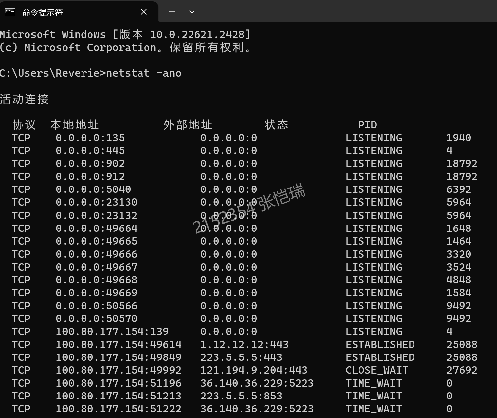

通过本次实验，我们得出以下结论：

1. 端口号是网络通信中不可或缺的元素，每个端口提供了特定的网络服务。
2. 不同的网络协议（如HTTP和HTTPS）和不同的服务（如Web服务、邮件服务）使用不同的端口，有时即使是相同的服务，不同的通信协议也会使用不同的端口。
3. 正确的端口号和协议是访问网络服务的关键，错误的端口号会导致连接失败。
4. `netstat -ano`命令是一个强大的工具，用于监控和诊断系统的网络连接状态。

## 3. 网络线的制作和测试实验

<h3>[实验时间]</h3>

2023.9.20 第二周周三7-8节

<h3>[实验目的]</h3>

本实验最终目的为接通一根网线，网线由一下两个方面构成：首先是双绞线，我们选用非屏蔽双绞线(UTP)，它在塑料绝缘外皮里面包裹着 8 根信号线，它们每 2 根为一对相互缠绕，形成总共 4 对。其次是水晶头，其外表晶莹透亮，双绞线的两端必须都安装 RJ-45 插头，以便插在网卡、集线器（Hub）或交换机（Switch）RJ-45 接口上。

本实验中将会接通二者并进行测试是否完成一根合格的网线。 

<h3>[实验原理]</h3>

在接通时主要需要掌握两种接通方法，

* 其一是直通线接法，该接法中：
  端 1 白橙 橙 白绿 蓝 白蓝 绿 白棕 棕 
  端 2 白橙 橙 白绿 蓝 白蓝 绿 白棕 棕 

* 其二是交叉线接法，该接法中： 
  端 1 白橙 橙 白绿 蓝 白蓝 绿 白棕 棕 
  端 2 白绿 绿 白橙 蓝 白蓝 橙 白棕 棕 

两种接法例图如下所示： 


<h3>[实验设备]</h3>

五类双绞线一根，TJ45水晶头两个，压线钳一个，网络电缆测试仪一个

<h3>[实验内容]</h3>

1. 实验工具的准备。
2. 剪线：利用压线钳斜口剪下所需要的双绞线，用压线钳将网线的一端皮套剪去2cm。
3. 拆线：将旋成4股的网线拆分开。
   
4. 排线：将裸露的双绞线中的橙色对线拨向自己的左方，棕色对线拨向右方向，绿色对线拨向前方，蓝色对线拨向后方。
   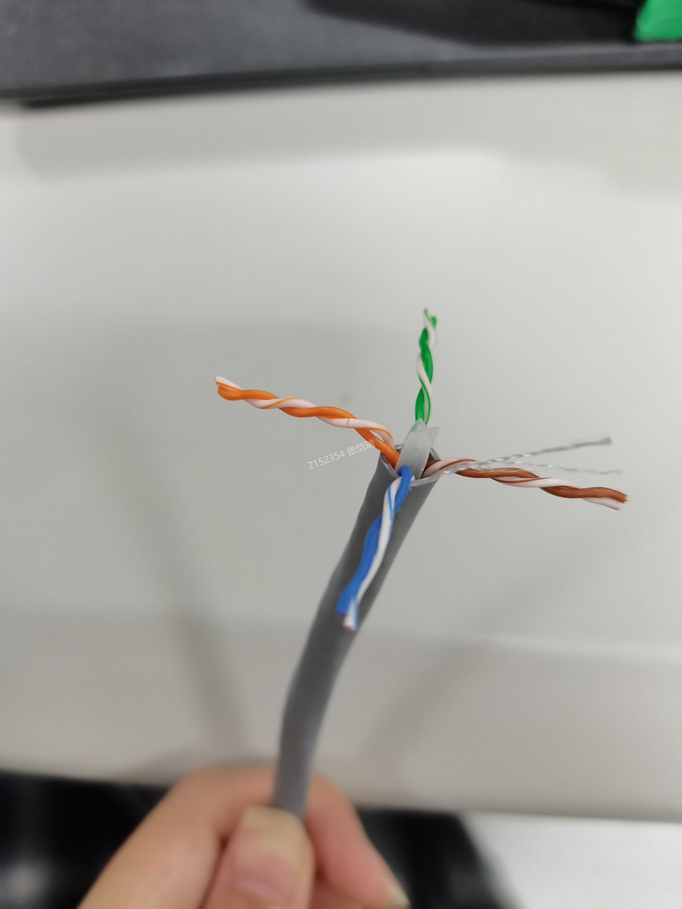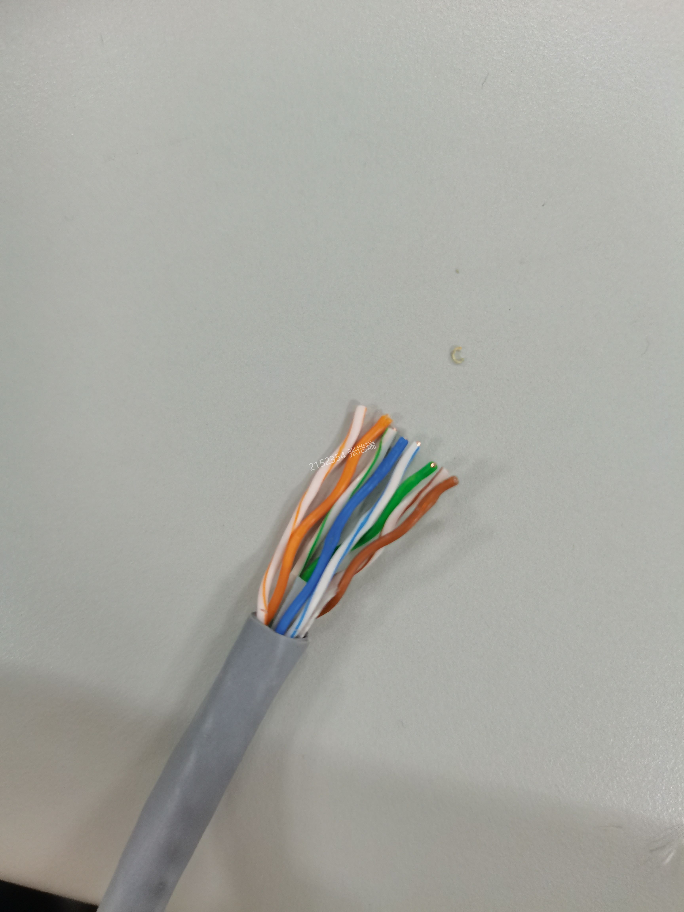
   再将剥好的线按序号排好，我们在实验中遵循的是 EIA／TIA 568B 的标准(白橙－橙－白绿－蓝－白蓝－绿－白棕－棕)排列。排好以后可将裸露出的双绞线用剪刀或斜口钳剪下只剩约 1.4厘米的长度。
5. 接入引脚：最后再将双绞线的每一根线依序放入 RJ－45 接头的引脚内，第一只引脚内应该放白橙色的线，其余类推确定双绞线的每根线是否按正确顺序放置，并查看每根线是否进入到水晶头的底部位置。
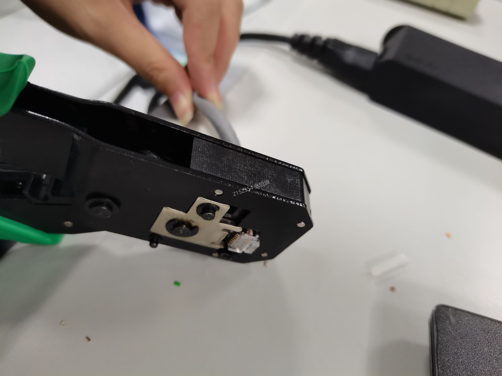
6. 压实：进行压实操作，用 RJ－45 压线钳压接 RJ－45 接头，把水晶头里的八块小铜片压下去后，使每一块铜片的尖角都触到一根铜线，此时即完成工作。 
   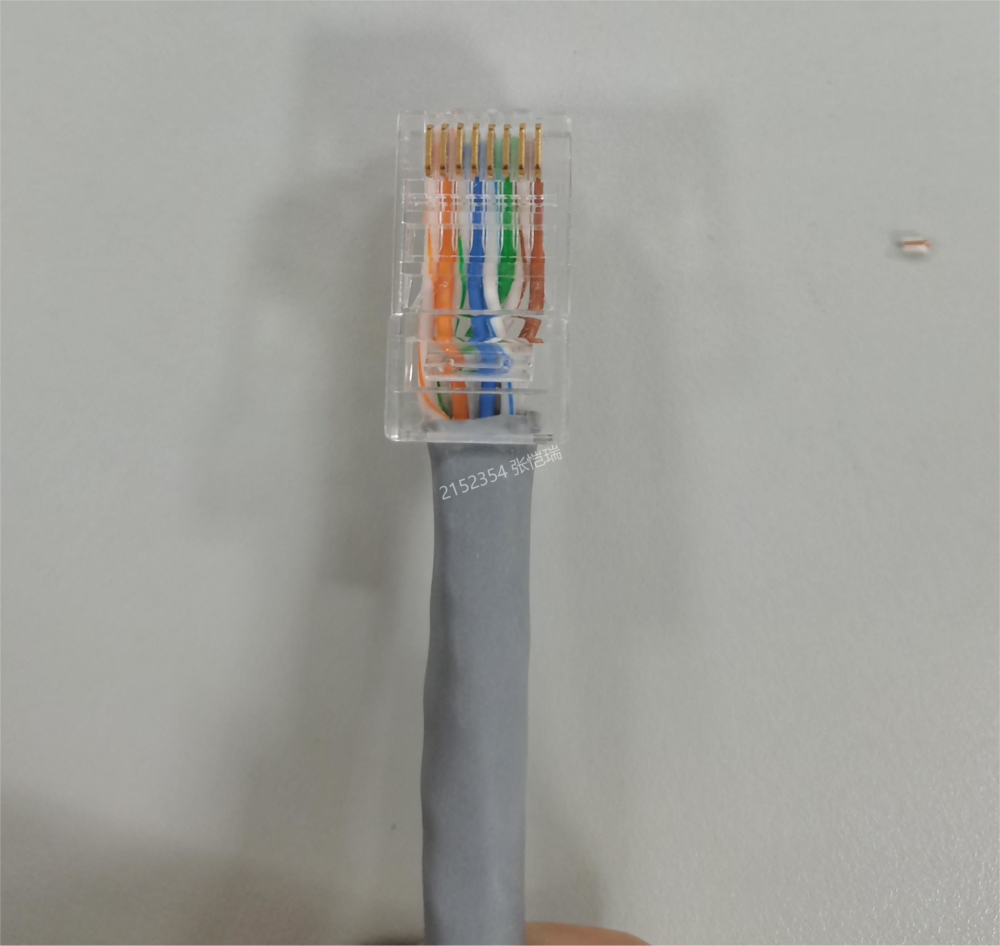
7. 用同样的方法制作另外一个插头。
8. 连接并观察现象：如果两组 1、2、3、4、5、6、7、8 指标灯对应的灯同时亮，则表示制作双绞线制作成功。测试的是直通线测线仪指示灯 1-1 2-2 3-3 4-4 5-5 6-6 7-7 8-8 显示即为测试成功。 

<h3>[实验总结]</h3>

通过实践，我们首先掌握了双绞线及水晶头的基本构造，了解了制作网线所需的基本工具与材料。接着，通过剪裁、拆线、排线、接入引脚、压线、测试等步骤，以确保双绞线能够正常工作。在此过程中，我们采用了EIA/TIA 568B标准进行线序排列，这是最为广泛使用的网络布线标准。

在制作过程中，我们学习了两种不同的接线方式：直通线和交叉线接法，这两种线路分别适用于不同的网络设备连接场景。直通线主要用于不同类型设备间的连接，如交换机到计算机，而交叉线用于相同类型设备的连接，例如计算机到计算机。

实验中，我们还学习到在剥线和压线时需要注意的细节，比如在进行压实操作时一定要注意方向，是压实铜片一端而不是另一端，否则会对水晶头造成破坏。此外在剥线的过程中，容易对内部的八根线造成损坏，使得最终接好水晶头之后的线不可使用，因此需要仔细剥线，防止最终实验失败。在进行实验时需注意细节，这样才能准确地得到实验结果。

成功制作双绞线后，我们使用网络电缆测试仪进行了功能测试。测试结果显示，只有在正确的线序和压线操作下，网络线才能顺利通过测试，显示1-1、2-2至8-8指示灯对应亮起，这表明我们制作的网络线符合标准，能够在实际网络环境中使用。

## 4. UDP协议网络编程实验

<h3>[实验时间]</h3>

2023.9.27 第三周周三7-8节

<h3>[实验目的]</h3>

1. 理解客户机/服务器模型，了解端口在网络传输中的作用。
2. 了解无线连接通信方式以及编程方式。
3. 了解掌握基于 Socket 的UDP应用编程基本步骤。

<h3>[实验原理]</h3>

UDP（User Datagram Protocol，用户数据报协议）是一种无连接的网络传输协议，它允许应用程序将数据报文发送到网络中的其他主机，而无需先与对方建立连接。相比于TCP（传输控制协议），UDP简单、快速，没有握手过程，不保证数据的可靠送达，也不需要维护复杂的连接状态。这使得UDP非常适合那些对实时性要求高、可以容忍数据丢失的应用，例如视频会议和在线游戏。

在使用UDP进行网络编程时，通常涉及到两个主要组件：客户端（Client）和服务器端（Server）。客户端和服务器端都会使用Socket进行网络通信。Socket是计算机网络数据结构，提供了发送和接收数据的功能。在UDP编程中，Socket是无连接的。客户端使用Socket将数据包发送到指定的服务器端口，而服务器端监听在一个端口上，接收来自客户端的数据包。

客户机/服务器模型是网络应用的一个基础构架，其中服务器提供数据服务，客户机则发起请求并接收服务器响应。端口在网络传输中的作用是区分一个主机上的不同服务或进程，每个Socket都绑定到一个端口号上。

实验中涉及的Java类库中，`DatagramSocket`和`DatagramPacket`是UDP编程的基本元素。`DatagramSocket`用于发送或接收数据报包，而`DatagramPacket`对象代表了UDP数据包。

<h3>[实验设备]</h3>

Win11系统，Eclipse平台

<h3>[实验内容]</h3>

1. 运行 Eclipse 平台，创建 Socket 项目。

2. 创建 Java 包“edu.tongji.networklab.udp”
   右键项目“Socket/Java Resources/src”，选择“New”->“Package”
   

   输入包名“Name=edu.tongji.networklab.udp" -> “Finish”。创建该包用于存放UDP实验类。

3. 开发`UdpClient`类。

   1. 创建`UdpClient`类。在包“edu.tongji.networklab.udp” 下，创建`UdpClient`类。Name=UdpCLient，选择“public static void main(String[] arg)”->“Finish”
      

   2. 输入实验代码，用附录中的`UdpClient`代码覆盖初始代码。

   3. 保存。

4. 开发`UdpServer`类。

   1. 创建`UdpServer`类。创建过程类似步骤3。
      
   2. 代码开发。输入实验代码，用附录的`UdpServer`代码覆盖初始代码。
   3. 保存。

5. 代码运行测试。

   1. 运行`UdpServer`。右键UdpServer -> Run as -> Java Application
   
   2. 运行`UdpClient`发送。右键UdpClient -> Run as -> Java Application。
   
      
   
      点击“连接”，然后在发送区输入内容并点击发送。
   
      
   
   3. 接收文本。
   
      
   
      

<h3>[实验总结]</h3>

本次实验旨在通过Eclipse平台上的Java编程实践，深入理解客户机/服务器模型，并掌握基于Socket的UDP编程的基本步骤。在编程过程中，我们实现了UDP通信的基本流程，包括启动服务器监听特定端口，客户端发送数据报至服务器，以及服务器接收数据并作出响应。

通过实验，我们了解了UDP协议的无连接特性，以及如何在Java中使用`DatagramSocket`和`DatagramPacket`类进行网络通信。我们首先设置了UDP服务器端，使其在指定端口上等待客户端的数据包。然后，我们实现了UDP客户端，编写代码让客户端向服务器发送字符串数据。在客户端和服务器成功通信后，我们通过观察Eclipse的控制台输出来验证数据的发送和接收。

整个实验过程中，我们体验了网络编程的实际操作，从而加深了对于UDP协议和客户机/服务器通信模型的理解。同时，我们也认识到了UDP协议的局限性，即不保证数据的完整性和顺序，这一点在开发需要高可靠性的应用时需要格外注意。此外，实验也强调了网络编程中异常处理的重要性，以确保网络应用程序的稳定运行。

## 5. TCP应用协议编程实验

<h3>[实验时间]</h3>

2023.9.27 第三周周三7-8节

<h3>[实验目的]</h3>

1. 了解基于TCP网络应用服务器的基本编程架构
2. 了解面向连接和无连接的区别
3. 了解并发服务原理和编程方式

<h3>[实验原理]</h3>

TCP采用面向连接的方式，如果想同时服务多个客户则需要实现同时建立多个连接的能力。并发的TCP服务器由主进程和服务处理线程组成，作用如下图所示

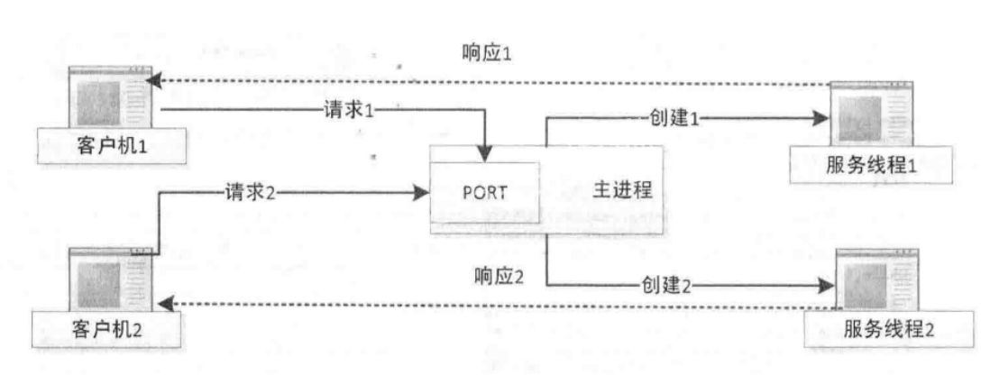 

与UDP编程不同的是，TCP需要一个额外的`MainServer`类，负责接收客户的会话请求，和创建服务线程，真正提供服务的是`ServiceServer`

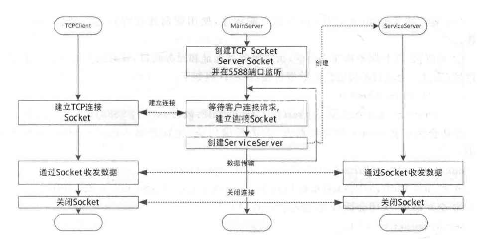

<h3>[实验设备]</h3>

Win11系统，Eclipse平台

<h3>[实验内容]</h3>

1. 运行 Eclipse 平台，创建 Socket 项目。

2. 创建 Java 包“edu.tongji.networklab.tcp”

   输入包名“Name=edu.tongji.networklab.tcp" -> “Finish”。创建该包用于存放TCP实验类。

3. 开发数据类User。

   1. 创建User类。
      
   2. 开发。输入User源代码：
      
   3. 保存并编译。

4. 开发客户端`TcpClient`类。

   1. 创建`TcpClient`类。在包“edu.tongji.networklab.tcp” 下，创建`UdpClient`类。Name=TcpCLient，选择“public static void main(String[] arg)”->“Finish”
      
   2. 输入实验代码，用附录中的`TcpClient`代码覆盖初始代码。
   3. 保存。

5. 开发基于线程的服务处理类`ServiceServer`类。

   1. 创建`ServiceServer`类。
      
   2. 代码开发。输入实验代码。
      
   3. 保存。

6. 开发服务调度类`MainServer`类。

   1. 创建`MainServer`类。
      
   2. 输入源代码。
      
   3. 保存并编译。

7. 代码运行测试。

   1. 运行`MainServer`。
      

   2. 运行客户端`TcpClient`，发送文本。
      

      点击“连接”，然后在发送区输入内容并点击发送。
      

   3. 接收文本。
      

<h3>[实验总结]</h3>

本次TCP应用协议编程实验中，我们实现了一个基本的网络通信模型。实验内容涉及了数据类`User`的创建、客户端`TcpClient`的实现、服务处理类`ServiceServer`的开发，以及服务调度类`MainServer`的搭建。

在这个过程中，我们了解到TCP与UDP的主要区别在于TCP是面向连接的，需要在传输数据之前建立连接。TCP提供了可靠的数据传输服务，保证了数据的顺序、完整性和可靠性。对于并发服务，我们使用了多线程的方法来允许服务器同时处理多个客户端的请求。

通过编写和测试`TcpClient`和`TcpServer`类，我们学习了如何在Java中使用套接字(Socket)进行网络通信，以及如何使用线程(Thread)来处理多个并发客户端连接。

在测试阶段，我们成功地运行了服务端`MainServer`程序，它能够接收来自客户端`TcpClient`的连接请求。发送和接收文本的功能也被验证，客户端可以发送字符串消息到服务端，服务端可以接收并显示这些消息。

## 6. 虚拟无线隐藏节点实验

<h3>[实验时间]</h3>

2023.10.11 第五周周三7-8节

<h3>[实验目的]</h3>

1. 提供对无线网络传输机制的直观理解。
2. 加深对CSMA/CA协议和RTS/CTS机制的理解。
3. 分析隐藏节点现象对无线网络传输的影响。

<h3>[实验原理]</h3>

**CSMA/CA机制**：多路存取载波监听/避免碰撞，确保任意时刻只有一个节点发送数据。

**隐藏节点问题**：由于节点之间的距离问题，导致节点不能感知到其他节点的传输，可能会造成数据在接收节点处冲突。


**RTS/CTS机制**：通过发送方和接收方的短控制消息握手交换请求发送和清除发送的控制信息来避免冲突。

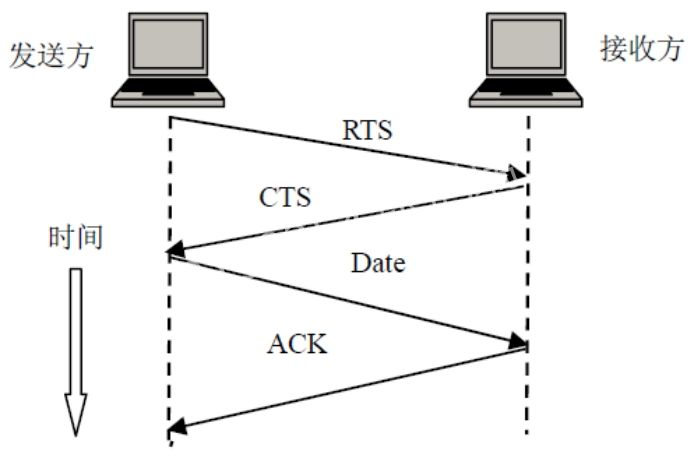

<h3>[实验设备]</h3>

1. 计算机一台，装有NS-3网络模拟器。

2. 相关网络模拟脚本`lab-wifi-hidden-stations.cc`。

3. `NetAnim`动画工具，用于展示无线网络动画。

<h3>[实验内容]</h3>

1. **实验场景设置**：通过调整节点间距离，设置正常节点场景和隐藏节点场景。
2. **RTS/CTS控制**：在这两种场景下，分别启用和不启用RTS/CTS控制，对比观察数据包丢失情况。
   1. 正常节点场景：
      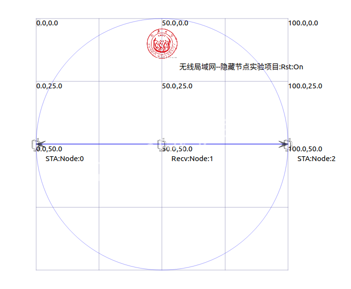
   2. 隐藏节点场景
      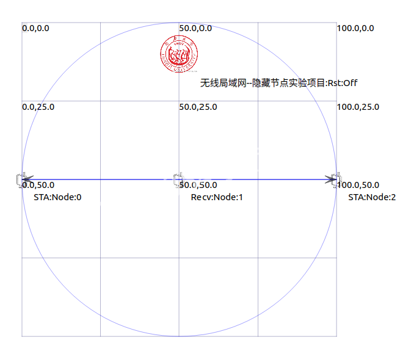
3. **数据分析**：收集和分析实验数据，确定丢包情况，并对比RTS/CTS机制的影响。

<h3>[实验总结]</h3>

**正常节点场景实验结果**：在启用RTS/CTS的情况下，数据包的丢失率较低，因为RTS/CTS机制有效地协调了节点之间的发送，减少了冲突的可能性。

​                                               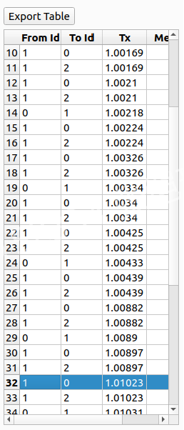         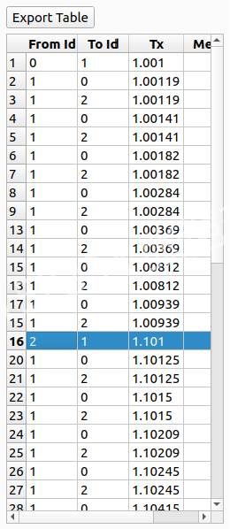

**隐藏节点场景实验结果**：切换控制台的Packets，如上右表所示。在1.101秒传输了16个数据包。对比上左表数据，在1.01秒传输了32个数据包。因此可得知在没有启用RTS/CTS的情况下，发生了较高的数据包丢失率。这证明了在隐藏节点场景下，由于两个节点都不能感知到对方的存在，同时向同一个节点发送数据，导致了数据在接收端的冲突。而启用RTS/CTS后，丢包率显著降低，因为RTS/CTS机制通过两步握手通知所有节点进行沉默，避免了同时发送的情况。

## 7. 异步串联通信收发实验

<h3>[实验时间]</h3>

2023.10.18 第六周周三7-8节

<h3>[实验目的]</h3>

1. 理解异步串行通信基本原理；
2. 熟悉掌握RS-232通信标准以及RS-232帧格式；
3. 了解波特率等主要通信参数的作用和使用；

<h3>[实验原理]</h3>

1. 串口：只能用一条线传输一位数据，每次传输一个字节的一位 ；
   并口：同时通过 8 或多条数据线传输信息，一次传输一个或多个；
   字节； 并行口由于同时传输更多的信息，速度明显高于串行口，但串行口可以用于比并行口更远距离的数据传输。 
2. PC 系统中串口的物理连接方式有 9 针和 25 针两种方式，通过额外的子卡挡板与电脑连接。 
3. 串行传输模式中，任何用户单独只能占据一条通信信道，逐位发送二进制数据；同步模式要求收发双方在时间基准上保持一致，而异步不需要，但数据包间需额外的分隔符
4. RS-232作为最常见的串行通信接口标准，它用正电压表示0，负电压表示空闲和1，传输开始升到正电压表示起始位，结束后降到负电压进入空闲状态

<h3>[实验设备]</h3>

两台带串口的计算机，一根串行交叉线用于连接两个计算机的串口，使用串口调试助手工具软件作为异步串行通信的实验操作平台。

<h3>[实验内容]</h3>

1. 关闭电脑，进行两台电脑主机的COM口连接；

   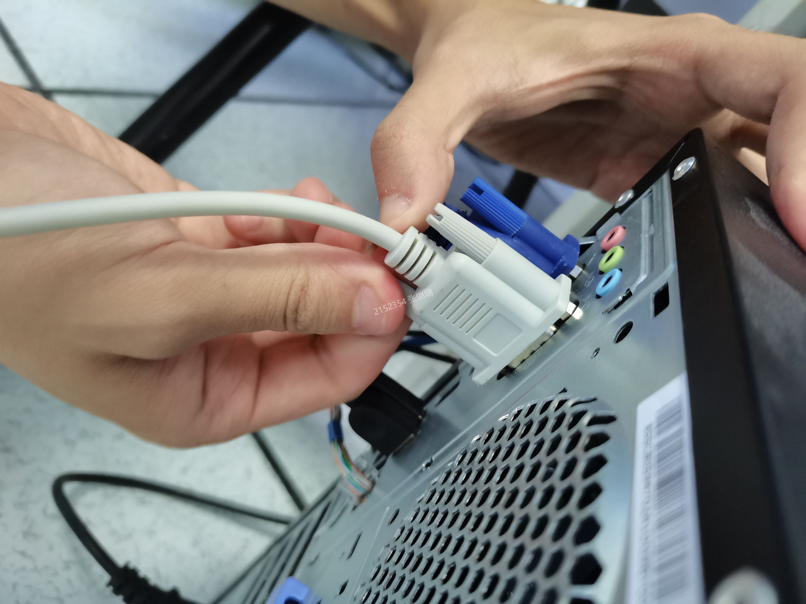

2. 开启电脑打开 putty串口调试助手，配置参数，进行串口的连接；

3. 两台电脑连接成功，打开终端；

4. 尝试接收和发出内容；
   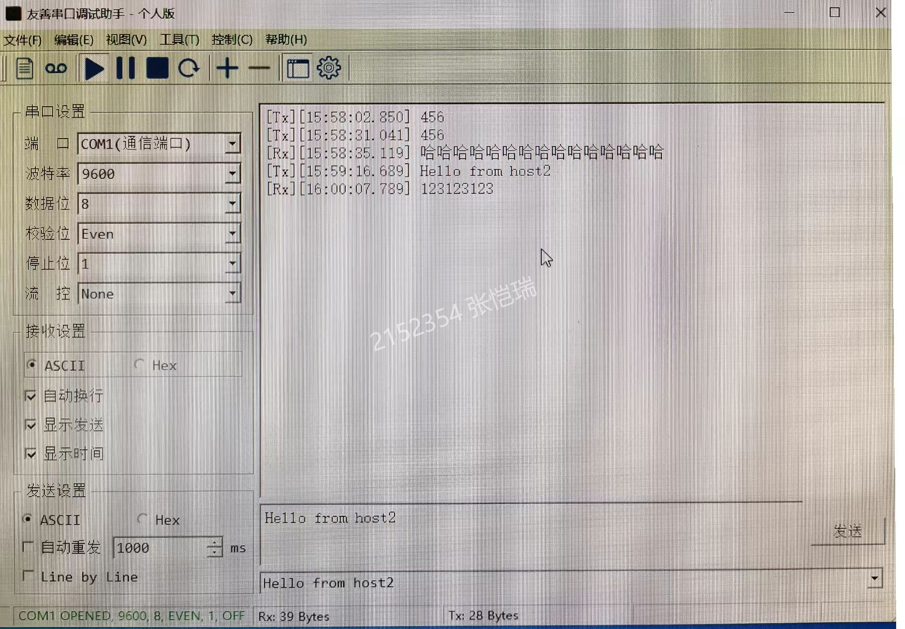

<h3>[实验总结]</h3>

在本次异步串行通信收发实验中，我们实现了两台计算机之间的串行通信，深化了对异步串行通信原理的理解。通过原理学习，我们了解了RS-232通信标准和对应的帧格式，以及波特率等主要通信参数的作用和设置方法。

通过配置putty串口调试助手，我们成功建立了两台电脑间的串口连接。实验中，我们体验了如何设置串口的各项参数，例如波特率、数据位、停止位和校验位等，这些参数对于确保通信的准确性和可靠性至关重要，比如通过实验我们可以看到，当两台主机的波特率设置成不同数值的时候，数据传输后得到的结果会是乱码。

## 8. 以太网组网实验

<h3>[实验时间]</h3>

2023.10.18 第六周周三7-8节

<h3>[实验目的]</h3>

1. 掌握局域网组网原理。
2. 理解掌握以太网组网步。
3. 了解以太网网络地址格式。

<h3>[实验原理]</h3>

加入以太网的主机，必须拥有一块以太网的网卡，现在的计算机一般在主板上都已经集成了以太网网卡。集线器和交换机是基于双绞线的以太网网络设备，一般会提供多个以太网端口，使用双绞线网线可以将主机网卡同交换机端口连接起来，构成一个独立的物理网络，加入网络的结点可以互相通信。

<h3>[实验设备]</h3>

两台计算机和一台交换机担当实验设备，两根双绞网线将两台计算机以太网网卡同交换机连接起来。

<h3>[实验内容]</h3>

（一）以太网组网实验

1. 用两根双绞线网线分别将两台计算机的网卡同交换机端口连接，连接时灯为橙色，转为绿色时表示连接成功，形成局域网。
   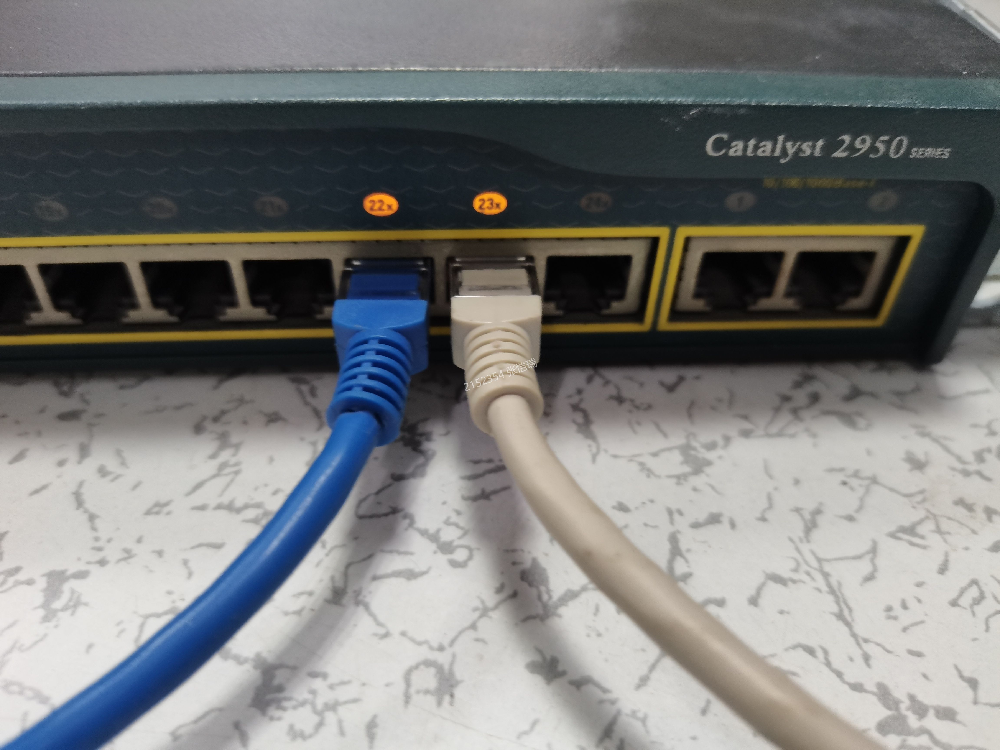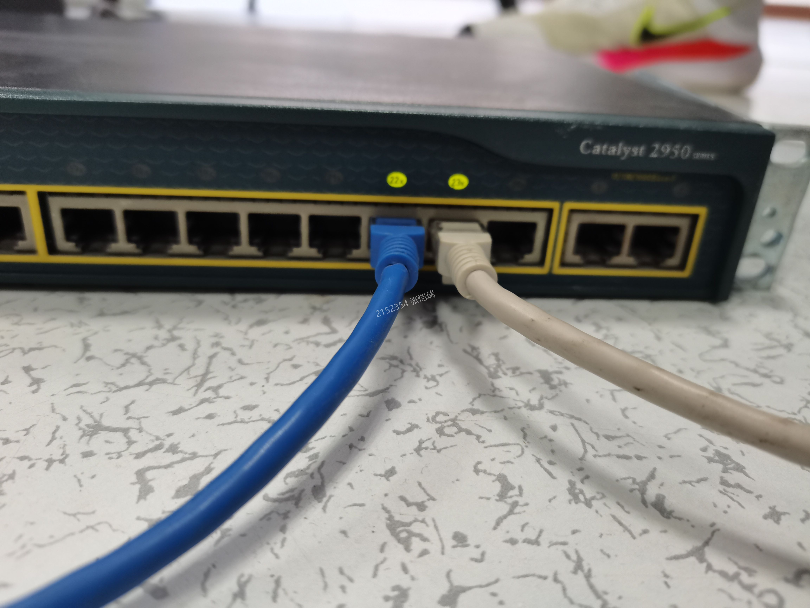
2. 为两台主机配置IP地址。此处，
   Host1 的IP地址设置为 192.168.0.122，子网掩码为 255.255.255.0
   Host2 的IP地址设置为 192.168.0.111，子网掩码为 255.255.255.0
   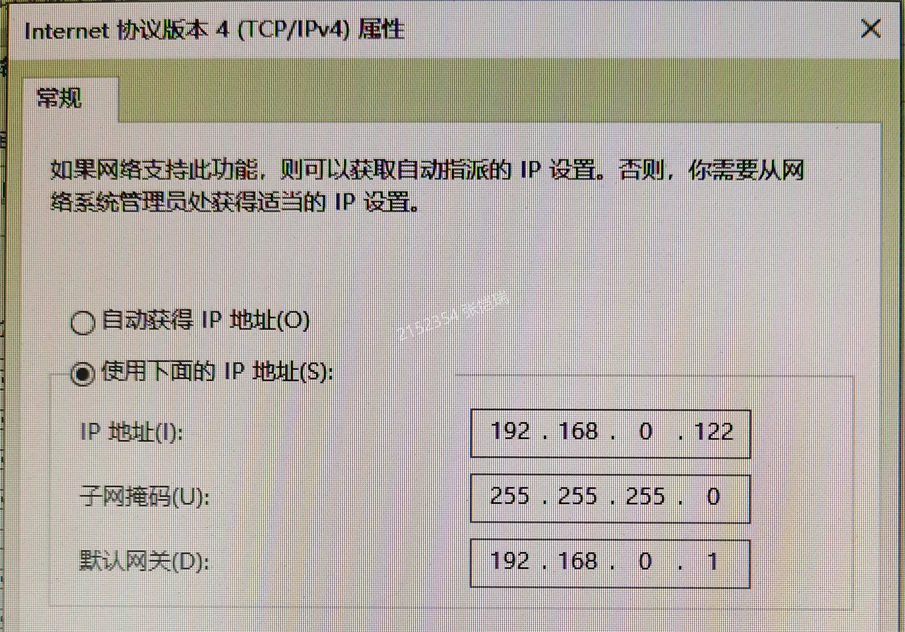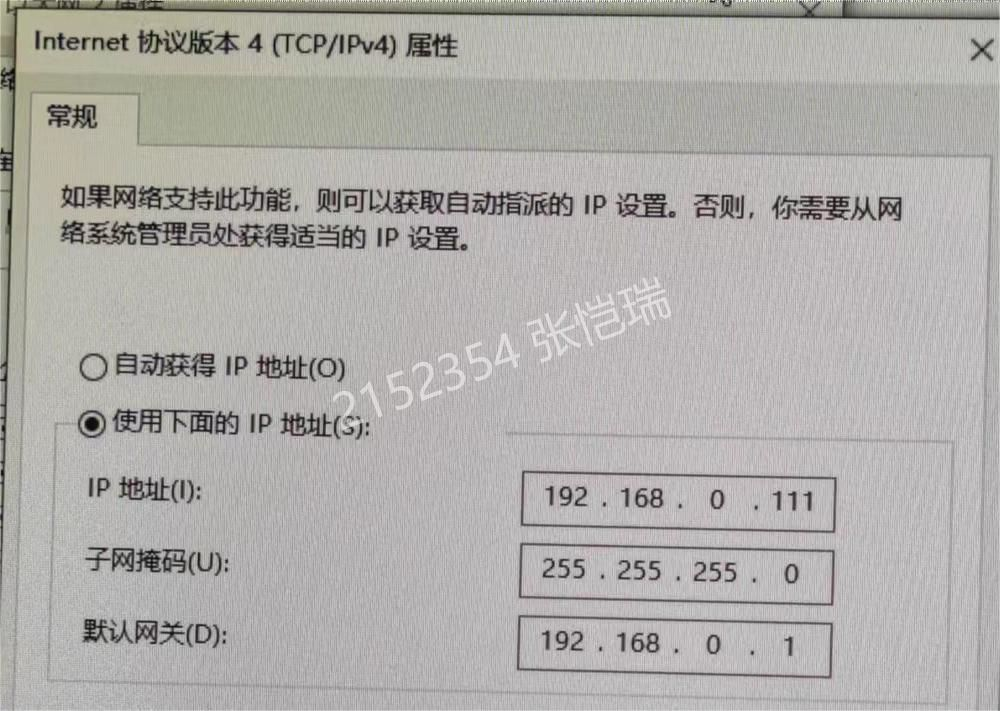
3. Host1 测试 Host2 是否连通。打开 Host1 命令行窗口，输入 ping 指令`ping 192.168.0.111`，可以看到连通；
   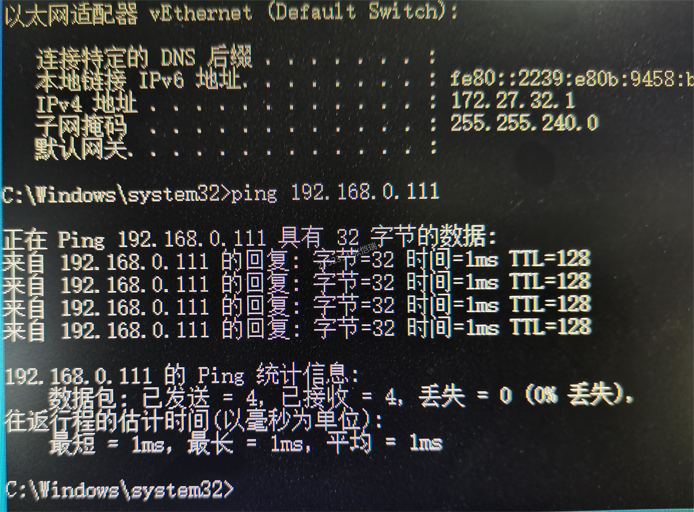

（二）以太网地址查看实验

Host1 查看自身以太网物理地址，打开命令行窗口，输入命令`ipconfig /all`，可以看到 Host1 以太网卡的IP地址和物理地址。

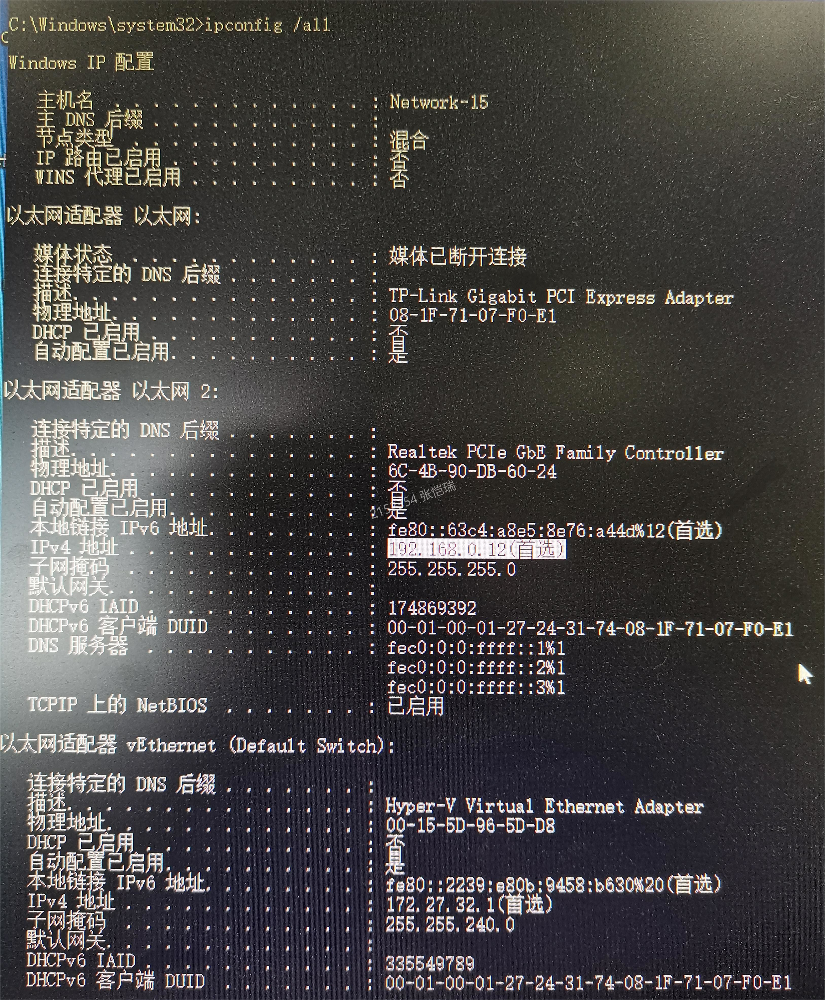

<h3>[实验总结]</h3>

在连接双绞线网线时，亮绿灯才表示接通，实验中出现了亮橙色灯或者不亮灯的情况，我们需要检查坏点处在交换机接口上还是双绞网线上，排除错误之后才能更好保证实验进行。

Ping命令容易截断，需要检查是否关闭了防火墙，否则可能出现始终连接不上Host2的情况。

需要配置两台电脑的 IP 地址，否则会出现连接不上的情况。同时，在配置IP地址时，可能出现IP地址已占用的情况，此时需要更换IP地址。

## 9. 主机路由实验

<h3>[实验时间]</h3>

2023.10.25 第七周周三7-8节

<h3>[实验目的]</h3>

1. 深入了解主机路由机制；
2. 了解和掌握主机路由配置方法；

<h3>[实验设备]</h3>

实验环境由一台路由器、两台计算机和一台交换机组。交换机担任网络连接设备，将路由器两个以太网端口和两台计算机网卡都用网线直接连接到交换机；通过串行线将主机 Host1 串口 com 同路由器 Console 口连接起来，启用其超级终端作为路由器管理的操作平台。

<h3>[实验网络拓扑]</h3>

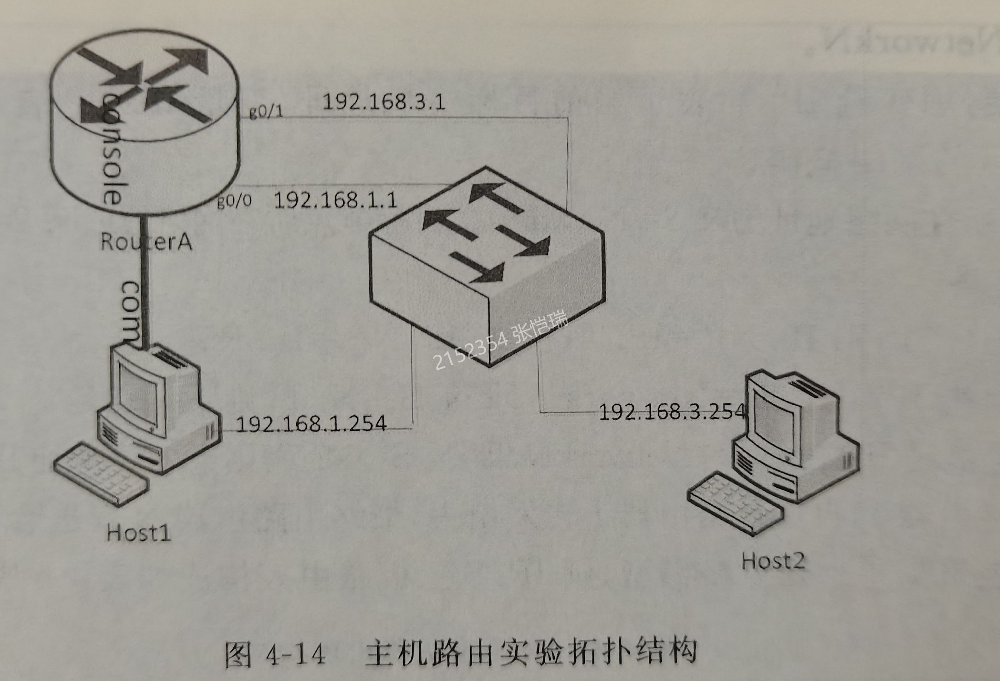

<h3>[实验原理]</h3>

IP网络模型中，不存在孤立的IP子网络，所有子网都通过路由连接在一起，因此每个IP子网对外均有一个进出口，称为网关，网关连接就是路由器。根据源主机节点和目标节点所在子网的关系，主机存在两种传输目标：子网内或子网外。

设置两个子网，子网间无法连通。用路由器直接连接这两个子网，为子网连通进行路由，但前提是主机设置 IP 地址时，必须将缺省网关设置为路由器以太网端口地址，以便通过路由器实现路由。

涉及路由器配置命令

* 端口IP 地址配置命令:`ip address <address><subnet mask>`
  其中，`address` 指 IP 地址，`subnet mask` 指地址掩码。
* 启用端口功能命令:`no shutdown`。
* 开启路由功能命令:`ip routing`。

<h3>[实验内容]</h3>

按照实验环境要求，完成实验拓扑结构连接，并打开相关设备电源。


**[实验一:主机路由实验]**

1. 配置主机 Host1 和 Host2 地址，并测试子网连通性。配置与测试图所示。

   1.  配置 Host1 和 Host2 地址。主机网卡 IP 地址设置如下:
      Host1：IP 地址=192.168.1.254，子网掩码=255.255.255.0，网关=192.168.1.1
      Host2：IP 地址=192.168.3.254，子网掩码=255.255.255.0，网关=192.168.3.1

      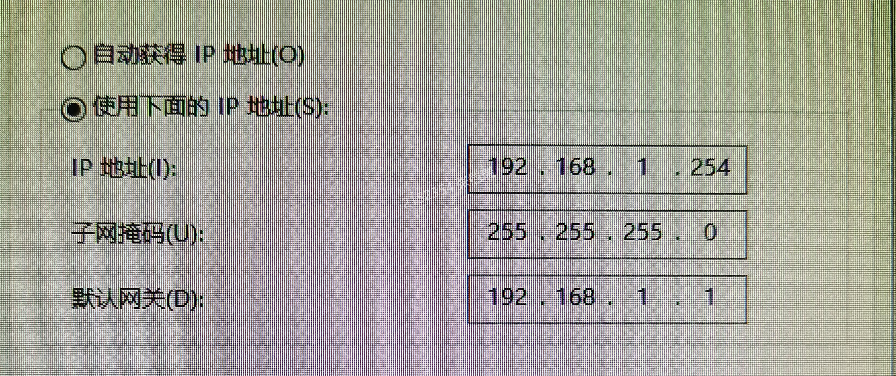

   2. 测试子网连通性。Host1 打开命令行窗口，输入“`ping 192.168.3.254`”，没有连通,原因是 Host1 和 Host2 的网络地址不同，网关地址虽设置了，但网关节点并不存在，设置无法起作用。

      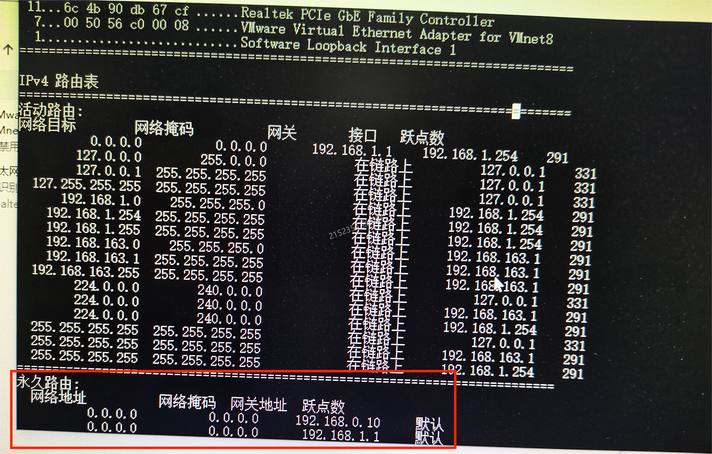

   3. 查看主机 Host1 主机路由表。Host1 使用命令行窗口。输人“`Route print`”,可以看到缺省路由(0.0.0.0 0.0.0.0)是 192.168.1.1。

2. 配置 RouterA 以设置子网网关。启用超级终端，配置路由器两个以太网端口分别成为两个子网的网关。

   1. 进入配置模式
      进入特权模式：`routerA>en `
      `Secret Password=cisco`
      进入配置模式：`routerA#config t`

   2. 192.168.1.0/24 网关配置。
      进入 f0/0 以太网端口配置模式：`routerA(config)#int f0/0`
      设置IP 地址：`routerA(config-if) #ip address 192.168.1.1 255.255.255.0`
      开启端口：`routerA(config-if) # no shut`
      退出端口配置模式，使端口配置生效：`routerA(config-if) # exit`

   3. 192.168.3.0/24 网关配置。
      进入 f0/1 以太网端口配置模式：`routerA(config)#in f0/1`
      设置 IP 地址：`routerA(config-if)#ip address 192.168.3,1 255.255.255.0`
      开启端口：`routerA(config-if)#noshut`
      退出端口配置模式，使端口配置生效：`routerA(config-if) # exit`

      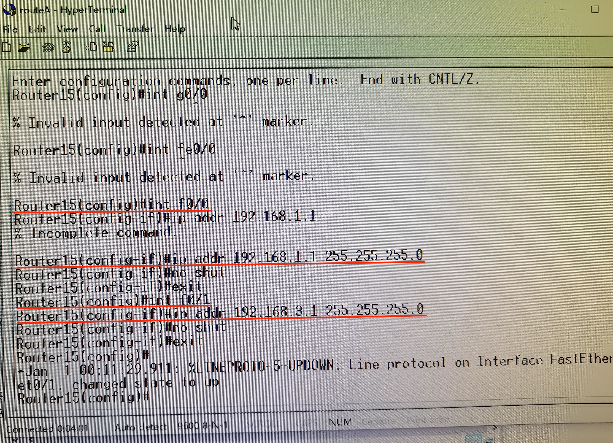

   4. 启用路由功能。
      启用路由功能：`routerA(config)ip routing`
      退出配置模式，使配置生效：`routerA(config)#exit`

3. 测试子网连通性。测试主机 Host1 是否连通主机 Host2，Host1 中打开命令行窗口，输入“`ping 192.168.3,254`”，有如下所示结果，则表示 Host1 已连通主机 Host2，主机路由表和主机网关发生作用，发挥了路由器路由转发功能。

   

**[实验二:主机网关缺失实验]**

取消主机 Host1 缺省网关地址，并测试同 Host2 连通性

1. 重置主机 Host1的缺省网关地址。删除默认网关地址->“确定”。

2. 测试子网连通性。Host1 打开命令行窗口，输人“`ping 192.168.3.254`”，表示不能连通 Host2。网关节点存在，但主机的网关地址没有设置，将不能发挥网关节点作用，无法访问其他子网。

   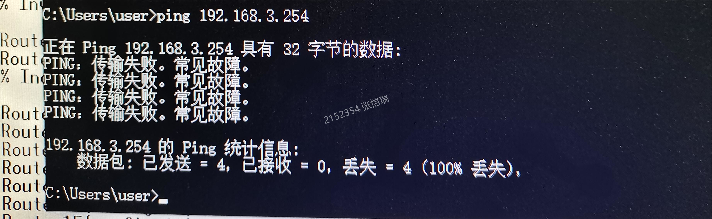

<h3>[实验总结]</h3>

首先是配置两台主机各自的IP地址和网关，并对子网内通信进行测试。结果表明，当网关正确设置并且路由器端口正确启用时，主机间能够实现跨子网的数据传输。其次，移除主机Host1的默认网关，测试结果再次证实了路由器作为网关在子网间通信中的核心作用。

此外，通过本次实验，我有以下收获：

1. **子网内与子网间通信**：理解了主机在同一子网内可以直接通信，但是跨子网通信需要通过网关（路由器）实现。
2. **网关地址配置**：掌握了如何在主机上设置网关地址，以及这个地址如何引导数据包向路由器发送。
3. **路由器端口配置**：学习了如何为路由器的每个端口分配IP地址，以及如何启用端口和开启路由器的路由功能。
4. **路由器作为网关的角色**：路由器在网络通信中扮演的网关角色，其对网络连通性非常重要。

## 10. VLAN 配置实验

<h3>[实验时间]</h3>

2023.10.25 第七周周三7-8节

<h3>[实验目的]</h3>

了解和掌握VLAN基本概念和操作。

<h3>[实验设备]</h3>

  一台cisco2950交换机，两台计算机作为操作平台。

<h3>[实验原理]</h3>

  VLAN是通过软件把网络按逻辑分组，不受物理上交换机端口所限制，把不同地理位置的主机分割到相同VLAN内，VLAN是在交换机上实现。

  VLAN能够解决广播风暴问题。交换机的每个端口是一个冲突域，但不能隔离广播，而一个VLAN就是一个广播域。

<h3>[实验网络拓扑]</h3>

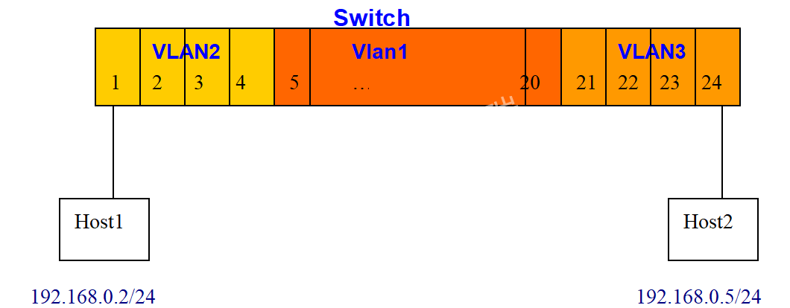

<h3>[实验内容]</h3>

1. 设置网卡IP地址
   首先配置两主机IP地址分别为 192.168.0.111 和 192.168.0.122，子网掩码均设置为 255.255.255.0

2. 未配置前端口通信测试
   用两根双绞线将两台主机连接到交换机的任意端口。
   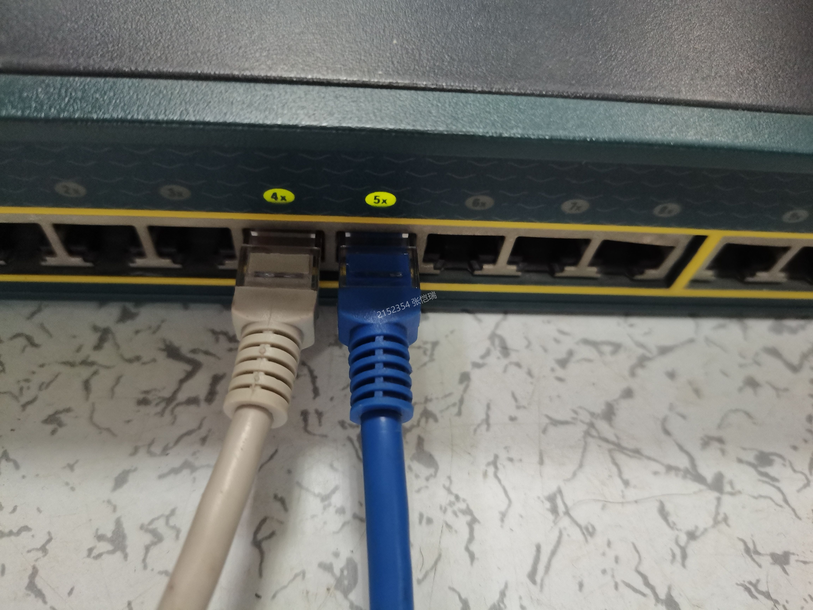
   测试192.168.0.122：ping 192.168.0.122#连通，则测试成功，如下所示：
   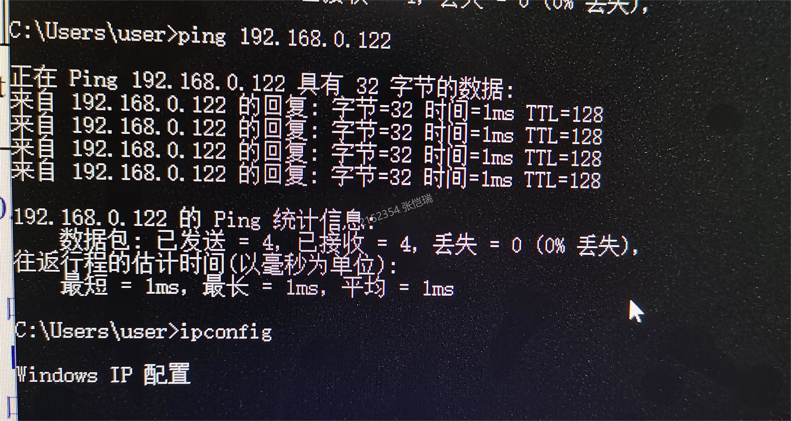

3. 配置VLAN2

   1. 连接交换机：
      使用console线将计算机串口com2与路由器的console口直接相连；建立HyperTerminal：开始->程序->附件->通讯->超级终端->名称= switch ->连接= com2 -> Baut Rate= 9600,8,no parity, 1 stop bit；

   2. 进入特权模式：
      `switch01>en(able)`
      `Enable Secret Password= cisco`

   3. 查看VLAN配置：`switch01# sh vlan`

      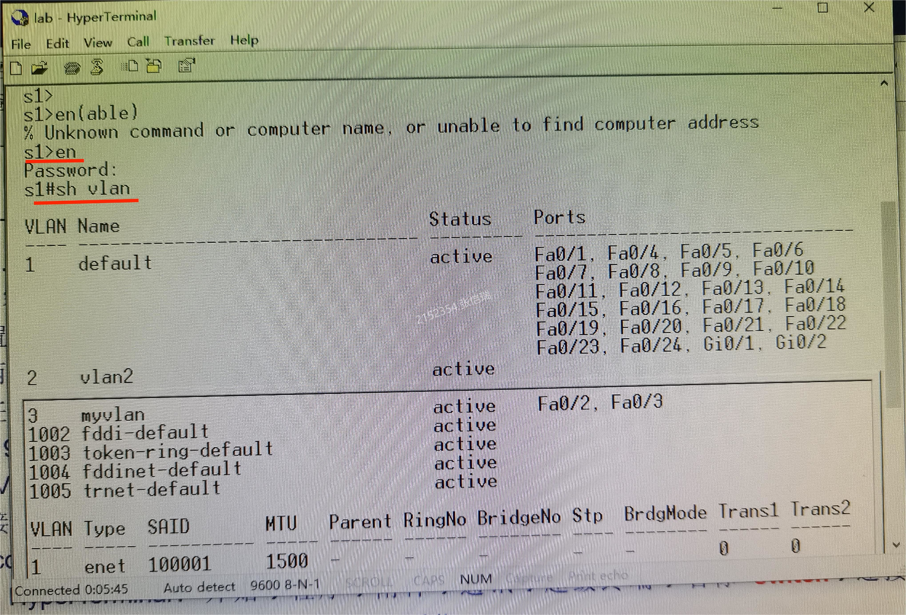

   4. 建立VLAN2
      进入vlan配置模式：`switch01#vlan database`
      添加vlan： `switch01(vlan)#vlan 2 name vlan2` 
      退出：`switch01(vlan)#exit`

      

   5. 建立VLAN3
      进入vlan配置模式：`switch01#vlan database`
      添加vlan： `switch01(vlan)#vlan 3 name myvlan` 
      退出：`switch01(vlan)#exit`

      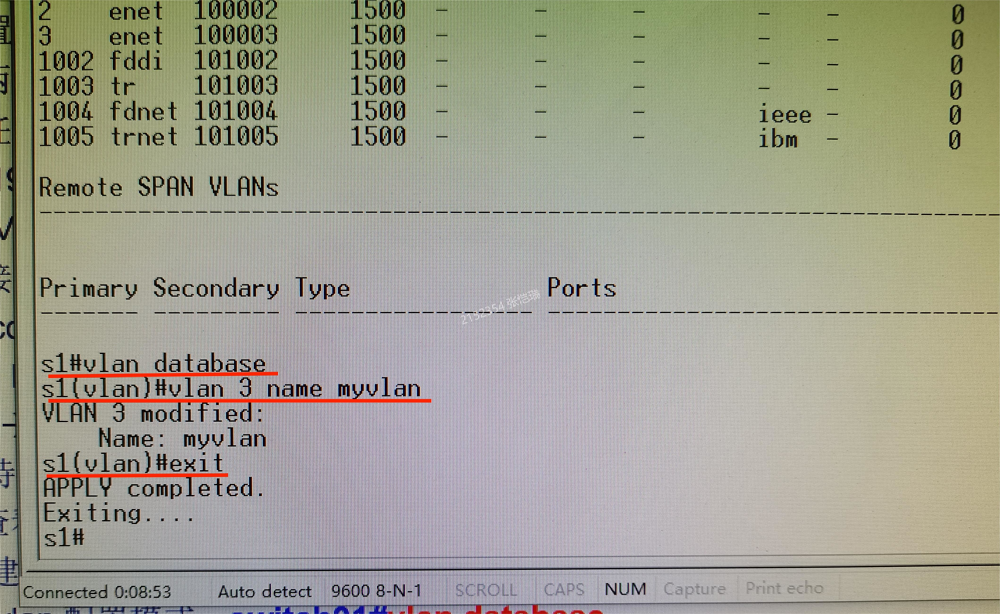

   6. 为VLAN2分配端口
      进入配置模式：`switch01#config t`
      进入f0/1端口：`switch01(config)#in f0/1`
      将端口分配给vlan2：`switch01(config -if)#switchport access vlan 2`
      退出：`switch01(config -if)#exit`
      查看VLAN2配置：`switch01# sh vlan name vlan2`

   7. 测试：重新测试192.168.0.122: ping 192.168.0.122 #不连通

   8. 为VLAN2分配新端口：
      进入f0/24端口：`switch01(config)#in f0/24`
      将端口分配给vlan2：`switch01(config -if)#switchport access vlan 2`
      退出：`switch01(config -if)#exit`

      

      查看VLAN2配置：`switch01# sh vlan name vlan2`

      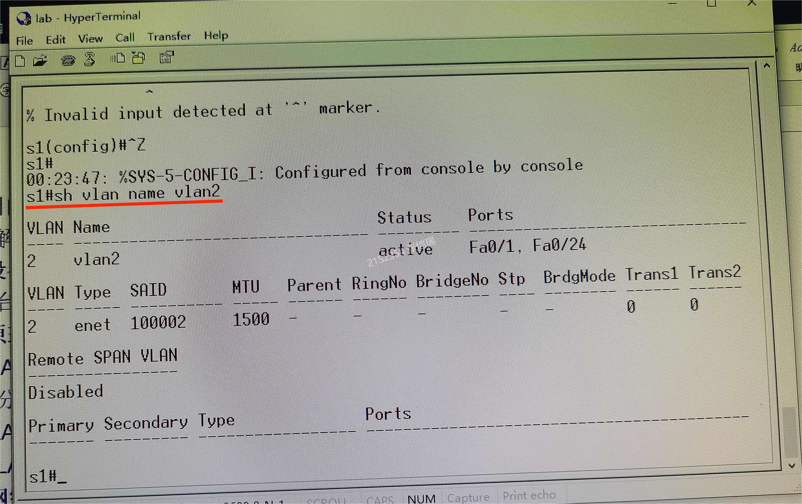

   9. 测试：重新测试 192.168.0.122: ping 192.168.0.122 #办连通

4. 配置VLAN3：类似上述方法

5. 删除VLAN

6. 重新测试不同VLAN之间主机的连通性。
   使用Ping判断连通性，发现两台主机无法连通，因为他们处在不同VLAN下。

<h3>[实验总结]</h3>

本次实验中，我们通过配置VLAN成功实现了网络的逻辑分割，理解并掌握了VLAN的基本概念和操作流程。我们将两台位于同一物理网络但不同逻辑子网的计算机进行通信测试，验证了VLAN配置的正确性和有效性。通过实验，我观察并得到以下结论：VLAN具有隔离功能。在相同物理网络上，不同VLAN内的主机不能直接通信，实现了网络的逻辑分割。

## 11. 静态路由配置实验

<h3>[实验时间] </h3>

2023.11.1 第八周周三7-8节

<h3>[实验目标]</h3>

静态路由，是指由人工根据网络拓扑结构来创建路由表。路由器需要依靠路由表来转发IP数据包，该实验是路由器实验中最基础的实验，后续的几个实验都以静态路由为基础。静态路由也是理解路由原理最直观的途径。实验模仿两个远程子网的互联，两个子网在本地各接一个路由器，路由器之间用远程网络相连，使用静态路由实现远程子网互联。

1. 深入了解IP路由基本原理。
2. 了解和掌握配置静态路由配置方法。

<h3>[实验原理]</h3>

静态路由原理：静态路由是指通过人工编辑方法，在路由器中直接设置路由表。静态路由表可以由多条路由条目组成。静态路由最大的优点是能揭示路由的基本原理，因为路由由手工配置出来，一般适用于比较简单的网络环境，工程实践采用动态路由为主。

<h3>[实验网络拓扑]</h3>

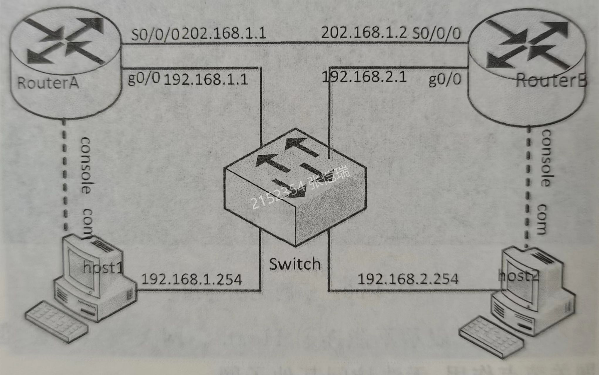

实验环境由两台路由器、两台计算机和一台交换机组成，模拟两个远程子网互联。使用单根串行交叉线将两个路由器的串口对接起来，代表路由器之间的远程网络；将路由器以太网端口和两台计算机网卡都用网线直接连接到交换机，由交换担当网络连接；

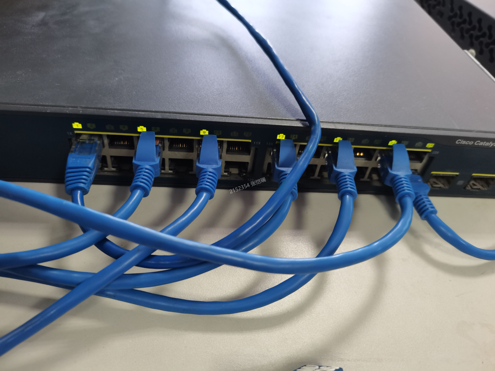

通过串行线将计算机串口 com 同路由器console口连接起来，两台计算机超级终端将作为路由器管理的操作平台。

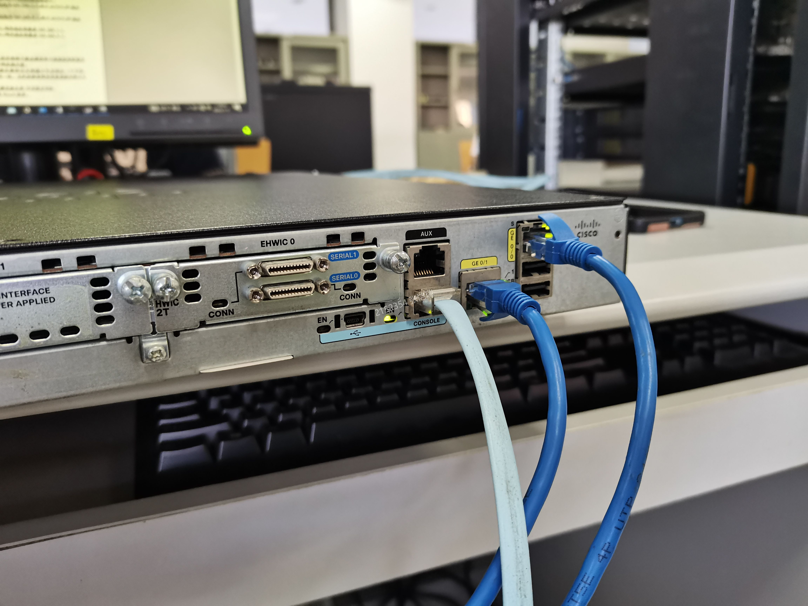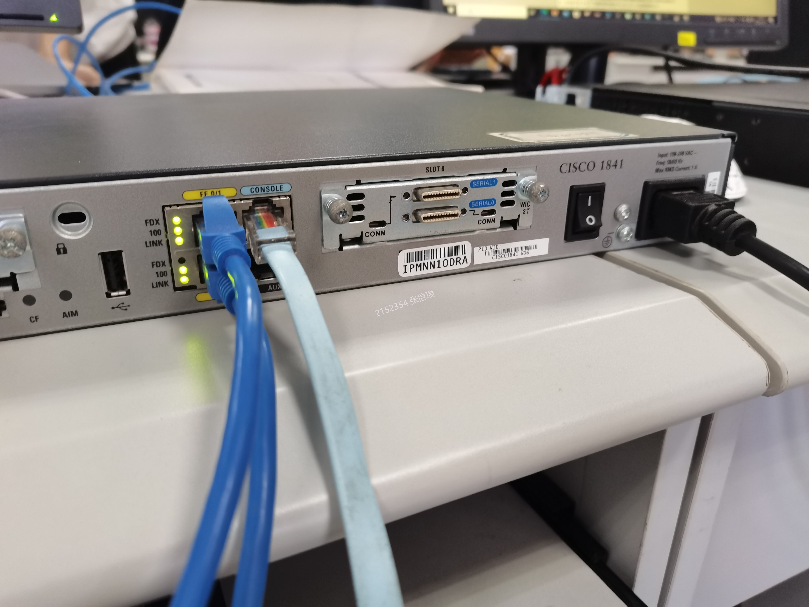

为处理方便，所有IP子网掩码都设置成255.255.255.0；其他配置参数如下：

1. 路由器A配置。以太网端口g0/0,IP地址设置为192.168.1.1；串口s0/0/0，IP地址设置为202.168.1.1。
2. 路由器B配置。以太网端口f0/0,IP地址设置为192.168.2.1；串口s0/0/0，IP地址设置为202.168.1.2。
3. 主机host1网卡地址设置为192.168.1.254，网关地址设置成192.168.1.1。
   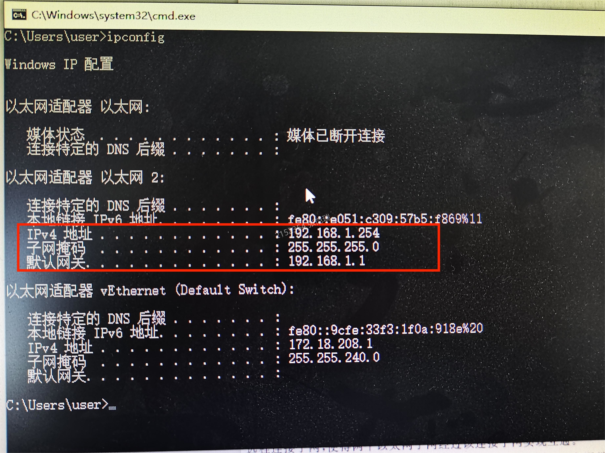
4. 主机host2网卡地址设置为192.168.2.254，网关地址设置成192.168.2.1。
   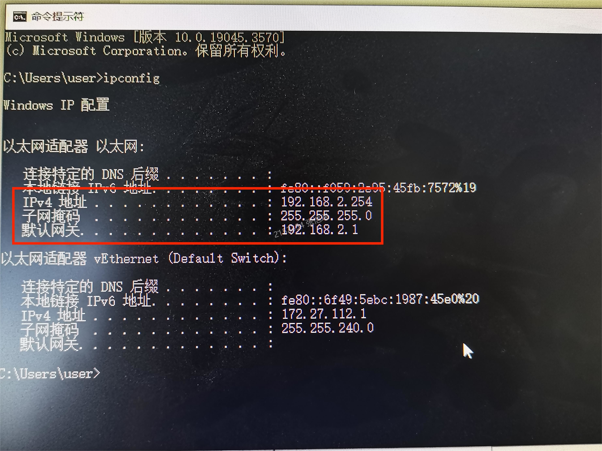

<h3>[实验步骤]</h3>

按照实验环境要求，完成实验拓扑结构连接，并打开相关设备电源。

1. 配置主机Host1和Host2网卡地址，测试连通性。

   ① 配置主机网卡地址。主机网卡IP地址设置如下：
   Host1：IP地址＝192.168.1.254，子网掩码＝255.255.255.0，网关＝192.168.1.1
   host2：IP地址＝192.168.2.254，子网掩码＝255.255.255.0，网关＝192.168.2.1

   ② 测试子网连通。Host1打开命令行窗口，测试Host2是否连通。
   输入"ping 192.168.2.1"，没有连通，因为两个节点在不同两个子网中，网关节点还不存在，无法通过网关连通。

2. 路由器RouterA配置。启用host1超级终端，进行网关设置、远程连接子网设置和静态路由配置。

   ① **进入配置模式。**
   进入特权模式：`routerA>en Secret Password=cisco`
   进入配置模式：`routerA# config t`
   ② **网关配置，以太网端口作为192.168.1.0/24子网网关。**
   进入以太网端口配置模式：`routerA(config)#int g0/0`
   设置IP地址：`routerA(config-if)#ip address 192.168.1.1 255.255.255.0`
   开启端口：`routerA(config-if) # no shut`
   退出端口配置模式，使端口配置生效：`routerA(config-if) # exit`
   ③ **远程连接子网配置。**
   进入串口配置模式：`routerA(config)#int s0/0/0`
   设置IP地址：`routerA(config-if) # ip address 202.168. 1. 1 255.255.255.0`
   开启端口：`routerA(config-if)#no shut`
   退出端口配置模式，使端口配置生效：`routerA(config-if)# exit`

   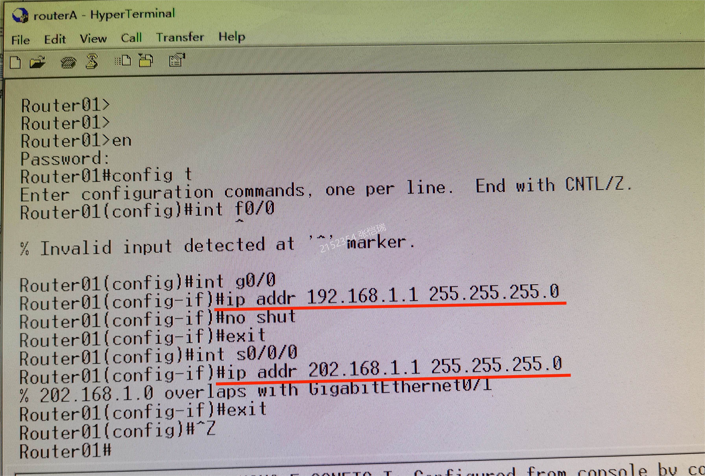

   ④ **配置静态路由表。**
   添加对端路由：`routerA(config) # ip route 192.168.2.0 255.255.255.0 202.168.1.2`
   退出配置模式，使配置生效：`routerA(config)# exit`
   查看路由表：`routerA# sh ip route`

   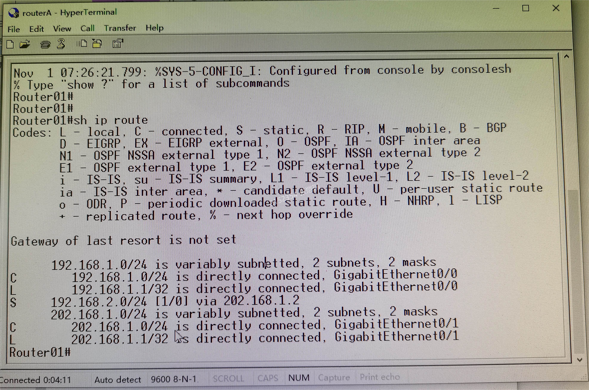

3. 路由器RouterB配置。启用host2超级终端，进行网关设置、远程连接子网设置和静态路由配置，操作方式同RouterA，具体配置如下：

   ① **进入配置模式。**
   进入特权模式：`routerB>en,Enable Secret Password=cisco`
   进入配置模式：`routerB#config t`
   ② **网关配置，以太网端口作为192.168.2.0/24子网网关。**
   进入以太网端口配置模式：`routerB(config) #int f0/0`
   设置IP地址：`routerB (config-if) # ip address 192.168.2.1 255.255.255.0`
   开启端口：`routerB (config-if) # no shut`
   退出配置模式，使端口配置生效：`routerB(config-if)#exit`
   ③ **远程连接子网配置。**
   进入串口配置模式：`routerB(config) #int s0/0/0`
   设置IP地址：`routerB(config-if) #ip address 202.168.1.2 255.255.255.0`
   开启端口：`routerB (config-if) # no shut`
   退出配置模式，使端口配置生效：`routerB (config-if) # exit`

   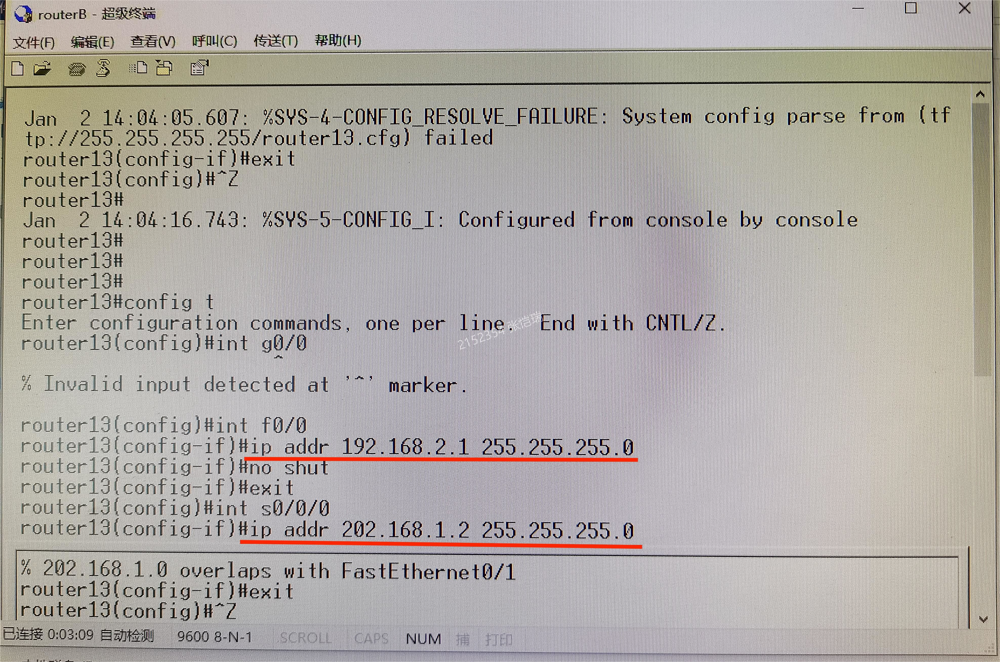

   ④ **配置静态路由表。**
   添加对端路由：`routerB(config)#ip route 192.168.1.0 255.255.255.0 202.168.1.1`
   退出配置模式，使配置生效：`routerB(config)#exit`
   查看路由表：`routerB# sh ip route`

   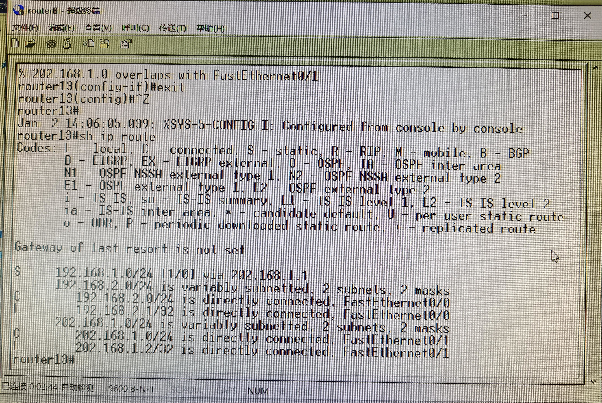

4. **测试子网连通。**测试 Host1是否连通 Host2，列出传输路径，Host1打开命令行窗口（图4-24)。
   测试连通性：`ping 192.168.2.254`，连通就表示实验成功，网关、连接子网和静态路由均发挥作用。
   跟踪路由：`tracert 192.168.2.254`，**经过了192.168.1.1和202.168.1.2两个中间节点**，恰好是网关地址（路由器A的以太网端口地址）和路由器B的串口地址。

   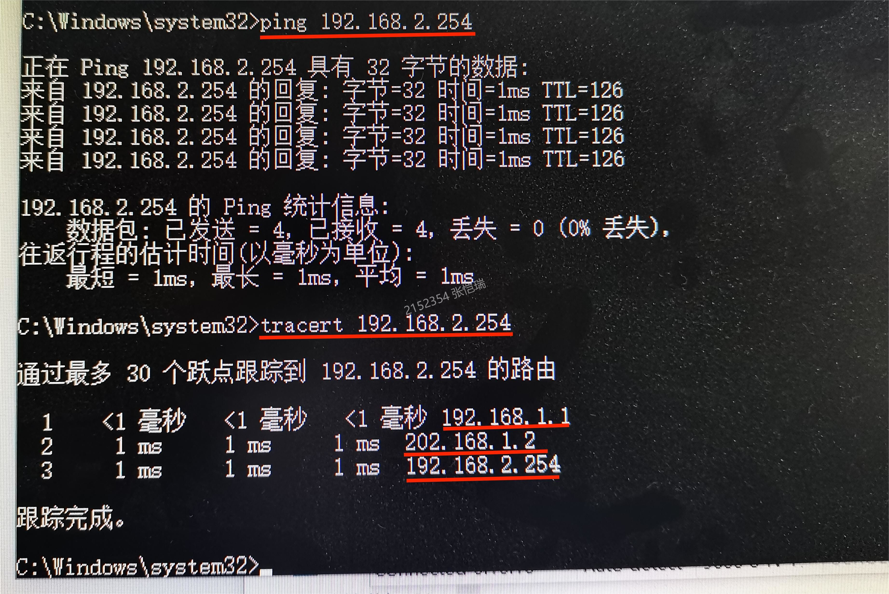

<h3>[实验总结]</h3>

实验结果显示，手动配置的静态路由能够正确引导IP数据包从一个子网传输到另外一个子网，验证了静态路由的有效性和路由选择的基本原理。通过实验，我们成功模拟了两个远程子网的互联，并通过静态路由实现了它们之间的通信。实验不仅加深了对静态路由概念的理解，而且进一步掌握了在路由器中设置静态路由的具体操作。此外，实验也表明了静态路由配置在简单网络环境中的实用性和路由器在网络连接中的核心作用。

## 12. 组播实验

<h3>[实验时间] </h3>

2023.11.1 第八周周三7-8节

<h3>[实验目标]</h3>

组播是一对多的传输模式，即一个节点向组播地址发送一个 IP数据包，所有该组播的成员都将接收这个IP数据包，具有较高传输渝效率。组播应用非常广泛，视频会议就就是组播的典型应用，正确使用组播对于提高网络传输效率非常常有价值。但组播不会自动跨域子网，需要对路由器进行适当设置。实验模仿两个远程子网的互联，两个子网各接一个路由器，路由器之间用远程网络相连，安排一个组播发送节点和两个组播接收节点，配置路由器使得组播播能跨越子网。

1. 了解组播协议基本原理。
2. 掌握路由器组播配置技能。

<h3>[实验原理]</h3>

互联网组播协议原理

IP组播地址指位于224.0.0.0到239.255.255.255之间的IP地址段。组播在一个IP子网内部使用没任何问题，只要直接使用以太网组播地址，其成员均能接收IP数据包。但当组播跨越IP子网时，路由器并不会自动支持组播路由。组播地址使用始终处于动态变化中，不断有成员加入，也不断有成员离开，无法像单播地址那样事先在路由器中设置组播路由。

组播协议包括组成员管理协议和组播路由协议。组成员管理协议用于管理组播组成员的加入和离开。互联网组播协议（Internet Group Multicast Protocol,IGMP）是组成员管理协议，运行在主机和组播路由器之间。路由器为建立组播路由必须了解每个组员在网络中的分布，当新成员加入某个组播时，通知路由器，由路由器设置该组播地址，一旦接收到该组播地址数据包就予以转发；日常会定时主动查询组播成员，以维护组播成员构成状况，适应组播成员的动态变化。IGMP协议运行原理如下：

1. 当主机上的一个进程加入组播组时，就必须发送一个IGMP请求消息给路由器，让该主机加入组播组。IGMP 协议以主机身份方式而非进程方式加入组播组，多个进程加入同一组播，只需要发送一条IGMP请求消息。进程退出组播组时，则主机不需要发送IGMP请求消息。
2. 组播路由器收到IGMP请求消息。路由器为每个组播维护一个组播组成员表。将发送请求的主机加入组播组成员表中。
3. 组播数据报转发。当路由器收到组播数据报时，就会将该数据报转发到属于组播组成员的主机所连接的端口上。
4. 组播路由器定时发送IGMP查询消息来维护组播组成员表。
   ① 组播路由器定时通过各个端口发送一个 IGMP 查询消息，了解主机是否还包含属于组播组的进程。
   ② 尚处于组播组成员的主机通过发送IGMP响应消息来回复IGMP查询，否则，就不用响应 IGMP 查询。
   ③ 组播路由器根据收到的响应消息维护当前组播组成员表。凡是没有响应的主机就表示已退出组播组，响应的主机继续保留在组播组内。

组播路由协议负责在路由器之间交互信息来建立组播树。协议无关组播PIM(Prutocal indepententmulticast）是一个组播路由协议，利用单播路由协议所生成的单播路由表为IP组播提供转发路径。

<h3>[实验网络拓扑]</h3>

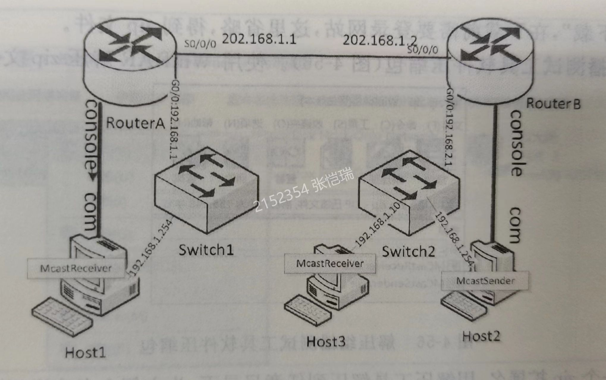

组播路由实验拓扑结构如上图所示。

实验环境主要由两台路由器、三台计算机和两台交换机组成。使用单根串行交叉线将路由器A同路由器B的串口对接起来，模拟远程传输网络；将路由器A以太网端口和主机host1用网线直接连接到一个交换机Switch1；将路由器B以太网端口和主机Host2和Host3用网线直接连接到另一个交换机Switch2；按图通过串行线将主机Host1 和Host2 串口com 同路由器 console 口连接起来，使用超级终端充当路由器管理的操作平台。运行组播测试工具软件用于组播测试。

为处理方便，所有IP子网掩码都设置成255.255.255.0，配置参数如下：

1. 路由器A：以太网端口g0/0,IP地址设置为192.168.1.1；串口s0/0/0,IP地址设置为202.168.1.1。
2. 路由器B：以太网端口g0/0,IP地址设置为192.168.2.1；串口s0/0/0,IP地址设置为202.168.1.2。
3. 主机 host1 网卡地址设置为192.168.1.254，网关地址设置成192.168.1.1；运行组播接收器McastReceiver。
4. 主机 host2 网卡地址设置为192.168.2.254，网关地址设置成192.168.2.1；运行组播发送器 McastSender。
5. 主机 host3 网卡地址设置为192.168.2.10，网关地址设置成192.168.2.1；运行组播接收器McastReceiver。

<h3>[实验步骤]</h3>

按照实验环境要求，完成实验拓扑结构连接，并打开相关设备电源。

1. 配置主机网卡地址。主机网卡IP地址设置如下：
   Host1:IP地址＝192.168.1.254，子网掩码＝255.255.255.0，网关＝192.168.1.1
   Host2:IP地址＝192.168.2.254，子网掩码＝255.255.255.0，网关＝192.168.2.1
   Host3:IP地址＝192.168.2.10，子网掩码＝255.255.255.0，网关＝192.168.2.1

   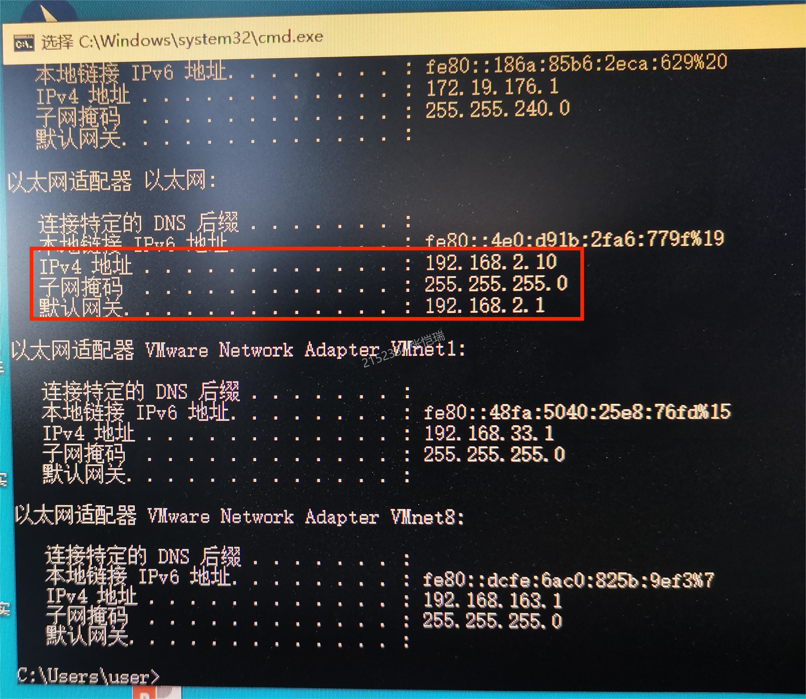

2. 按照《静态路由实验》要求，建立两个远程子网的互联。

3. 组播测试。
   ① 禁用其他无关网卡。
   ② Host2执行组播发送器，进行组播数据发送。Host2打开组播工具软件所在文件夹，双击`MCastSender. exe`文件。点击"开始"，可以看到该组播发送器在不断地发送组播数据包。
   ③ 测试 Host2 同 Host1 和 Host3 是否处于连通状态。Host2 打开命令窗口，输入命令：`ping 192.168.2.10` ，`ping 192.168.1.254`
   Host2 同 Host1 和 Host3 都处于连通状态。

   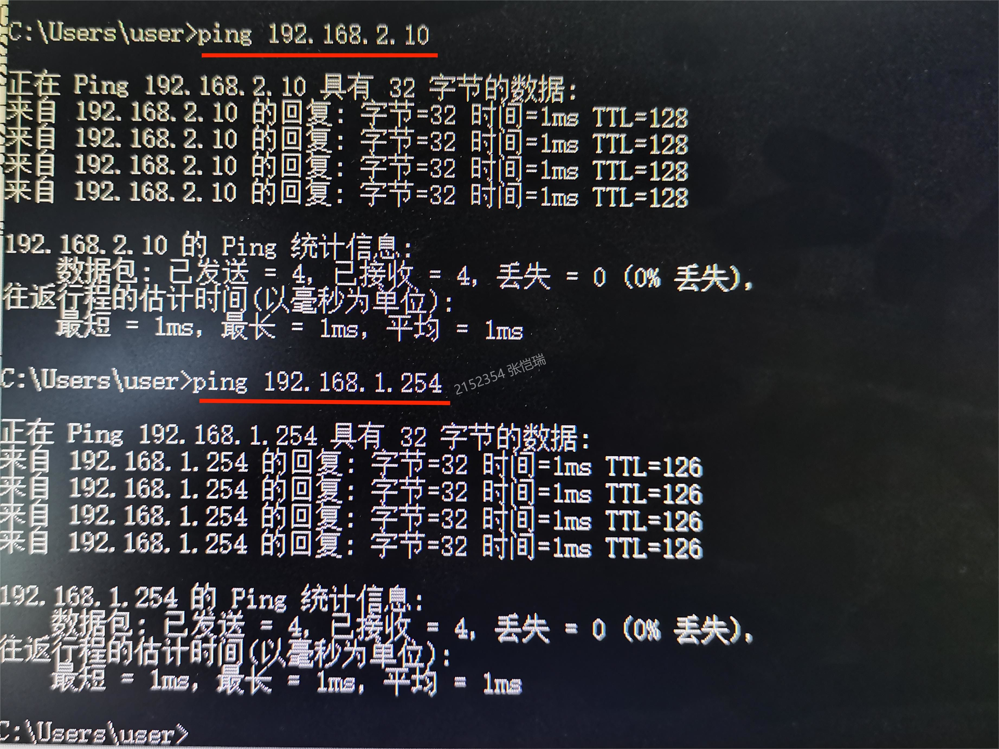

   ④ Host3启动组播接收器，准备接收发出的组播数据，Host3 打开组播工具软件所在文件夹，双击MCastReceiver. exe文件。

   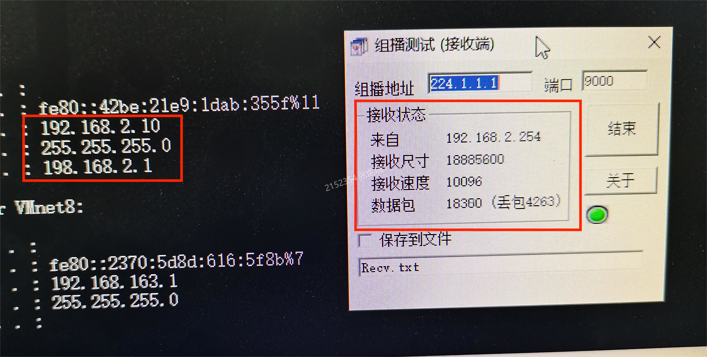

   点击"开始"，可以看到正在接收组播数据，而且注明是从192.168.2.254 主机获得，Host2 和 Host3 连接在同一个交换机上，直接就能获得组播数据包。
   ⑤ Host1 也启动组播接收器，准备接收发出的组播数据。Host1 打开组播工具软件所在文件夹，双击MCastReceiver. exe文件。点击"开始"，但未能看到接收组播数据，Host1 和 Host2 虽然连通，但需要通过路由器进行转发，组播数据包被路由器阻隔了，无法接收。

4. 路由器A配置组播路由协议。启用Host1 超级终端，进行组播配置，在各个端口上实施PIM 协议无关组播。
   ① **进入配置模式。**
   进入特权模式：`routerA>en,Enable Secret Password=cisco`
   进入配置模式：`routerA# config t`
   ② **启用各端口PIM协议无关组播。**
   进入端口以太网端口配置模式：`routerA(config) # in g0/0`
   启用PIM协议无关组播：`routerA(config-if) #ip pim dense-mode`
   退出端口配置模式，使端口配置生效：`routerA(config-if) # exit` 
   进入串口端口 s0/0/0配置模式：`routerA(config) # in s0/0/0`
   启用PIM协议无关组播：`routerA(config-if) # ip pim dense-mode` 
   退出端口配置模式，使端口配置生效：`routerA(config-if) # exit` 
   进入串口端口 s0/0/1:`routerA(config) # in s0/0/1`
   启用PIM协议无关组播：`routerA(config-if)#ip pim dense-mode`
   退出端口配置模式，使端口配置生效：`routerA(config-if)# exit`

   

   ③ **启用组播路由功能。**
   `routerA(config) # ip multicast-control`
   退出配置模式，使配置生效：`routerA(config)#exit`

5. 路由器B配置组播路由协议。启用Host2超级终端，进行组播配置，在各个端口上实施PIM协议无关组播，因为不涉及具体地址，配置完全一致，如下：
   ① **进入配置模式。**
   进入特权模式：`routerB>en,Enable Secret Password=cisco`
   进入配置模式：`routerB# config t`
   ② **启用各端口 PIM协议无关组播。**
   进入端口以太口配置模式：`routerB(config)#in f0/0`
   启用PIM协议无关组播：`routerB(config-if) # ip pim dense-mode`
   退出端口配置模式，使端口配置生效：`routerB(config-if)#exit` 
   进入串口端口 s0/0/0配置模式：`routerB(config)#in s0/0/0`
   启用PIM协议无关组播：`routerB(config-if) # ip pim dense-mode` 
   退出端口配置模式，使端口配置生效：`routerB(config-if)#exit` 
   进入串口端口 s0/0/1:`routerB(config)#in s0/0/1`
   启用PIM协议无关组播：`routerB(config-if) # ip pim dense-mode` 
   退出端口配置模式，使端口配置生效：`routerB(config-if) # exit` 
   ③ **启用组播路由功能。**
   `routerB(config) # ip multicast-control`
   退出配置模式，使配置生效：`routerB(config)#exit`

   

6. 重新观看 Host1 接收数据状况。Host1 可以重启组播接收器。接收发出的组播数据。可以看到 Host1 也开始接收组播数据，而且注明是从192.168.2.254主机获得，组播得到了路由器的转发，跨越了子网，组播实验成功。

   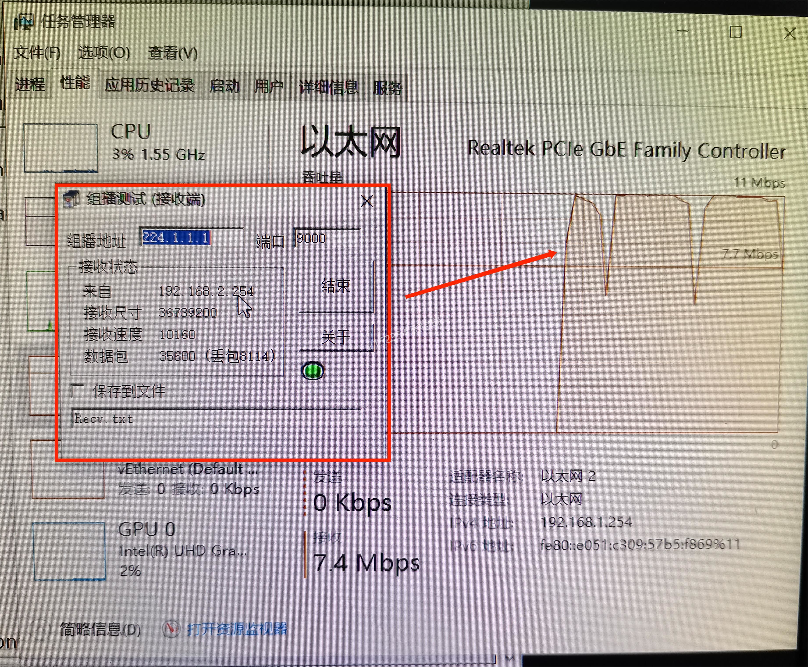

<h3>[实验总结]</h3>

本次实验成功实现了组播数据的跨子网传输，验证了IGMP和PIM协议在组播路由中的关键作用。路由器上对组播的正确配置对于实现网络中的高效组播通信至关重要。通过实验操作，不仅加深了对组播技术的理解，而且具体掌握了如何在路由器上配置组播协议，确保组播数据可以顺畅跨越IP子网。这对提高网络传输效率，尤其是在需要一对多通信模式的应用中具有重要的实践价值。

## 13. 访问控制列表 ACL 实验

<h3>[实验时间]</h3>

2023.11.8 第九周周三7-8节

<h3>[实验目标]</h3>

包过滤机制是路由器基本处理机制，加入过滤规则，可以实施基本的网络安全控制。阻隔访问敏感网站和关键主机，均可以使用访问控制列表作为过滤规则实施。学习访问控制列表，不但可以了解基本网络安全知识，而且还可以提高路由器使用水平。本实验利用路由器的访问控制列表功能，使得特定的IP地址不能访问，实现网络安全管理任务。

1. 了解路由器包滤基本原理。
2. 了解访问控制列表实施原理。
3. 利用控制列表实施网络安全。

<h3>[实验原理]</h3>

访问控制列表原理：

路由器包过滤机制是指路由器在转发IP数据包时，需要对每一个IP数据包头部进行分析，检查头部是否损坏并用于计算路由，为转发服务。
访问控制列表（Access Control Lists,ACL)，是指路由器在包过滤时，以IP数据包头部中的信息，诸如以源地址和目的地址等数据域作为规则条件，制订访问控制规则，只允许让满足条件的IP数据包通过，达到访问控制的目的，从而提高网络可管理性和安全性。

在工程应用中，可以设置规则不允许访问某些网站，比如禁止访问一些不健康网站；也可以对自身网络中某段地址进行保护，比如保护网站服务器。典型的Web应用，一般有 Web服务器和数据库两种服务器，Web服务器必须让外界直接访问，但数据库服务器就不应让外部直接访问，避免遭受攻击。通过访问控制列表，可以允许外部网能访问Web服务器地址，但不允许访问数据库服务器地址。

<h3>[实验网络拓扑]</h3>

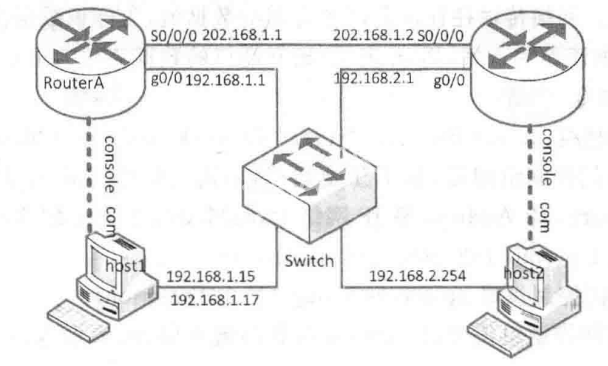

实验环境主要由两台路由器、两台计算机和一台交换机组成。使用单根串行交叉线将两个路由器的串口对接起来；将路由器以太网端口和两台计算机网卡都用网线直接连接到交换机，由交换机担当网络连接；通过串行线将计算机串口 com同路由器console口连接起来，两台计算机超级终端作为路由器管理的操作平台。为处理方便，所有子网掩码设置成255.255.255.0。配置参数如下：

1. 路由器A：以太网端口g0/0，IP地址设置为192.168.1.1，串口地址设置为202.168.1.1
2. 路由器B：以太网端口g0/0，IP地址设置为192.168.2.1，串口地址设置为202.168.1.2
3. host1承担测试任务，网卡地址设置在192.168.1.0/24网段，网卡地址将根据实验要求，在192.168.1.15和192.168.1.17之间进行切换，网关地址设置成192.168.1.1
4. host2网卡地址设置为192.168.2.254，网关地址设置成192.168.2.1。

<h3>[实验步骤]</h3>

1. 建立两个远程子网的互联。

2. 测试 Host1网卡使用192.168.1.15和192.168.1.17地址是否都能连通 Host2。

   键入“ping 192.168.2.254”,连通就表示静态路由配置成功。将 Host1地址改成 192.168.1.17，测试仍旧连通。

3. RouterA 配置访问控制列表。在完成静态路由配置成功基础上修改，配置访问控制组及实施。注意不要同时为RouterB配置访问控制列表。
   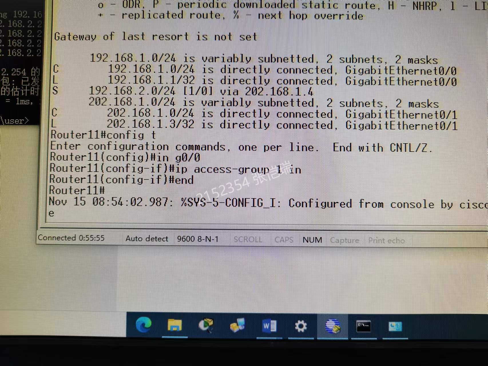

4. 重新测试连通。重新测试访问控制组是否发生作用。

   1. 测试 Host1地址为197.158.1.17时是否连通host2.

      键入“ping 192.168.2.254”，如下图所示，不连通就表示访问控制表发生作用，192.168.1.17地址没有得到允许访问，所以无法访问。
      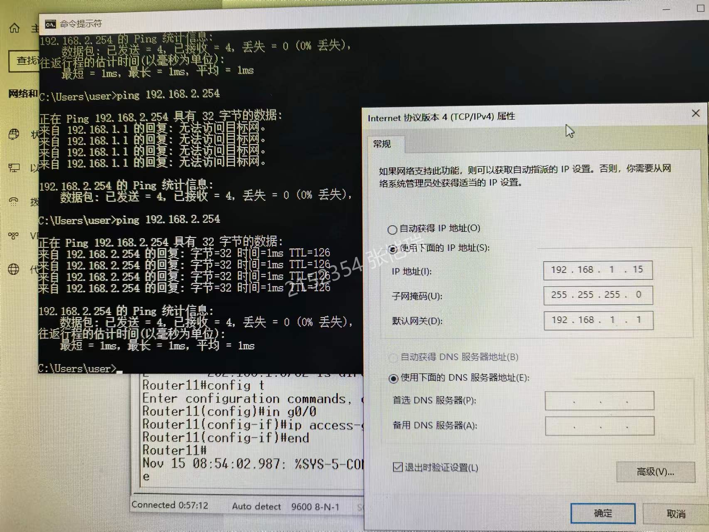

   2. Host1地址改回192.168.1.15，并重新测试。

      键入“ping 192.168.2.254”，如上图所示，连通就表示实验成功，表示控制列表访问组起作用，允许访问192.168.1.15地址。

<h3>[实验总结]</h3>

通过本次ACL实验，我们成功地实现了对网络访问的控制，阻止了不符合规则的IP地址访问网络资源。实验不仅验证了ACL在网络安全中的应用，而且加深了对路由器包过滤机制和ACL配置方法的理解。

## 14. RIP动态路由实验

<h3>[实验时间]</h3>

2023.11.15 第十周周三7-8节

<h3>[实验目的]</h3>

1. 了解和掌握路由信息协议RIP概念；
2. 配置RIP动态路由，实现网际通信。

<h3>[实验原理]</h3>

1. RIP（Routing InformationProtocols ，路由信息协议）是应用较早、使用较普通的 IGP 内部 网关协议，适用用于小型同类网络，是距离矢量协议。
2. RIP 协议跳数做为衡量路径开销的，RIP 协议里规定最大跳数为 15；RIP 协议有两个版本：RIPv1 和 RIPv2，RIPv1 属于有类路由协议，不支持 VLSM，以广播形式进行路由信息的更新，更新周期为 30 秒；RIPv2 属于无类路由协议，支持 VLSM，以组播形式进行路由更新。

<h3>[实验设备]</h3>

两台路由器，使用串行线将两个0串口对接；两台计算机作为操作平台；一台交换机担当网络连接。

<h3>[实验网络拓扑]</h3>

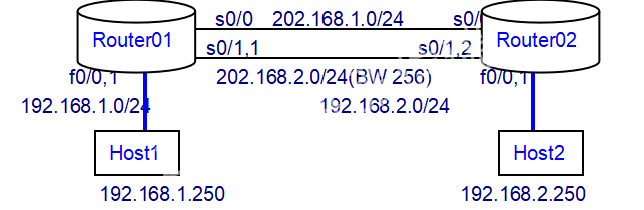

<h3>[实验内容]</h3>

1. 连接路由器；

2. 查看端口状态：`router01# sh interface` 记录IP地址；

3. 配置快速以太网f0/0。

4. 配置串口s0/0。

5. 配置串口s0/1

6. 配置RIP动态路由。
   添加RIP： `router01(config)#router rip`#如果路由功能关闭，rip必须重新配置。
   指定邻居网络：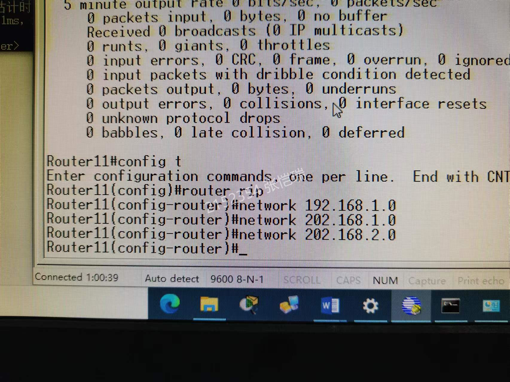查看RIP路由表：`router01# sh ip route rip`
   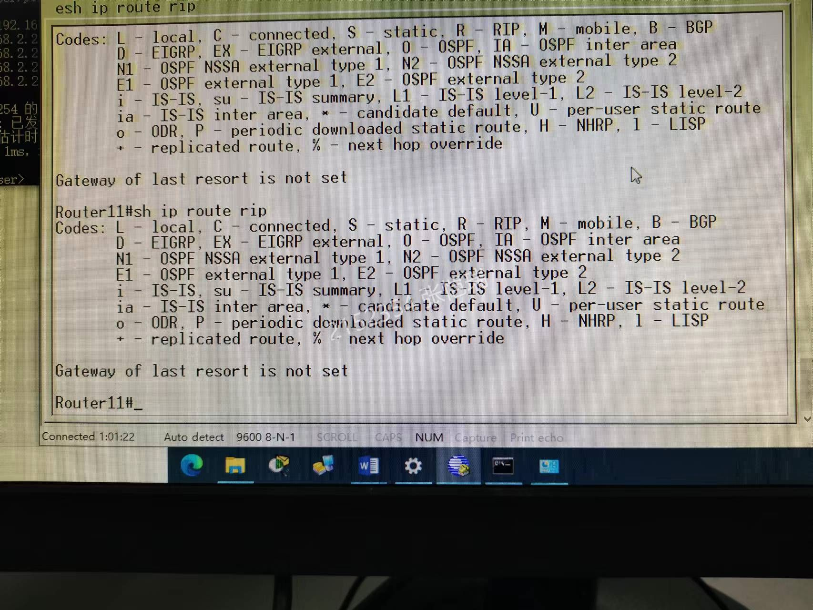

7. 测试：配置计算机IP地址：192.168.x.254
   `router01#no ip domain-lookup`
   `router01#trace ip 192.168.2.250`

8. 跟踪调试：
   `router01#debug ip rip`#查看信息发送端口
   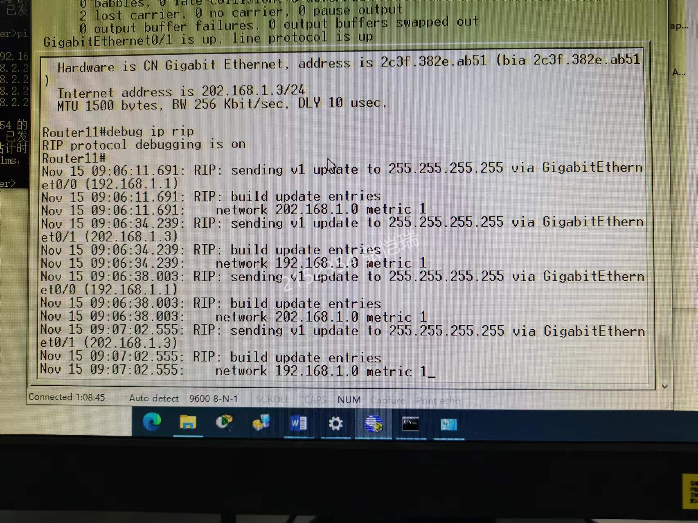

9. 被动接口设置 
   进入RIP设置：`router01(config)#router rip`
   以太网端口配置成被动模式： `router01(config-router)#passive-interface f0/0`
   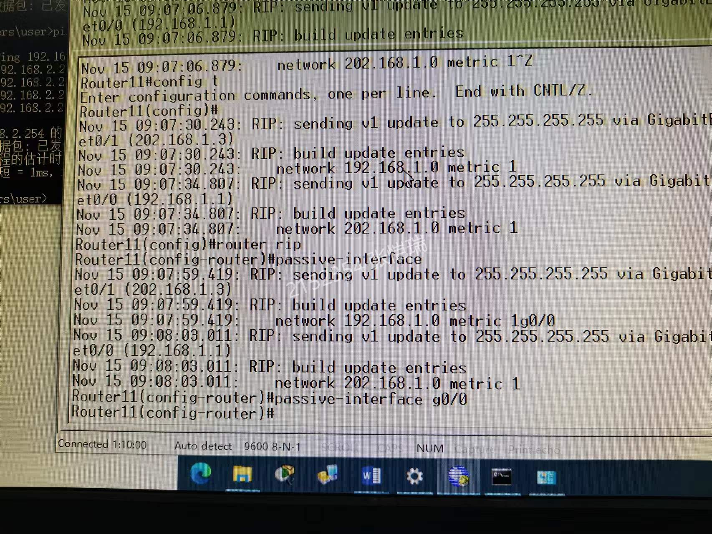

   查看调试，发现以太口不再发送。

<h3>[实验总结]</h3>

本次RIP动态路由实验成功地实现了网络之间的动态路由配置和通信。通过此实验，不仅加深了对RIP协议工作原理的理解，而且还掌握了RIP动态路由的配置和调试技巧。通过被动接口的配置，也学会了如何优化和减少路由器上不必要的网络流量。

实验中经常遇到配置错误的情况，这时候可以用`sh ip route`来显示当前接口配置，删去之前课程配置的不需要的配置，再重新配置本次实验所需的配置，即可提高成功可能性。通过耐心调试，我现在能够熟练进行实验拓扑结构的搭建和配置。

## 15. OSPF动态路由实验

<h3>[实验时间]</h3>

2023.11.15 第十周周三7-8节

<h3>[实验目的]</h3>

1. 了解动态路由表生成基本原理；
2. 了解最短路径优先算法基本思想
3. 掌握OSPF动态路由技能

<h3>[实验原理]</h3>

开放式最短路由优先协议（OSPF）的核心算法是最短路径优先（SPF），该算法的基础是Dijkstra算法，得到的结果是从当前节点到目标节点的下一跳地址。

链接状态信息是两个节点之间的连通性，OSPF协议对其维护的方式有：

1. 广播链接状态信息；
2. 每台路由器使用SPF算法计算路由表；
3. 路由器定时监测链接状态；

<h3>[实验设备]</h3>

带以太网网卡的计算机两台、路由器两台、交换机一台

<h3>[实验步骤]</h3>

1. 配置两台主机的IP子网掩码，配置好后测试连通性，因不在同一子网ping失败。
2. 配置路由器A。先设置IP地址，再配置远程连接子网202.168.0.1/24,由于本实验使用的路由器只有两个串行口，无法进行不同带宽的通信线路选择测试。对路由器B进行对称的配置操作。 
3. 配置OSPF动态路由，如下图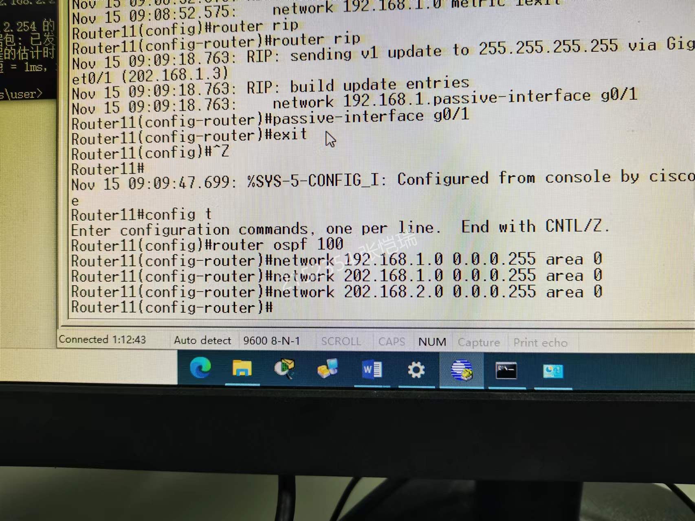

4. 输入“sh ip route ospf”和“sh ip ospf nei”可以分别查看OSPF路由表和邻居。
   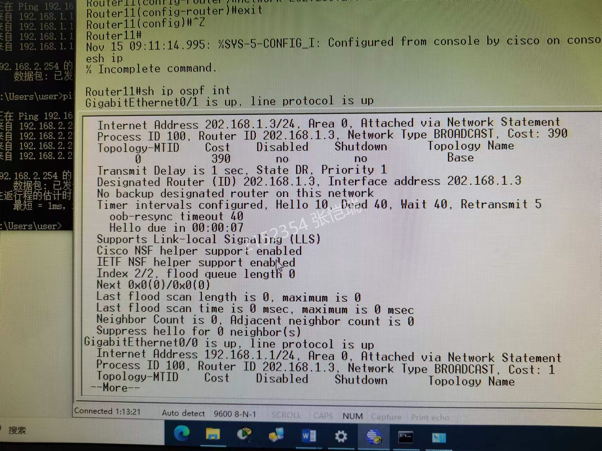  

5. 配置好动态路由后，再次用ping命令测试，成功连通。

   用tracert命令，观察到数据包经过网关、远程连接子网202.168.1.0/24的202.168.1.2端口，最终到达192.168.2.254
   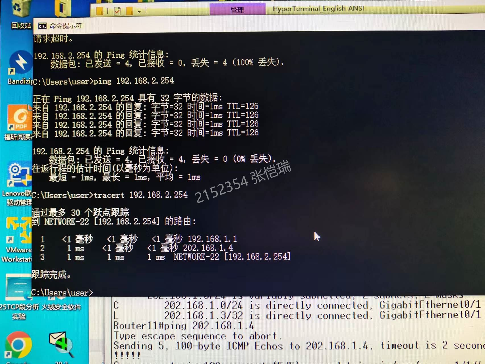

<h3>[实验总结]</h3>

本次实验通过配置OSPF动态路由协议，成功实现了两个不同子网间的通信。实验过程中，不仅加深了对OSPF和SPF算法的理解，而且具体掌握了如何配置路由器以使用OSPF协议，确保了网络的快速和有效连通。通过动态路由，网络在拓扑变化时能够自适应地更新路由信息，保证数据传输的可靠性和高效性。

## 16. 帧中继配置实验

<h3>[实验时间]</h3>

2023.11.22 第十一周周三7-8节

<h3>[实验目的]</h3>

1. 了解广域网基本概念.
2. 区分二层和三层路由的概念.
3. 熟悉帧中继交换机永久虚电路和配置步骤.

<h3>[实验原理]</h3>

1. 广域网：广域网由多个包交换机组成，它们之间用高速通信线路直连。广域网是典型的多跳网络，其中的交换机就是路由节点。

2. 帧中继：帧中继是一种广域网技术，只实现了物理层和链路层两层功能。若帧包含错误码或缓冲区已满，只能丢弃到来的帧。它采用面向连接的服务。
   1. DLCI(数据链路连接标识)，是帧中继网络的第2层地址，用于标识帧中继源和目的设备间的逻辑链路。
   2. PVC(永久虚电路)，通过设置帧中继交换机静态路由实现 。
   3. LMI(本地管理接口)，实现帧中继设备之间的连接管理 。

<h3>[实验设备]</h3>

带以太网网卡的计算机三台、路由器三台、交换机一台

<h3>[实验网络拓扑]</h3>

根据该拓扑图连接各设备，其中A、B需要用广域网串口线与C相连。

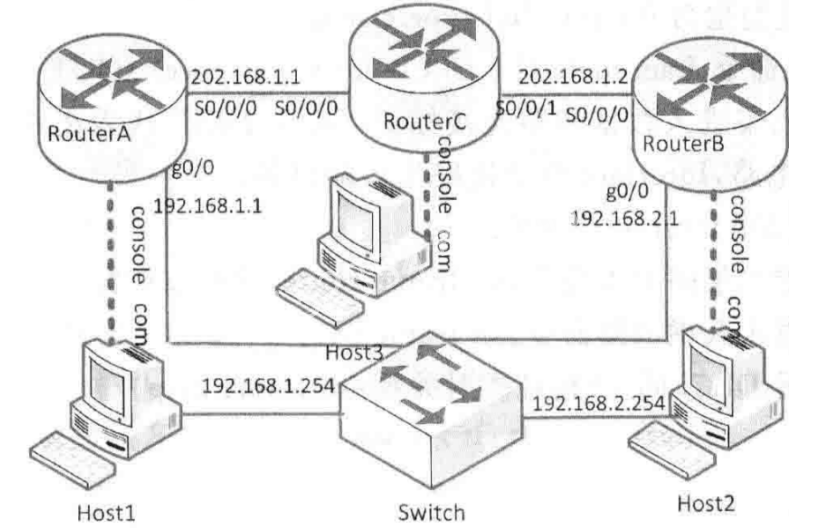

<h3>[实验步骤]</h3>

按照实验环境要求，完成实验拓扑结构连接，并打开相关设备电源。

1. RouterC 配置成为帧中继交换机。

   （1）确认串口线是否连接正确

   查看端口s0/0物理线路连接状态及接口类型，必须是DCE:routerC#sh control s0/0
   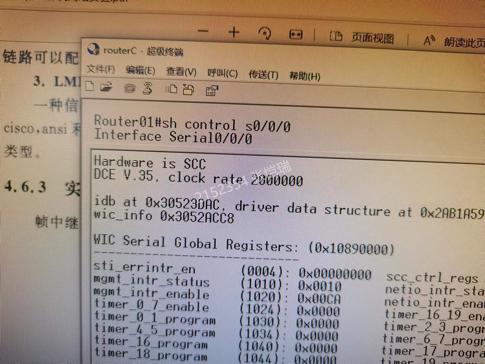

   查看端口s0/1物理线路连接状态及接口类型，必须是DCE;routerC#sh control s0/1
   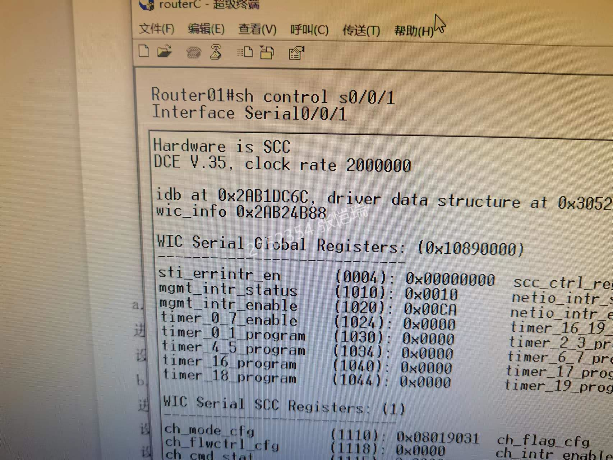

   （2）帧中继配置。配置帧中继永久电路以连接路由器 RouterA和 RouterB。
   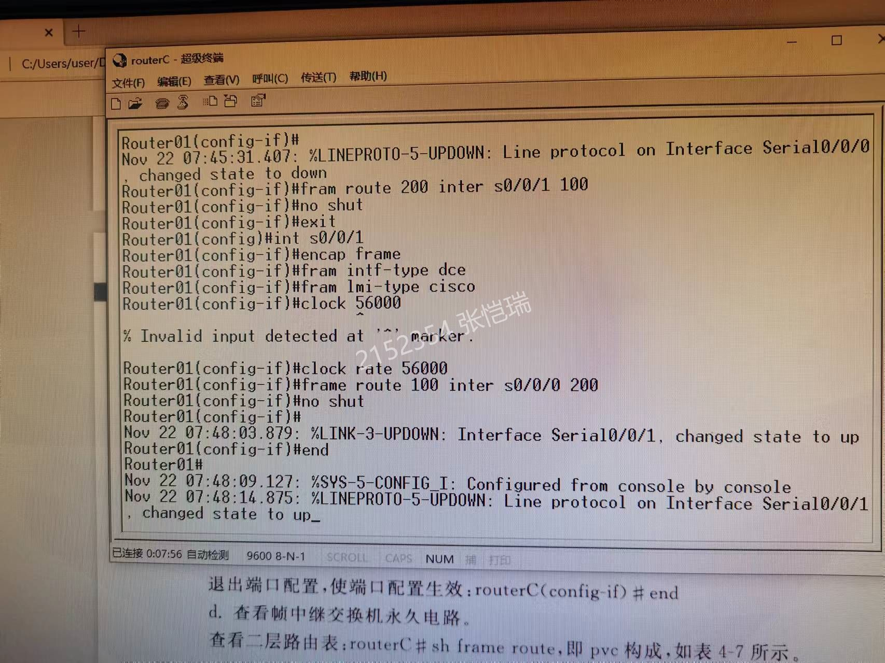

   1. 启用路由器作为帧中继运行。
   2. 串口s0/0/0配置模拟帧中继端口。
   3. 串口s0/0/1配置模拟帧中继端口。

2. 主机 Host1和 Host2 网卡地址配置。

   主机网卡 IP 地址设置如下：

   Host1:IP地址=192.168.1.254,子网掩码=255.255.255.0,网关=192.168.1.1

   Host2:IP地址=192.168.2.254,子网掩码=255.255.255.0,网关=192.168.2.1

3. 再分别配置RouterA和RouterB的网关、帧中继端口，以及添加静态路由。
   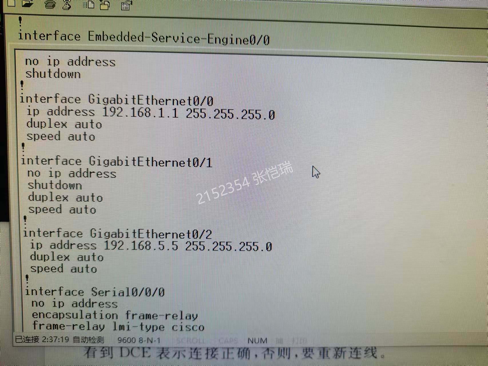

   帧中继连接端口配置。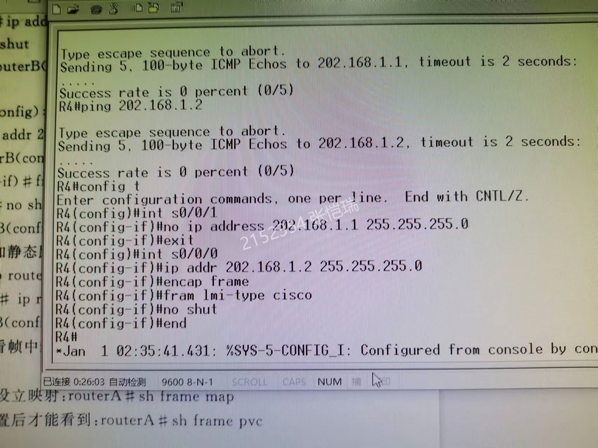

4. 测试子网连通。测试主机 Host1是否连通主机 Host2。
   

   结果显示连通，表示网关、帧中继交换机永久电路和路由均起作用，实验成功。

<h3>[实验总结]</h3>

实验成功地展示了帧中继交换机在广域网中的配置和作用。在实验前，我能够删除当前电脑环境内的错误配置，随后通过正确配置RouterC的帧中继功能和在RouterA与RouterB上添加相应的静态路由，实现了两个不同子网间的通信。实验过程中，对广域网的物理连接、数据链路层的帧传递以及三层路由的概念有了更深入的理解。这次实验不仅加深了对帧中继技术和广域网概念的认识，也提高了对配置网络设备的实践能力。

## 17. 虚拟LTE蜂窝网络组网实验

<h3>[实验时间]</h3>

2023.12.6 第十三周周三7-8节

<h3>[实验目的]</h3>

1. 理解蜂窝网络信元的构成及其工作机制。
2. 掌握LTE-EPC网络X2切换原理和机制。
3. 理解基于X2接口的内部切换仿真流程。

<h3>[实验原理]</h3>

1. **蜂窝网络信元**：由基站构成的无线信号覆盖区，通常呈正六边形结构，负责与移动终端通信。
2. **LTE蜂窝网络X2接口**：用于在LTE系统内基站间的切换管理，实现用户在不同信元间平滑过渡。
3. **信元切换**：智能终端在移动过程中，根据信号质量进行的基站切换。
4. **X2切换流程**：涉及Handover Request、Handover Request Ack等消息交换，以及UE Context Release等步骤，实现端到端切换。
5. **切换算法**：包括A3-rsrp-handover-algorithm和A2-A4-rsrq-handover-algorithm等，决定切换的时机和目标。

<h3>[实验设备]</h3>

计算机一台，安装有`ns-3`网络模拟器；`NetAnim`动画模拟器，用于展示网络拓扑和节点移动；实验所需的软件和库文件。

<h3>[实验步骤]</h3>

1. 在终端中执行`lab-lte-handover.cc`脚本，启动信元切换实验。
   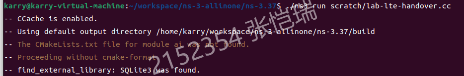
2. 调整脚本中的参数，例如UE的数量和速度，以模拟不同的移动环境。
3. 运行`NetAnim`，打开跟踪文件，观察模拟过程。如下图所示：LTE蜂窝网络基站切换实验项目子项实验场景
   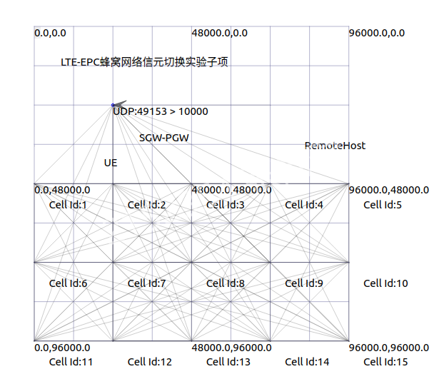
   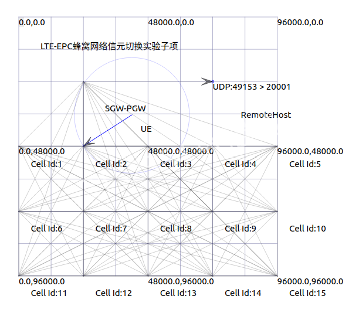
4. 分析智能终端与信元间切换情况，记录任何异常或性能指标。
5. 实验结束后，通过日志文件回溯和确认信元切换事件。

<h3>[实验总结]</h3>

实验通过虚拟LTE蜂窝网络组网成功模拟了信元切换的整个过程。通过调整不同的运行参数和使用NetAnim工具的直观展示，对LTE-EPC网络中基于X2接口切换机制的工作原理有了深刻的理解。

实验证明，在合理的参数配置下，信元切换能够根据信号强度平滑进行，没有观察到由于切换导致的服务中断。日志文件的分析也验证了仿真模型的准确性和切换算法的有效性。

## 18. NAT网络地址转换实验

<h3>[实验时间]</h3>

2023.12.13 第十四周周三7-8节

<h3>[实验目标]</h3>

1. 了解地址转换原理，以及私有网与互联网互通和互联网接入共享原理.
2. 了解NAT和NAPT技术。
3. 掌握网络地址转换技术，应用与网络安全。

<h3>[实验原理]</h3>

1. 由于互联网路由器不支持私有地址，IP数据包只出不进，为了实现私有网和互联网的互通，需要进行网络地址转换.
2. 网络地址转换就是私有地址和标准IP地址的相互映射。NAT仅限IP地址转换，而NAPT可以将端地址也加入转换，实现多个私网节点共享一个互联网地址.
3. NAPT转换表与NAT的区别在于每个网络地址后还附加了端口号.

<h3>[实验网络拓扑]</h3>

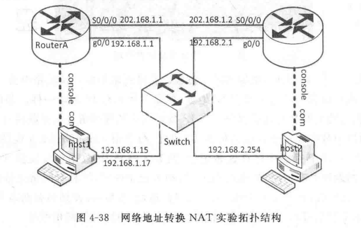

<h3>[实验步骤]</h3>

1. 按照《静态路由实验》要求，建立两个远程子网的互联。其实验内容完全等同实验。
2. 测试 Host1网卡使用192.168.1.15和192.168.1.17是否都能连通 Host2。
   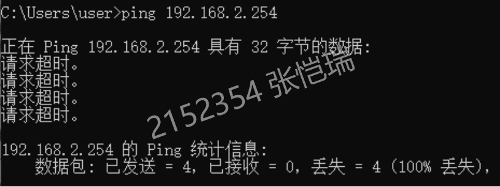
   无法连通Host2.
3. 配置 RouterB。在完成静态路由配置成功基础上修改，删除 RouteB路由，或者在实施静态路由配置时，不要为RouterB配置路由表。
4. RouterA 配置 NAT。在静态路由配置成功基础上修改，进行 NAT配置。
   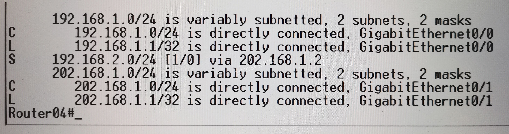
   1. 建立 NAT,建立访问控制组和NAT转换规则。
      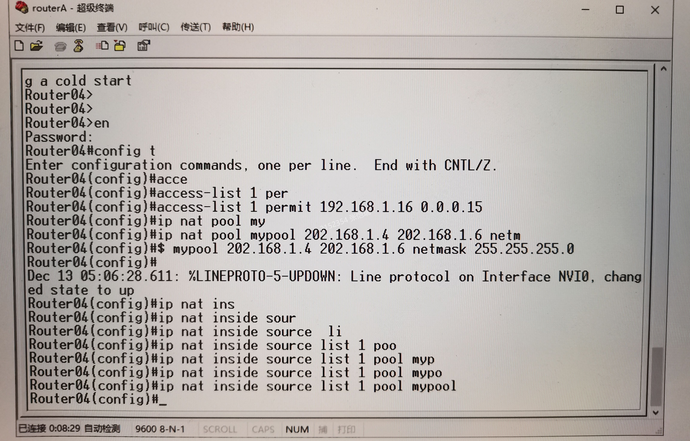
   2. 配置以太网端口实施入口NAT转换。
      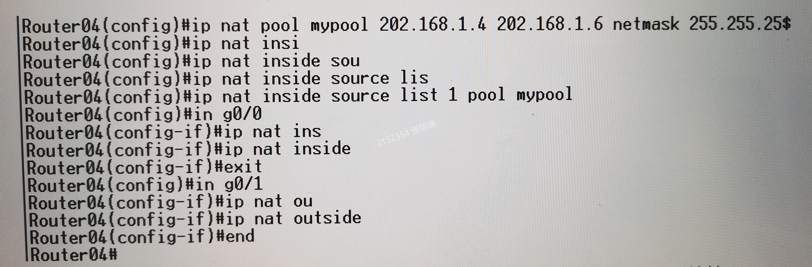
5. 地址转换测试。Host1地址设置为192.168.1.17,该地址将被转换。
6. 地址转换限制测试。改变 Host1地址为转换限制地址，重新测试私网到互联网连通性。
   现象与结论：私网能连通互联网，而互联网不能直接访问私网地址192.168.1.17，必须使用互联网转换地址202.168.1.4

<h3>[实验总结]</h3>

通过本次实验，我们验证了NAT技术使得私有网与互联网可以实现互通，而NAPT技术进一步允许多个私有网节点共享同一个互联网地址进行通信。这项技术对于节约IP地址资源、提高网络安全具有重要意义。实验还展示了NAT的限制性，即虽然私网可以主动与互联网通信，但互联网不能直接访问到私网内的特定IP地址，除非使用NAT转换后的公网地址。这增加了私有网络的安全性，因为它阻止了未授权的外部访问。

## 19. 邮件收发实验

<h3>[实验时间]</h3>

2023.12.13 第十四周周三7-8节

<h3>[实验目标]</h3>

1. 了解应用层数据规范和交互命令基本组成
2. 了解电子邮件运行的基本模型
3. 了解邮件服务器基本安装和管理步骤
4. 了解邮件发送和接收的交互方式，分别对应SMTP和POP协议

<h3>[实验原理]</h3>

1. 简单邮件传输协议（SMTP）用于发送邮件，邮局协议（POP）用于接收邮件。
2. SMTP服务器缺省端口号为25，它的主要功能是将接收到的邮件存放至邮件存储区。
3. POP服务器缺省端口号110，负责管理邮件存储区，使用者管理邮箱需通过身份认证。

<h3>[实验设备]</h3>

计算机一台，包含SMTP和POP服务器的邮件服务器，Telnet软件

<h3>[实验网络拓扑]</h3>

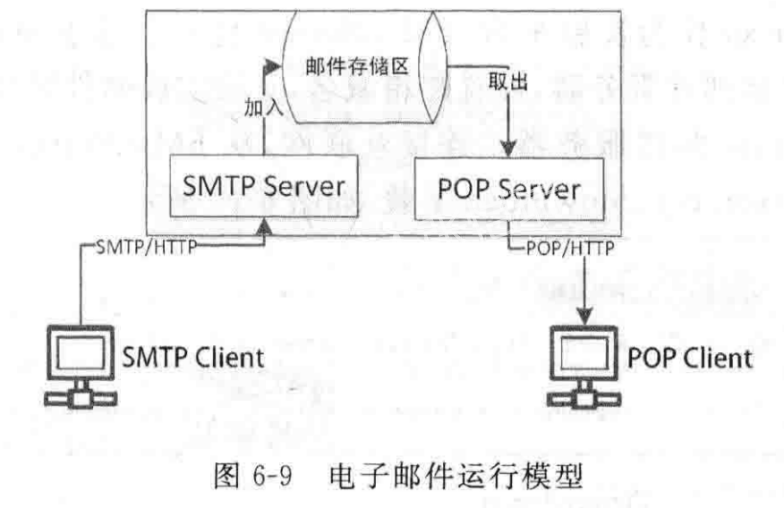

<h3>[实验步骤]</h3>

1. 下载并安装`hMailServer`邮件服务器。

2. 进行`hMailServer`邮件服务器设置。
   设置邮箱服务器域名为 networklab.com。
   创建实验邮件账号。创建邮件账户 student1@ networklab.com。
   

   检查是否设置伪域名。必须设置 networklab.com为127.0.0.1。

3. SMTP 邮件发送实验

   （1）启动邮件服务器服务，然后利用Telnet作为客户机，连接TCP端口25，访问SMTP服务器，输入一系列SMTP请求消息，目的是向student1邮件账号发送一封不带附件的电子邮件。

   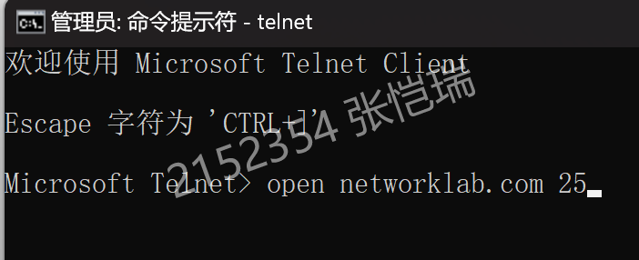

   （2）SMTP 消息。SMTP 消息分请求消息和响应消息。

   ① SMTP 请求消息，由邮件客户发送给邮件服务器，采用字符串格式。
   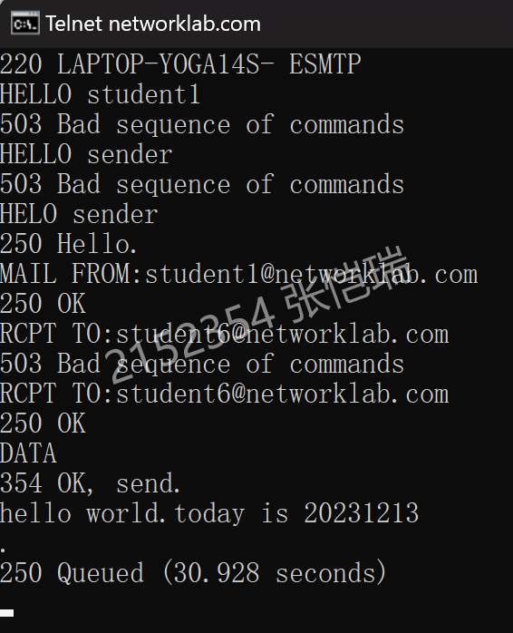

   HELLO:<SENDER>,标识发送人身份；

   MAIL FROM:<MAILBOX>,指明发件人邮箱地址，MAILBOX是发件人邮箱名；

   PCPT TO:<MAILBOX>,指明收件人邮箱地址，MAILBOX是收件人邮箱名；

   DATA要求发送信件主体，以<cr><LF>.<cr><LF>结束；

   QUIT,结束 TCP连接退出。

   ② SMTP响应消息，由邮件服务器返回给邮件客户，使用数字表示：

   250：回复客户请求消息成功接收；

   221：确认结束连接；

   220：正常。

4. POP 邮件接收实验

   (1)启动邮件服务器服务，然后利用Telnet作为客户机，连接110端口访问POP服务器，

   输入一系列POP请求消息，目的是从student1邮箱中获取已接收的邮件，并查看邮箱中的电子邮件内容。

   (2)POP消息。主要POP请求消息。
   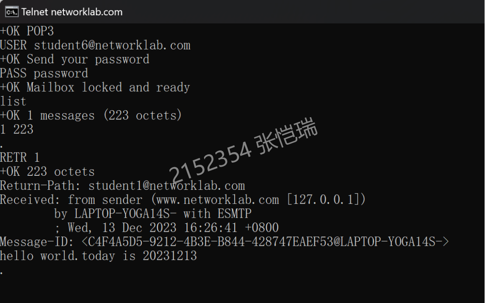

   USER<MAILBOX>,指明邮件接收者的邮箱账号，MAILBOX 代表邮箱名；

   PASS<PASSWORD>,指明邮件接收者的邮箱账号口令，PASSWORD代表邮箱账号口令；

   LIST,列出邮箱内邮件编号列表；

   RETR<NO>,显示指定邮件编号内容，NO 代表邮件编号；

   QUIT,结束 POP 服务器连接退出。

<h3>[实验总结]</h3>

在实验中，首先我们搭建了邮件服务器环境，并创建了必要的邮件账户和域。通过配置`hMailServer`邮件服务器，我们模拟了一个实际的邮件环境。在邮件发送部分，我们使用Telnet客户端直接与SMTP服务器通信，通过输入一系列SMTP命令，我们模拟了邮件发送过程。

在邮件接收部分，我们继续使用Telnet连接到POP服务器，通过输入POP协议指定的命令，实现了邮件的接收和查看。这个过程加深了我们对POP协议的理解，尤其是它如何处理用户认证以及邮件检索。

## 20. ARP 消息分析实验

<h3>[实验时间]</h3>

2023.12.20 第十五周周三7-8节

<h3>[实验目标]</h3>

了解 ARP 协议以及掌握分析 ARP 数据包。

<h3>[实验原理]</h3>

1. ARP 原理及流程 
   在任何时候，一台主机有 IP 数据报文发送给另一台主机，它都要知道接收方的逻辑（IP）地址。但是 IP 地址必须封装成帧才能通过物理网络。这就意味着发送方必须有接收方的物理（MAC）地址，因此需要完成逻辑地址到物理地址的映射。而 ARP 协议可以接收来自 IP 协议的逻辑地址，将其映射为相应的物理地址，然后把物理地址递交给数据链路层。
   1. ARP 请求 
      任何时候，当主机需要找出这个网络中的另一个主机的物理地址时，它就可以发送一个 ARP 请求报文，这个报文包好了发送方的 MAC 地址和 IP 地址以及接收方的 IP 地址。因为发送方不知道接收方的物理地址，所以这个查询分组会在网络层中进行广播。
   2. ARP 响应
      局域网中的每一台主机都会接受并处理这个 ARP 请求报文，然后验证接收方的 IP 地址是不是自己的地址，只有验证成功的主机才会返回一个 ARP响应报文，这个响应报文包含接收方的 IP 地址和物理地址。这个报文利用收到的 ARP 请求报文中的请求方物理地址以单播的方式直接发送给 ARP 请求报文的请求方。

2. ARP 协议报文格式

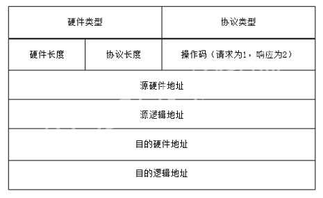

* 硬件类型：16 位字段，用来定义运行 ARP 的网络类型。每个局域网基于其类型被指派一个整数。例如：以太网的类型为 1。ARP 可用在任何物理网络上。
* 协议类型：16 位字段，用来定义使用的协议。例如：对 IPv4 协议这个字段是0800。ARP 可用于任何高层协议
* 硬件长度：8 位字段，用来定义物理地址的长度，以字节为单位。例如：对于以太网的值为 6。 
* 协议长度：8 位字段，用来定义逻辑地址的长度，以字节为单位。例如：对于IPv4 协议的值为 4。
* 操作码：16 位字段，用来定义报文的类型。已定义的分组类型有两种：ARP 请求，ARP 响应。
* 源硬件地址：这是一个可变长度字段，用来定义发送方的物理地址。例如：对于以太网这个字段的长度是 6 字节。 
* 源逻辑地址：这是一个可变长度字段，用来定义发送方的逻辑（IP）地址。例如：对于 IP 协议这个字段的长度是 4 字节。
* 目的硬件地址：这是一个可变长度字段，用来定义目标的物理地址，例如，对以太网来说这个字段位 6 字节。对于 ARP 请求报文，这个字段为全 0，因为发送方并不知道目标的硬件地址。
* 目的逻辑地址：这是一个可变长度字段，用来定义目标的逻辑（IP）地址，对于 IPv4 协议这个字段的长度为 4 个字节。

<h3>[实验设备]</h3>

Ubuntu22.04 与 ns3.37、NetAnim3.108，Win11主机

<h3>[实验步骤]</h3>

1. 查看Win11主机的IPv4地址，用于ARP消息的收发测试。
   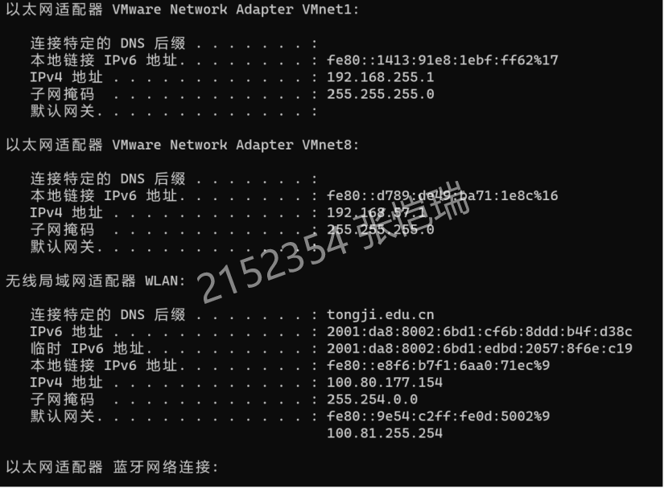

   成功获取到本机的IP地址：100.80.177.154

2. 打开虚拟机，用 Terminal 打开至文件夹/ns-3-allinone/ns-3.37

3. 检查设备的连通性：命令行中输入`ping 100.80.177.154`
   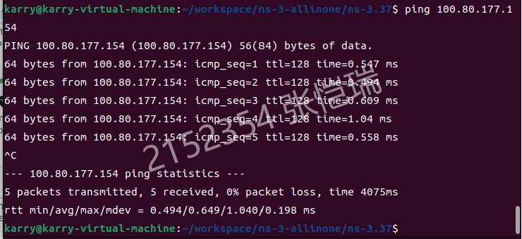

   我们可以看见数据成功收发，没有丢包，设备连通性良好。

4. 用 Terminal 分别打开至文件夹/ns-3-allinone/netanim-3.108（接收端）和/ns-3-allinone/ns-3.37（发送端）

5. 发送端输入`ping 100.80.177.154`以发送ARP消息。

6. 接收端输入 `sudo tcpdump -ex arp -i ens33` 进行监听：

   使用管理员权限启动tcpdump工具，，以捕捉传输层的数据包，特别是ARP协议的数据包。`-ex` 选项确保tcpdump以十六进制和ASCII码显示每个数据包的内容，方便用户分析。`-i ens33` 指定了要监听的网络接口为ens33。如果发送端和接收端在同一局域网中，接收端应该能够捉到发送端发出的ARP请求。

7. 观察并分析抓包获取到的信息：
   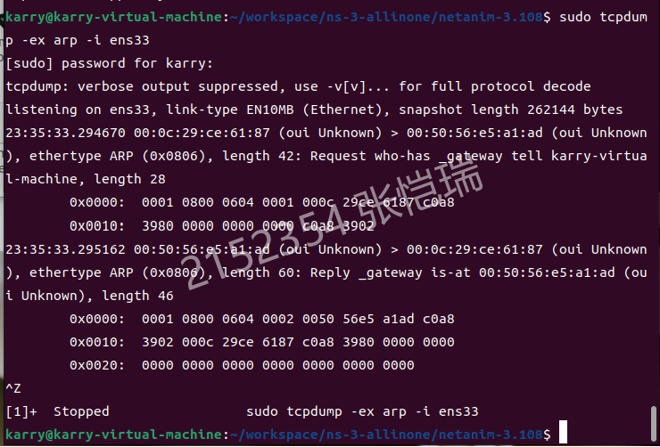

   接受到的ARP报文如上所示，我们可以对捕获到的ARP报文进行分析。ARP报文用于将网络层的IP地址解析为链路层的MAC地址。在这个特定的输出中，我们看到了两个ARP报文的捕获，一个是ARP请求，另一个是ARP响应。

   1. ARP请求：
      - 源MAC地址：00:0c:29:ce:61:87
      - 目标MAC地址：00:50:56:e5:a1:ad
      - ARP类型：请求（Request）
      - 请求信息：who-has gateway tell karry-virtual-machine
      - 请求者询问网关的MAC地址，并告知对方请求来自名为karry-virtual-machine的主机。
      - 请求者的IP地址（源IP）：(c0a8:3980) -> 192.168.57.128
      - 目标IP地址（网关）：(c0a8:3902) -> 192.168.57.2
   2. ARP响应：
      - 源MAC地址：00:50:56:e5:a1:ad
      - 目标MAC地址：00:0c:29:ce:61:87
      - ARP类型：回复（Reply）
      - 响应信息：gateway is-at 00:50:56:e5:a1:ad
      - 响应者告知网关的MAC地址就是00:50:56:e5:a1:ad。
      - 响应者的IP地址（网关IP）：(c0a8:3902) -> 192.168.57.2
      - 目标IP地址（请求者）：(c0a8:3980) -> 192.168.57.128

   解析这些信息，我们可以知道：

   - ARP请求是karry-virtual-machine（192.168.57.128）发出，询问网关（192.168.57.2）的MAC地址。
   - ARP响应是网关（192.168.57.2）发出，告诉karry-virtual-machine（192.168.57.128）它的MAC地址（00:50:56:e5:a1:ad）。

   这样的ARP通信是网络上主机进行通信之前的正常过程，用于确定主机或网关的物理硬件地址，以便可以在本地网络上进行数据包的正确路由。

<h3>[实验总结]</h3>

通过实验的步骤，我们成功模拟了ARP请求与响应的过程，并利用tcpdump工具监测并分析了交换的ARP数据包，从而达到了实验的预定目标。

其中，通过分析tcpdump工具捕获的数据包，我们得到以下几点结论：

1. ARP请求由请求主机发出，目的是查询局域网网关的MAC地址。
2. ARP响应由网关返回，向请求主机提供了其MAC地址。

这两个过程展示了ARP在实际网络中的功能和重要性——将逻辑地址（IP地址）映射到物理地址（MAC地址），确保了网络数据包能够在局域网中被正确地传递到目的地。

本次实验不仅加深了对ARP工作机制的理解，也提高了我们使用网络监测工具分析协议流程的能力。通过这些实验操作，我们能够更好地理解网络数据的传输过程以及网络故障的排查方法。

## 21. IP数据包分析实验

<h3>[实验时间]</h3>

2023.12.20 第十五周周三7-8节

<h3>[实验目标]</h3>

了解 IP 协议的原理以及分析 IP 报文

<h3>[实验原理]</h3>

1. **IP 数据报文格式总览** 

IP 协议提供不可靠无连接的数据报传输服务，IP 层提供的服务是通过 IP 层对数据报的封装与拆封来实现的。IP 数据报的格式分为报头区和数据区两大部分，

其中报头区是为了正确传输高层数据而加的各种控制信息，数据区包括高层协议需要传输的数据。

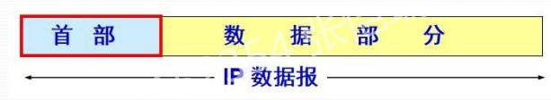

格式总览 ：一个 IP 数据报由首部和数据两部分组成。

2. **头部**

头部的前一部分是固定长度，共 20 字节，是所有 IP 数据报必须具有的。在首部的固定部分的后面是一些可选字段，其长度是可变的。

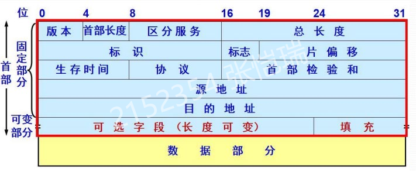

3. **IP 数据报首部的固定部分中的各字段** 

**版本**——占 4 位，指 IP 协议的版本。目前的 IP 协议版本号为 4 (即 IPv4)。

首部长度——占 4 位，可表示的最大数值是 15 个单位(一个单位为 4 字节)，因此 IP 的首部长度的最大值是 60。

区分服务——占 8 位

总长度——占 16 位，指首部和数据之和的长度，单位为字节，因此数据报的最大长度为 65535 字节。总长度必须不超过最大传送单元 MTU。

标识(identification) ——占 16 位，它是一个计数器，用来产生 IP 数据报的标识。

标志(flag)——占 3 位，目前只有前两位有意义。标志字段的最低位是 **MF (Moreragment)**。MF= 1 表示后面“还有分片”。MF = 0 表示最后一个分片。标志字段中间的一位是 **DF (Don’t Fragment)。**只有当 DF = 0 时才允许分片。

片偏移——占 13 位，指出：较长的分组在分片后某片在原分组中的相对位置。片偏移以 8 个字节为偏移单位。

生存时间——占 8 位，记为 TTL (Time To Live)，指示数据报在网络中可通过的路由器数的最大值。

协议——占 8 位，指出此数据报携带的数据使用何种协议，以便目的主机的 IP 层将数据部分上交给那个处理过程。

首部检验和——占 16 位，只检验数据报的首部，不检验数据部分。

源地址和目的地址都各占 4 字节。

IP 首部的可变部分就是一个选项字段，用来支持排错、测量以及安全等措施，内容很丰富。选项字段的长度可变，从 1 个字节到 40 个字节不等，取决于所选择的项目。

4. IP数据报上传协议对照表

   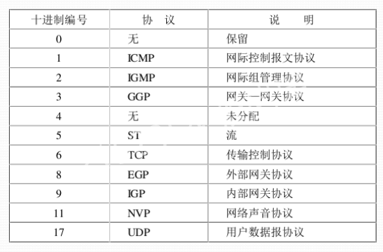

<h3>[实验设备]</h3>

Ubuntu22.04 与 ns3.37、NetAnim3.108，Win11主机

<h3>[实验步骤]</h3>

1. 查看Win11主机的IPv4地址，用于IP数据报的收发测试。
   

   成功获取到本机的IP地址：100.80.177.154

2. 打开虚拟机，用 Terminal 打开至文件夹/ns-3-allinone/ns-3.37

3. 检查设备的连通性：命令行中输入ping 100.80.177.154
   

   我们可以看见数据成功收发，没有丢包，设备连通性良好。

4. 与此同时，用 Terminal 打开至文件夹/ns-3-allinone/netanim-3.108

5. 输入sudo tcpdump -ex ip -i ens33进行网络抓包：

   其中：

   - `sudo`: 运行命令时提供管理员权限，因为监听网络接口通常需要更高的权限。
   - `tcpdump`: 调用`tcpdump`程序。
   - `-ex`: 在输出中显示链路层头信息，和显示数据包内容的十六进制形式。
   - `ip`: 表示仅抓取IP层及以上数据包的信息。
   - `-i ens33`: 指定监听的网络接口为`ens33`。

6. 观察并分析抓包获取到的信息：
   

   其中的部分IP数据报如上所示，我们可以尝试对其进行分析以进一步理解IP数据报的结构：

   ```
   16:13:17.562877 - 时间戳，表示数据包被捕获的时间。
   00:0c:29:ce:61:87 - 源 MAC 地址，属于发送方的物理地址。
   00:50:56:e5:a1:ad - 目的 MAC 地址，属于接收方的物理地址。
   ethertype IPv4 (0x0800) - 表示该帧是一个IPv4数据包。
   length 98 - 整个以太网帧的长度为98字节。
   karry-virtual-machine > 100.80.177.154 - 源主机名指向目的IP地址。
   ICMP echo request - 表示这是一个 ICMP 回显请求类型的数据包，通常用于ping操作。
   id 9, seq 5 - ICMP消息的标识符和序列号。
   length 64 - ICMP数据负载的长度为64字节。
   ```

   数据包的十六进制内容分析：

   - `4500` - IP版本号为4和首部长度（IHL），表示没有任何选项，长度为5*32=160位或20字节。
   - `0054` - IP数据包的总长度，84字节。
   - `174a` - 标识(Identification), 一个顺序号，用来标识数据包。
   - `4000` - 标志字段和片偏移，这里表示不分片。
   - `4001` - 寿命（TTL）为64，协议为ICMP（值为1）。后一个数据报中的`8001`表示TTL值为128
   - `134c` - 头部校验和。
   - `c0a8 3980` - 源IP地址（以十六进制表示），转化为十进制后为192.168.57.128。
   - `6450 b19a` - 目的IP地址（以十六进制表示），转化为十进制后为100.80.177.154。

   接下来是ICMP报文的具体内容：

   - `0800` - ICMP类型和代码，这里表示是回显请求(echo request)，用于ping。
   - `f780` - ICMP校验和。
   - `0009` - ICMP回显请求的标识符。
   - `0005` - ICMP回显请求的序列号。
   - 接下来的数据是ICMP数据载荷，通常是发送者指定的数据，这里以十六进制显示。

   数据包的内容显示这是一个标准的ICMP回显请求（ping），它被发送到100.80.177.154，并带有64字节的数据负载。后一个数据报的ICMP回显应答表明，100.80.177.154成功收到了之前发送的ping请求，并且发回了一个响应，确认通信是成功的。这通常是网络诊断中常见的ping操作的一部分。

<h3>[实验总结]</h3>

通过本次实验，我深入了解了IP协议的核心原理和IP数据报的分析方法。在实验的过程中，我首先复习了IP数据报文的结构，包括它的首部和数据部分，以及首部中每个字段的含义和作用。特别是，我对首部长度、总长度、标识、标志、片偏移、寿命(TTL)、协议和首部检验和等字段有了更加清晰的认识。

实验中，我使用`tcpdump`工具进行了实际的网络抓包操作，这让我有机会将理论知识应用于实际的网络数据分析中。观察到的ICMP回显请求和回显应答数据包，不仅加深了我对ICMP协议的理解，也帮助我实践了如何读取和解释网络数据包的十六进制表示。

结合课本上IP数据报的格式，我手动分析比对了IP数据报，此外，我也体验到了网络连通性测试的重要性，并且亲自实践了如何使用ping命令和网络抓包工具来诊断网络状态。

## 22. UDP用户数据报分析实验

<h3>[实验时间]</h3>

2023.12.20 第十五周周三7-8节

<h3>[实验目标]</h3>

了解 UDP 相关理论概念，了解了使用网络抓包工具抓取 UDP 数据包的方法以及分析数据包内容的方法。 

<h3>[实验原理]</h3>

1. **UDP 的概述**
   UDP 是传输层的协议，功能即为在 IP 的数据报服务之上增加了最基本的服务：复用和分用以及差错检测。 
   UDP 提供不可靠服务，具有 TCP 所没有的优势。
   UDP 无连接，时间上不存在建立连接需要的时延。空间和时间上都具有优势。 

2. **UDP 报文格式**

   **UDP 的首部格式：** 
   UDP 数据报分为首部和用户数据部分，整个 UDP 数据报作为 IP 数据报的数据部分封装在 IP 数据报中，UDP 数据报文结构如图所示： 
   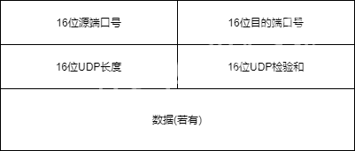
   UDP 首部有 8 个字节，由 4 个字段构成，每个字 段都是两个字节: 
   
   * 源端口： 源端口号，需要对方回信时选用，不需要时全部置 0。 
   * 目的端口：目的端口号，在终点交付报文的时候需要用到。 
   * 长度：UDP 的数据报的长度（包括首部和数据）其最小值为 8（只有首部）。 
   * 校验和：检测 UDP 数据报在传输中是否有错，有错则丢弃。该字段是可选的，当源主机不想计算校验和，则直接令该字段全为 0。 当传输层从 IP 层收到 UDP 数据报时，就根据首部中的目的端口，把 UDP 数据报通过相应的端口，上交给应用进程。 
   
   如果接收方 UDP 发现收到的报文中的目的端口号不正确（不存在对应端口号的应用进程 0），就丢弃该报文，并由 ICMP 发送“端口不可达”差错报文给对方。

<h3>[实验设备]</h3>

Ubuntu22.04 与 ns3.37、NetAnim3.108，Win11主机

<h3>[实验步骤]</h3>

1. 查看Win11主机的IPv4地址，用于UDP数据报的收发测试。
   

   成功获取到本机的IP地址：100.80.177.154

2. 打开虚拟机，用 Terminal 打开至文件夹/ns-3-allinone/ns-3.37

3. 检查设备的连通性：命令行中输入ping 100.80.177.154
   

   我们可以看见数据成功收发，没有丢包，设备连通性良好。

4. 用 Terminal 分别打开至文件夹/ns-3-allinone/netanim-3.108（接收端）和/ns-3-allinone/ns-3.37（发送端）

5. 发送端输入`echo "networklab12345">/dev/udp/100.80.177.154.5555`以发送UDP数据包：

   它会向指定的IP地址和端口（在这里是`100.80.177.154`的`5555`端口）发送一个UDP数据包。`echo`命令用于产生一串文本（"networklab12345"），然后通过重定向操作符（`>`），这串文本被发送到特殊的设备文件`/dev/udp/`，这是一个伪设备，用于在Linux系统中通过UDP发送数据。命令的效果是将字符串"networklab12345"封装成UDP数据包的数据部分，并发送到目的地。
   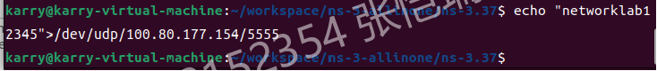

6. 接收端输入sudo tcpdump -xp -i ens33 udp port 5555 进行监听：

   这一命令以管理员权限（`sudo`）启动了`tcpdump`，并且使用了以下参数：

   - `-x`：以十六进制格式输出每个数据包的内容。
   - `-p`：禁用混杂模式，这意味着只捕获发往本机的数据包。
   - `-i ens33`：指定监听的网络接口为`ens33`。这通常是你的网络设备的标识，可以是物理或虚拟的。
   - `udp port 5555`：过滤表达式，指示`tcpdump`只捕获目的或源端口为`5555`的UDP数据包。

7. 观察并分析抓包获取到的信息：
   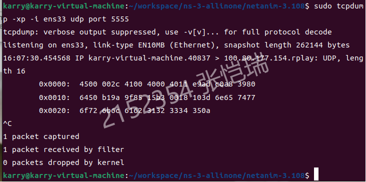

   接受到的UDP数据报如上所示，显示了捕获到的UDP数据包的信息。下面是对这个数据包的详细分析：

   **tcpdump输出行：**

   - `16:07:30.454568` - 数据包的时间戳，表示数据包被捕获的时间。
   - `Ip karry-virtual-machine.40837 > 100.80.177.154.rplay` - 表示这个UDP数据包是从名为`karry-virtual-machine`的主机的`40837`端口发送到IP地址为`100.80.177.154`的主机的`rplay`服务（端口号`5555`）。
   - `UDP` - 表示这是一个UDP数据包。
   - `length 16` - UDP数据包的数据（负载）长度是16字节。

   **十六进制内容：**

   - 第一行（0x0000）：
     - `4500` - IP版本号为4，首部长度为5个32位字（即20字节），无选项字段。
     - `002c` - IP数据报总长度为44字节（包括首部和数据）。
     - `4100` - 标识字段，用于数据包重组。
     - `4000` - 标志字段和片偏移，表示不分片。
     - `4011` - 寿命（TTL）为64，协议字段为17（代表UDP）。
     - `e9ad` - 首部校验和。
   - 第二行（0x0010）：
     - `c0a8 3980` - 源IP地址为`192.168.57.128`（十六进制转换为十进制）。
     - `6450 b19a` - 目的IP地址为`100.80.177.154`。
   - 第三行（0x0020）：
     - `9f85` - 源端口号为`40837`。
     - `15b3` - 目的端口号为`5555`（十六进制`15b3`转换为十进制）。
     - `0018` - UDP长度，包括8字节的UDP头部和16字节的数据。
     - `103d` - UDP校验和。
   - 第四行（0x0030）：
     - `6e65 7477 6f72 6b6c 6162 3132 3334 35` - 这是数据包的实际数据部分，表示为十六进制。当转换为ASCII表示时，它对应`networklab12345`，这与发送命令中的字符串一致。
     - `0a` - ASCII码中的换行符（`\n`），这可能是由于`echo`命令在输出时默认添加了换行符。

   通过分析比较UDP数据报结构与这个数据包的内容，我们可以得知其中的信息：从源IP`192.168.57.128`的端口`40837`发送到目的IP`100.80.177.154`的端口`5555`；数据负载是字符串"networklab12345\n"；UDP数据包被正确捕获，并未丢失任何内容。

<h3>[实验总结]</h3>

在这次的UDP用户数据报分析实验中，我不仅加深了对UDP协议理论的理解，还通过实际操作增强了我对网络抓包工具的熟悉度，以及分析网络数据包的实践技能。

首先，我复习了UDP的基础概念和UDP数据报的基本结构，实验中，我使用了`echo`命令和特殊文件`/dev/udp/`来简单而直接地发送UDP数据包。在实验的接收端，我利用`tcpdump`工具对UDP数据包进行了捕获和分析。通过设置相应的过滤器，我能够专注于特定端口的数据流，从而减少了无关信息的干扰。在对捕获到的数据包进行十六进制分析时，我逐步解读了各个部分的含义，如IP头部、源目的地址、端口号以及数据内容，这个过程极大地提升了我的分析能力。

## 23. 自主虚拟实验团队项目

### 1）个人阅读文献

<h1>Symbolic Distillation for Learned TCP Congestion Control</h1>

> 论文网址：http://arxiv.org/abs/2210.16987

<h2>一、论文研究内容</h2>

本文提出了一种新颖的拥塞控制算法——基于符号蒸馏的TCP拥塞控制(SymbolicPCC)，它结合了先进的深度强化学习(RL)方法和符号回归技术来优化TCP拥塞控制决策。该方法首先通过深度RL训练一个神经网络代理来学习拥塞控制策略，然后使用符号回归将复杂的神经网络策略转化为简单、直观和易于实施的符号规则。这样的转换不仅提高了策略的可解释性，还保留了RL方法的性能，同时大大减少了计算资源的需求。

<h2>二、算法简介</h2>

SymbolicPCC通过一个两阶段过程实现：第一阶段利用深度RL训练神经网络代理；第二阶段将训练得到的策略通过符号回归转化为一个轻量级的符号规则树。这种转换过程涉及到识别和聚合网络条件下的多个符号PCC代理策略，并通过轻量级分类算法“分支决定器”在部署时选择最合适的策略。算法能够在不同网络条件下自适应地调整发送速率，以提高网络性能。

论文提出的SymbolicPCC算法是一个结合深度强化学习 DRL 和符号回归 SR 的创新方法，用于改善 TCP 的拥塞控制。算法的核心思想是通过学习和提炼过程，将复杂的、通常难以解释的神经网络决策映射到一个简单、直观的符号表达式，从而实现高效和可解释的拥塞控制策略。

**深度强化学习（DRL）：** 
	在深度强化学习阶段，算法使用神经网络作为代理来学习如何基于网络的当前状态进行决策。这些状态可能包括网络的延迟、丢包率、吞吐量等等。神经网络代理尝试通过探索和利用过程来寻找最优的行动策略，即它学习在何时增加或减少数据的传输速度来最大化网络的效率和公平性。

**符号回归（SR）：**
	当神经网络代理训练完成并能有效控制网络拥塞后，进入符号回归阶段。在这一阶段，算法尝试将神经网络的决策逻辑抽象化成为符号规则，比如数学公式。这些符号规则用简单的数学表达式来描述决策逻辑，使得人们可以更容易地理解和验证网络决策的合理性。

**两阶段过程详解：**

1. **训练阶段** - 使用DRL环境训练一个深度神经网络（称为“教师”代理），使其学习如何根据网络状态来优化TCP的发送速率。这个过程涉及大量的试验和错误，以及对网络状态的仔细监控。

2. **提炼阶段** - 将训练好的深度神经网络的策略转化为更简单的符号规则（称为“学生”代理）。这是通过符号回归技术实现的，它搜索可能的数学表达式来最好地近似神经网络的行为。产生的符号规则是一棵决策树，其中包含了逻辑判断和操作节点，易于理解并且计算成本低。

**算法特点和优势：**

- **可解释性：** 符号规则相比于神经网络更容易被人类理解，提供了更好的透明度和可解释性。
- **轻量级：** 符号决策树使用的资源比复杂的神经网络少，这意味着在资源受限的环境中（如内置于路由器的拥塞控制算法）也能运行。
- **自适应性：** 通过符号分支算法，算法能够自适应不同的网络条件，实现更加个性化的拥塞控制决策。

SymbolicPCC算法通过深度学习找到了有效的拥塞控制策略，然后通过符号回归将这些策略转换为易于理解和部署的形式，综合来看是一种结合了深度学习的强大性能和符号表达的简明性的创新。

<h2>三、应用场景</h2>

本文的方法适用于需要TCP拥塞控制的所有场景，特别是在网络条件动态变化的环境中。例如，可以应用于流媒体视频、VoIP、VR/AR游戏和物联网设备等依赖TCP的网络服务中，以提高数据传输的效率和稳定性。

<h2>四、仿真拓扑结构及相关参数</h2>

论文中通过在Mininet网络仿真器上进行仿真实验来验证算法的性能，仿真环境包括不同带宽、延迟、队列大小和随机损失率的网络条件。论文还针对具有动态变化带宽的网络进行了实验，以测试算法对网络动态变化的适应能力。

以下是仿真拓扑结构和相关参数的详细信息：

**拓扑结构：**

- 使用了一个简单的网络拓扑，其中包括一个发送方和一个接收方，这两者通过一个网络链路相连。
- 链路上设有一定的队列大小，以模拟现实世界中的路由器或交换机在处理高速数据流时的队列情况。

**网络参数设置：**

- **带宽：** 实验设置了多个带宽情况，例如在动态条件模拟中，带宽交替在20 Mbps和40 Mbps之间变化，每5秒钟进行一次切换。
- **延迟：** 网络延迟固定设置为30毫秒，模拟中等距离网络的通信延时。
- **队列大小：** 仿真实验中使用了1000个数据包大小的队列，这是典型的中型队列长度，用来模拟不同程度的网络拥塞。
- **损失率：** 在一些情况下设置了随机损失率，比如1%的数据包被随机丢弃，以模拟非拥塞相关的数据包丢失。

**测试场景：**

- **有损耗网络条件：** 用于测试在存在随机丢包时代理的性能。这种测试帮助评估算法是否能够区分由于网络拥塞造成的数据包丢失和随机的丢包事件。
- **网络动态变化条件：** 用于测试当网络带宽动态变化时代理的反应能力。这种测试环境模拟了如流量高峰期间网络带宽的波动。

**性能评估指标：**

- **吞吐量：** 衡量发送方成功将多少数据传输到接收方。
- **链路利用率和网络敏感性：** 计算实际吞吐量与链路可用带宽的比率，理想情况是100%利用率，表示代理完全利用了可用的带宽。
- **速度：**算法做出决策和调整的快慢，即响应网络变化的迅速性。
- **均方误差（MSE）：** 用于衡量代理策略的实际吞吐量与理想吞吐量之间的差距。MSE越低，表明代理的性能越接近理想状态。

这些参数的设置允许评估SymbolicPCC在各种网络条件下的性能，包括其对网络环境变化的适应性、效率和准确性。通过这些详细的仿真实验，论文展示了SymbolicPCC相对于传统方法和其他RL方法的优越性能。例如，评估一个算法在处理高带宽、高延迟或高损失率环境下的有效性和适应性。论文通过这些指标的表现，展示了其提出算法的优越性能，特别是在动态和有损网络条件下的适应能力。

<h2>五、论文实验结论</h2>

实验结果表明，SymbolicPCC在多种网络条件下均展现出高性能，与传统TCP拥塞控制算法相比具有更低的均方误差，且对随机损失的鲁棒性更强。此外，与基于神经网络的深度RL方法例如Aurora相比，SymbolicPCC具有更快的运行速度和更低的资源需求，同时保持了相似或更优的性能。通过将神经网络策略转化为符号规则，论文证明了可以在不牺牲性能的前提下，提高TCP拥塞控制算法的效率和可解释性。

### 2）团队实验报告

<h1>NS3模拟针对复杂多环网络拓扑的路由改进算法</h1>

| 姓名   | 学号    | 分工                                                         |
| ------ | ------- | ------------------------------------------------------------ |
| 陈雨彤 | 2153677 | 建立使用P2P连接的多环网络拓扑(调用 NS3 模块构建拓扑);<br />生成随机拓扑的算法(输入拓扑所含环数、环中节点数、环中通信节点数);文档撰写； |
| 张恺瑞 | 2152354 | Dijkstra算法实现；对比实验与结果记录；文档撰写；             |
| 宓田田 | 2151214 | PRR算法实现；文档撰写；                                      |
| 田鑫阳 | 2150618 | 算法整合对比；拓扑生成与模拟传包；                           |

<h2>一、实验目的</h2>

通过实现基于论文的计算复杂多环网络拓扑结构转化的路由改进 PRR 算法，本实验的主要目的是：

1. 深入理解并应用新型路由算法，提高多环网络中的数据传输效率；
2. 掌握 NS3 网络仿真模拟器的搭建环境、搭建配置以及基本使用，为进一步的仿真实验打下基础；
3. 利用 NS3 仿真软件，成功实现复杂多环网络拓扑结构的仿真；
4. 通过对比两种不同路由算法（Dijkstra 算法、PRR 算法），评估它们在生成路由方面的性能，为网络设计和优化提供实证数据。

这一系列实验旨在深化对网络仿真和路由算法的理解，为网络通信性能的提升提供实用的数据支持。

<h2>二、实验设备</h2>

一台配备 Ubuntu 22.04 操作系统环境，已安装 NS3-3.37 网络仿真工具和 NetAnim 动画演示工具的计算机。

<h2>三、实验背景</h2>

随着网络技术的快速发展，网络运营商为用户提供的光纤接入主干网通常以环型网络的形式提供服务。这种环型网络在多个领域，如电力、电信和有线电视等，提供了良好的本地网络连接体验，并满足生存性和安全性的要求。然而，针对大规模、环数众多、连接方式多样化的复杂多环网络，目前缺乏性能优良的路由算法。传统环网结构存在传输效率低、延迟高的问题，而且在节点或链路发生故障时变得不可靠，可扩展性也较差。

为了解决传统环网结构的问题，本实验提出了一种针对复杂多环网络拓扑的路由改进算法，旨在将复杂路由问题转化为单环网中的简单路由问题，从而提高传输效率和降低延迟。通过设计源溯节点还原以及路径还原算法，将单一环网改进为增强环网网络结构，有效解决了传统环网结构的局限性。

<h2>四、实验原理</h2>

本实验的核心原理是利用增强环网结构模型来改进复杂多环网络的路由问题。具体而言，实验包含以下关键步骤：

1. 增强环网结构模型： 构建了多种增强环网结构模型，定义了它们的增强原子操作，并详细阐述了由增强环网结构衍生的复杂多环网络的定义和操作。这包括弦环网、边缘互连多环网和分层环网等。
2. 多环网络拓扑： 分析了多环网络拓扑的特点，包括环共享节点、环连接方式的复杂性，以及通信节点的定义。特别地，将网络中的节点划分为通信节点和环内节点。
3. 路由改进算法（PRR算法）： 在分析多环网络拓扑特点的基础上，提出了针对该网络的路由改进算法，即PRR算法。该算法通过预处理、节点恢复和路径恢复等关键步骤，将复杂多环网络的路由问题转化为单环网中的简单路由问题。
4. 实验结果分析： 通过实验结果表明，相比于现有的优化 Dijkstra 算法，PRR算法在搜索空间上提升了约13%，具有更好的改进效果。此外，算法运行时间缩短了79%，更适合复杂多环网络的路由计算。

下面进行详细阐述。

<h3>4.1 复杂多环网络拓扑</h3>

在增强环网结构中，多环网络扮演着重要的角色，并可在拓扑结构上分为三大类：（1）环共享节点，包括单节点和连续的多节点，被称为共享边；（2）桥连接环网，涵盖单桥和多桥；（3）多环混合连接。如下图 1 所示：

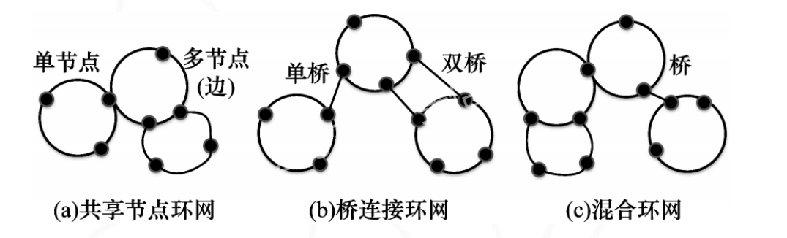

 <p style="text-align: center;">图 1 多环网络拓扑</p>

通信节点（Connected Node）指的是环与环之间共享的节点以及桥上的节点。而环内的其他节点，即不涉及与其他环交互和通信的节点，被称为非通信节点或环内节点。

在论文所研究的复杂多环网络拓扑中，“复杂”主要体现在两个方面。首先，网络中环与环的连接方式复杂，可能通过节点、边，或者通过桥来进行连接。其次，网络拓扑规模也呈现出一定的复杂性。这种多方面的复杂性使得我们需要深入研究和解决在复杂多环网络中的路由问题。

<h3>4.2 路由改进算法（PRR算法）</h3>

环网拓扑在搜索节点时每次都必须从当前节点沿着顺时针或逆时针遍历环 上的其余节点，直至遇到通信节点才可以进入下一个环中进行遍历，因此搜索空 间和时间往往会很大。PRR 算法的核心思想是“分而治之”，从原有的拓扑中识别通信节点并以其构建新的拓扑，在该拓扑中进行选路并执行还原算法以保证网络的不失真和结果的正确性。

<h4>4.2.1 预处理（Preprocessing）</h4>

预处理算法的目的是将整个网络拓扑图去“冗余”节点，简单来说就是将所有的通信节点抽离出来，为这些节点建立一个新预处理拓扑图𝐺 ′并缓存下来以便后续调用数据。

步骤如下：

 1）首先遍历所有环的节点的度数，如果节点的度数大于 2，那么可以认定其为通信节点。将每个环的通信节点加入到通信节点集（𝐶𝑁(𝑖)( )→ 𝐶𝑁）；

 2）构建新的预处理拓扑图𝐺 ′，将通信节点集中的节点加入𝐺 ′，即𝐶𝑁 → 𝐺 ′

 3）对于同一环内的通信节点，两两节点构成边，计算他们之间的最短距离并将边加入到𝐺 ′

<h4>4.2.2 源溯节点还原（Recovering Nodes）</h4>

新的拓扑图𝐺 ′存在的问题是可能不包含请求中的源溯节点(𝑠,𝑡)，通过节点还原算法将原拓扑中的这部分节点和边信息还原到拓扑图𝐺 ′中，步骤如下：

 1）判断源溯节点(𝑠,𝑡)是否为通信节点，如果是则不需要下列步骤，否则执行下列操作；

2）遍历环内节点，寻找节点𝑠,𝑡所在的环。

3）计算节点𝑠,𝑡到所在环的所有通信节点的距离。并对他们到所在环的每一个通信节点构建边加入到新的拓扑图𝐺 ′。

<h4>4.2.3 路径还原（Recovering Path）</h4>

在预处理的拓扑中执行选路算法获得的路径为只包括通信节点源溯节点的路径，路径还原算法可以将同一环内通信节点间的路径还原为完整的最短路径。步骤如下：

 1）在拓扑图𝐺 ′中获得初步的路径𝑝𝑎𝑡ℎ，对𝑝𝑎𝑡ℎ中的所有的边的端节点和末节点判断是否为同一个环中的节点。若不同，则不执行操作；

 2）若该边的端节点和末节点属于同一个环中的节点，在该环中执行寻路算法，获得端节点到末节点的路径𝑝𝑎𝑡ℎ ′；

3）删除路径𝑝𝑎𝑡ℎ中的该边。在𝑝𝑎𝑡ℎ中从节点𝑝到𝑞添加𝑝𝑎𝑡ℎ ′； 

<h2>五、实验内容</h2>

<h3>5.1 实验思路</h3>

实验的整体思路是构建一个网络拓扑结构，并在该拓扑中运行一个基于UDP的客户端-服务器通信实验。

首先，根据给定的节点数量，创建一个节点容器，并生成相应数量的节点。接下来，根据提供的邻接表，创建节点之间的点对点连接。通过遍历邻接表，为每个节点的邻居节点创建一个节点容器，并记录每条边对应的节点索引，再为所有节点安装网络协议栈。随后设置数据传输速率和延迟，并为每条边安装点到点连接，为每条连接设置IP地址，并将IP地址分配给相应的接口。然后，配置服务器端和客户端应用程序。使用UDP服务器和UDP客户端帮助类安装应用程序，并设置相关属性，如最大数据包数、发送间隔和数据包大小。接着，填充路由表，使用IPv4全局路由帮助类填充节点的路由表。最后，通过启动仿真器进行仿真运行，并根据实验需求获取结果。整个实验旨在模拟基于UDP的客户端-服务器通信，并通过网络参数和应用程序的配置来评估和分析网络性能和通信行为。

<h3>5.2 实验流程</h3>

1. 拓扑结构准备：

   1.  根据实验目的和原理，确定多环网络的拓扑结构，为了合理设置复杂的网络拓扑结构，我们主要设置了环的数量`ringNum`、每个环上的节点数量`ringNodeNum`和通信节点数量`connectedNodeNum`三大参数。
   2.  使用MultiRingNet类生成多环网络，并进行预处理操作，确保图连通。调用`createGraph()`方法来生成多环网络和构建图，并确保图连通性。

2. 网络参数配置：

   1. 在代码中引入必要的NS-3网络模块来配置NS-3网络仿真环境。

   2. 设置日志输出级别和命令行参数解析。通过调用`LogComponentEnable()`方法设置日志组件的输出级别，通过`CommandLine`类解析命令行参数并设置实验的配置参数。

   3. 我们在代码中对网络参数进行了相应的配置：

      （1）节点数量（numNodes）：通过调用`NodeContainer`的`Create()`方法来创建节点容器，其中`numNodes`表示节点的数量。

      （2）数据传输速率（DataRate）和延迟（Delay）：通过创建`PointToPointHelper`对象`p2p`，并设置其设备属性和链路属性来配置点到点连接的数据传输速率和延迟。

      1. 数据传输速率设置为 1 Mbps：`p2p.SetDeviceAttribute("DataRate", StringValue("1Mbps"));`
      2. 延迟设置为 2ms：`p2p.SetChannelAttribute("Delay", StringValue("2ms"));`

      （3）IP地址和子网掩码设置：通过创建`Ipv4AddressHelper`对象`ipv4`，并使用`SetBase()`方法来设置IP地址和子网掩码的基础值，并使用`Assign()`方法为链路设置IP地址。

      （4）IP地址和子网掩码设置：`ipv4.SetBase(ipAddress.c_str(), subNetMask);`

      （5）应用层的配置：

      1. 服务器端应用程序配置：通过创建`UdpServerHelper`对象`echoServer`，并使用`Install()`方法为服务器端节点安装应用程序。
      2. 客户端应用程序配置：通过创建`UdpClientHelper`对象`echoClient`，并使用`Install()`方法为客户端节点安装应用程序。

      （6）客户端与服务端参数设置：

      1. 端口号设置：`uint16_t port = 9;`，表示应用层通信的端口号。
      2. 客户端应用程序的其他属性设置：`SetAttribute()`方法用于设置客户端应用程序的其他属性，如最大数据包数`MaxPackets`为1、发送间隔`Interval` 为 1.0s 、数据包大小`PacketSize` 为1024字节。

3. 路由路径算法设计：

   1. Dijkstra算法设计：
      1. 输入：多环网络图G、起点s、终点t
      2. 输出：从s到t的最短路径
      3. 步骤：
         - 初始化距离数组dist，将起点s到其他节点的距离初始化为无穷大，将起点s的距离初始化为0。
         - 创建一个优先队列Q，并将起点s加入队列。
         - 当队列不为空时：
           1. 从队列中取出距离最小的节点u。
           2. 遍历节点u的邻居节点v：
              - 计算从起点s经过节点u到达节点v的距离d。
              - 如果d小于节点v的当前距离dist[v]，则更新dist[v]为d，并将节点v加入队列。
         - 返回dist[t]作为从起点s到终点t的最短路径长度。
      4. 算法的伪代码如下所示：
      5. 
   2. MultiRingNet算法设计：
      1. 输入：多环网络图G、起点s、终点t
      2. 输出：从s到t的最短路径
      3. 步骤：
         - 初始化路径数组path，将起点s到其他节点的路径初始化为空路径。
         - 初始化标记数组visited，将起点s标记为已访问。
         - 创建一个栈S，并将起点s加入栈。
         - 当栈不为空时：
           1. 从栈顶取出节点u。
           2. 遍历节点u的邻居节点v：
              - 如果节点v未被访问，则将节点v标记为已访问，并将节点v加入栈。
              - 更新路径数组path[v]，将节点u加入路径数组path[v]的末尾。
         - 返回从起点s到终点t的路径path[t]作为最短路径。
      4. 算法的伪代码如下所示：
      5. 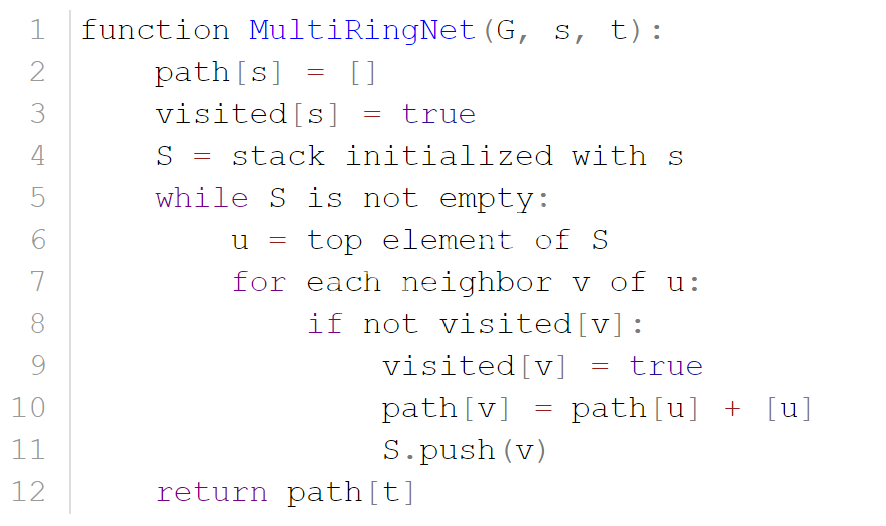

4. 执行实验：

   1. 在主函数中，创建节点容器和链路容器，以及设置节点之间的数据传输速率、延迟和丢包率等参数。通过调用`NodeContainer`类和`PointToPointHelper`类来创建节点和链路，并设置相应的属性
   2. 配置应用层，包括安装应用程序和设置应用程序的参数。使用`UdpEchoServerHelper`类和`UdpClientHelper`类来配置UDP Echo Server和UDP Echo Client应用程序。
   3. 运行网络仿真。通过调用`Simulator::Run()`来运行网络仿真，并调用`Simulator::Destroy()`来销毁仿真器。

5. 结果分析：

   1. 根据实验结果的输出，分析Dijkstra算法和MultiRingNet算法在不同网络拓扑和参数设置下的性能差异。比较Dijkstra算法和MultiRingNet算法的运行时间和生成路径的准确性。
   2. 使用NS-3提供的可视化工具NetAnim来展示拓扑结构和数据包传输路径。通过调用`AnimationInterface`类和`animate()`方法，将程序运行生成的.xml文件放入可视化工具来生成网络拓扑的动画。

<h2>六、实验结果与分析</h2>

<h3>6.1 两种路由算法的生成用时比较</h3>

  经过初步实验，两种算法均能找到最短路径，接下来在控制环数、环中通信节点数不变，改变环中节点数的条件下，比较两种算法的时间。可以看出随着环中节点数增加，Dijkstra算法处理批量业务的执行时间随着业务量的增加呈线性增长，而PRR算法随着业务量的增长，算法执行时间增长较为平稳与缓慢。

<p style="text-align: center;">图 2 不同业务规模下的实验结果</p>

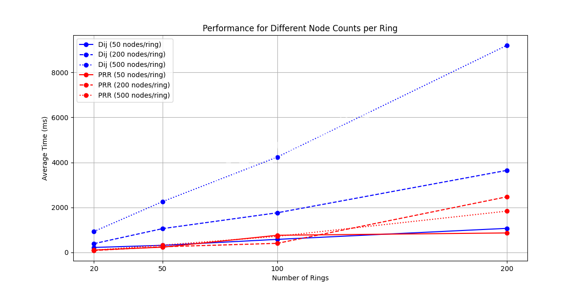

当环个数不变时，通信节点个数增加，原算法时间增加不显著甚至有减小，而 PRR 算法运行时间明显增加。出现这种结果的主要原因是通信节点个数增加后，环与环之间连通性增强了，节点到节点间路径更短了，因此原算法运行时间减少，而改进算法由于通信节点的增加，构建新拓扑图复杂度则提升。

<p style="text-align: center;">表 1 不同参数下的实验结果</p>


<p style="text-align: center;">图 3 不同参数下的实验结果</p>

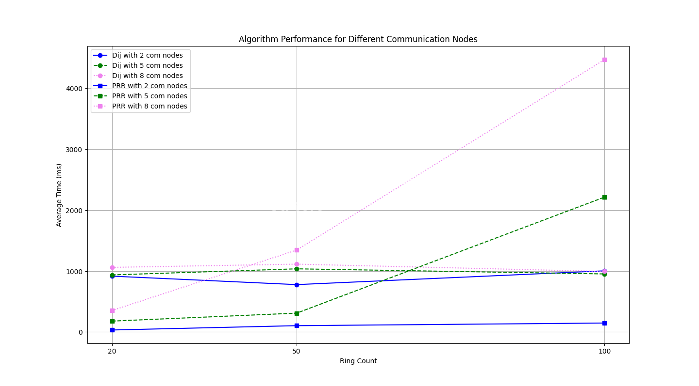

于是我们可以令 *ρ* = 通信节点个数/环个数，从表2的实验数据对比可发现，在一定程度内，随着 *ρ* 的不断增加，PRR 算法效果表现得越好。*ρ* 也可以理解为每个环与其他环连接的个数占所有环个数比。所以，当 *ρ* 较大时，环与环之间的连接较为复杂，每个环可连接的环增加，而 PRR 算法简化了此步的搜索。但并不是 *ρ* 越大，实验效果越好，因为环与环之间连通性太高，可能导致节点与节点间路径大幅减小，效果不明显。

<p style="text-align: center;">表 2 不同ρ值（通信节点个数/环个数）下的实验结果</p>

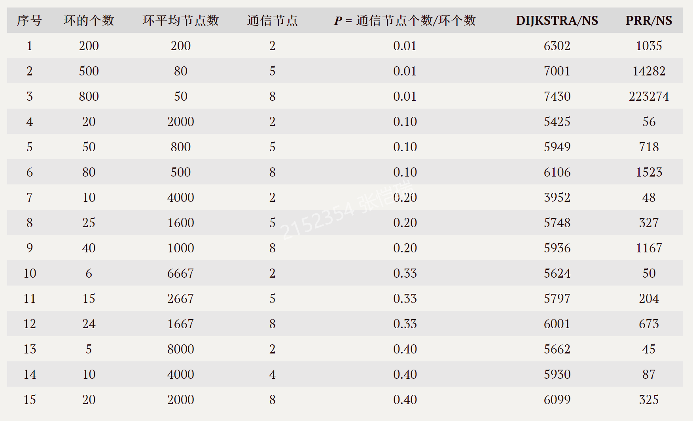

我们对不同规模下的两种路由选择算法的算法运行时间进行了统计并计算每组条件下的平均值，实验结果如表3所示。当环个数固定，随着每个环中节点个数增加，PRR 算法的表现越来越优于原算法；而当每个环中节点个数一定时，随着环个数增加，PRR 算法的表现也更加优良。

<p style="text-align: center;">表 3 不同规模下实验结果</p>

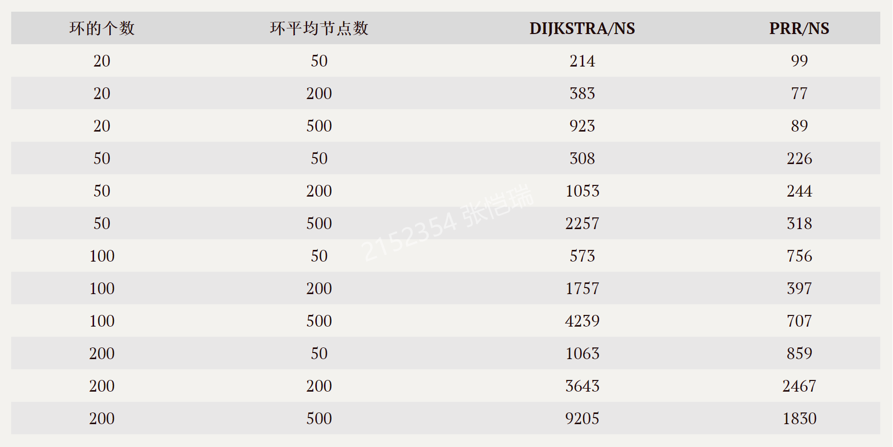

以上结论是基于较为复杂的网络拓扑结构的环境中的测试得出的，路径的起点和终点需跨多个环，从编号0的起始节点跨越到最大编号的终止节点，不涉及各节点到除自身以外的其他节点的最短路径的计算，因此不能全面反映出网络拓扑结构中每一个路由器计算其路由表的代价。

由上述缺陷，我们设计了更加全面的测试以观察PRR算法在整体网络中的性能表现，计算了不同网络拓扑结构下所有节点到其他各节点的时间累加和，如表 4 所示。

<p style="text-align: center;">表 4 不同规模下复杂多环网络的路由表计算时间和</p>

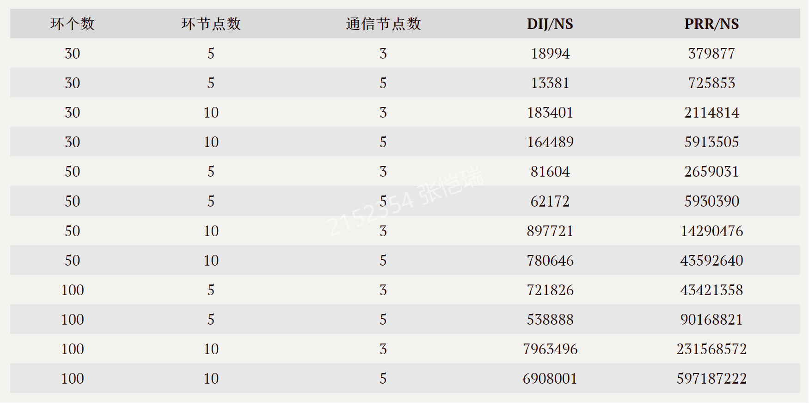

整体上看，为了使用路由路径算法计算出每个路由器的路由表，我们需要考虑每个点寻找到其他各个节点的最短路径的时间，因此我们测试了PRR和Dijkstra算法的整体路由计算时间，如上表所示，可以看出，PRR的整体时间上是不优于Dijkstra算法的，PRR算法在某个节点到拓扑网络中的某些节点的速度可能比Dijkstra算法更快，但在计算如邻近自己的结点等情况下，算法时间代价大，因此它可以给出我们的启示是，我们可以在特殊情况下进行路由算法替换以加速整体的路由计算速度。

如图3所示，环个数为30，环节点数为5，环通信节点为3的网络拓扑图中，从位于同一环内的83节点到123节点，使用Dijkstra算法只需要大约58ns，而PRR算法因为需要预处理，因此算法执行总时间约为298ns，因此尽管有较为复杂的拓扑图，但图中不是所有点对点的路径都需要跨越复杂多环结构，对邻近环或同环结点而言，如果使用预处理程序来计算路由，时间代价仍然非常大。因此PRR算法在复杂多环的网络拓扑中具有一定的优越性，但不适用于广泛计算并更新所有路由表的场合。

<p style="text-align: center;">图 3 复杂多环网络拓扑</p>

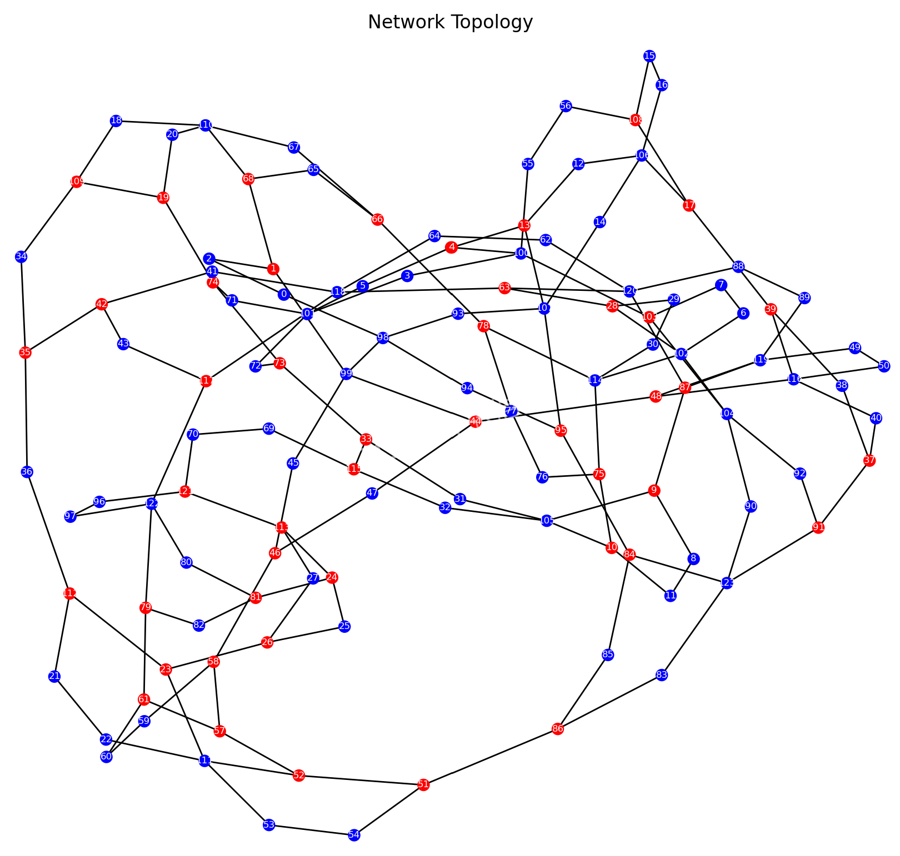

<h3>6.2 拓扑生成与模拟传包</h3>

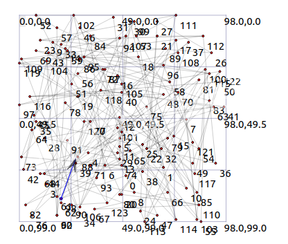

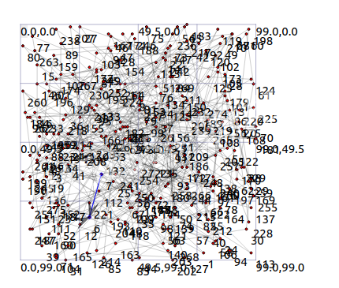

经过路径比对，传包路径正确。

### 3）虚拟实验代码

```c++
#include "ns3/core-module.h"
#include "ns3/network-module.h"
#include "ns3/internet-module.h"
#include "ns3/point-to-point-module.h"
#include "ns3/applications-module.h"
#include "ns3/netanim-module.h"

// #include "../rawAlgos/MultiRingNet.h"
#include <vector>
#include <list>
#include <chrono>
using namespace std;
using namespace ns3;

NS_LOG_COMPONENT_DEFINE("TestExample"); // 指定日志的组件名称

/* MultiRingNet类
- 功能：生成一个多环网络，其中包含若干个环，每个环上有若干个节点，每个环上有若干个通信节点，每个通信节点可以与其他环上的通信节点相连，也可以与其他环上的非通信节点相连，但是不能与本环上的非通信节点相连。
*/
class MultiRingNet

{
public:
    MultiRingNet(int r, int rn, int cn) : ringNum(r), ringNodeNum(rn), connectedNodeNum(cn) {}
    // 构造函数，初始化ringNum、ringNodeNum、connectedNodeNum
    // 参数：r：环的数量；rn：每个环上的节点数量；cn：每个环上的通信节点数量

    // dijkstra算法
    // 参数：start：起点；end：终点
    vector<int> dijkstra(int start, int end)
    {
        vector<int> dis(graph.size(), INT_MAX); // 距离
        vector<int> parent(graph.size(), -1);   // 父节点
        priority_queue<pair<int, int>, vector<pair<int, int>>, greater<pair<int, int>>> q;

        dis[start] = 0;
        q.push({0, start}); // 使用0作为起点的距离，并将其推入队列

        while (!q.empty())
        {
            int u = q.top().second;
            q.pop();

            if (u == end)
                break; // 如果已经达到终点，退出循环

            for (auto v : graph[u])
            {
                if (dis[u] + 1 < dis[v]) // 所有边的权重都设置为1
                {
                    dis[v] = dis[u] + 1;
                    parent[v] = u;
                    q.push({dis[v], v}); // 更新队列中的距离
                }
            }
        }

        if (dis[end] == INT_MAX)
            return {}; // 如果终点的距离仍然是INT_MAX，表示没有路径

        vector<int> path;
        for (int at = end; at != -1; at = parent[at])
        {
            path.push_back(at);
        }
        reverse(path.begin(), path.end()); // 反转路径以获得正确的顺序
        return path;
    };
    // 测试路径的最短性可能需要其他方法或者预先计算的最短路径来对比。

    NS_LOG_UNCOND("Dijkstra path is valid.");
    cout << "Dijkstra path is valid." << endl;
    return true;
}

void
createNet();        // 生成一个多环网络
void createGraph(); // 生成一个多环网络的图
// 生成一个环
void createRing(int &nodeNum, list<pair<int, int>> &bridgeNodes, list<pair<int, int>> &sharedNodes, int bridgeNum = -1);
// 将环连接起来
void linkNodes(int &nodeNum, list<pair<int, int>> &bridgeNodes, list<pair<int, int>> &sharedNodes);
void addEdges();                                             // 将环和桥接节点连接起来
void addEdge(int a, int b);                                  // 将a和b连接起来
bool isConnected();                                          // 判断图是否连通
void visit(int k, vector<bool> &isVisited);                  // 判断图是否连通
void preprocessing();                                        // 预处理
void recoveringNodes(int start, int end);                    // 恢复节点
void addRecoveringNode(int node);                            // 添加恢复节点
void addConnectedEdge(int a, int b, int dis, int ring);      // 添加通信边
vector<pair<int, int>> getOrignalPath(int start, int end);   // 获取原始路径
vector<int> recoverPath(vector<pair<int, int>> orignalPath); // 恢复路径
vector<int> getPath(int start, int end);                     // 获取路径
void print();                                                // 打印路径
vector<vector<int>> getGraph()                               // 获取图
{
    return this->graph;
}

private:
vector<vector<int>> graph;          // 图的邻接表
vector<vector<int>> rings;          // 环的节点列表
vector<pair<int, int>> bridges;     // 桥接节点列表
vector<int> connectedNodes;         // 通信节点列表
vector<vector<int>> connectedEdges; // 通信边列表
int ringNum;                        // 环的数量
int ringNodeNum;                    // 每个环上的节点数量
int connectedNodeNum;               // 每个环上的通信节点数量
}
;

// 主函数
int main(int argc, char *argv[])
{
    Time::SetResolution(Time::NS);

    bool verbose = true;
    // uint32_t numNodes = 6;
    int ringNum = 30;
    int ringNodeNum = 5;
    int connectedNodeNum = 3;

    CommandLine cmd;

    cmd.Usage("This project aims to simulate the shortest path routing algorithm in a multi-ring system.");
    cmd.AddValue("r", "Ring number in the generated graph", ringNum);
    cmd.AddValue("rn", "Node number in the generated graph", ringNodeNum);
    cmd.AddValue("cn", "Communication node number in the generated graph", connectedNodeNum);

    cmd.Parse(argc, argv);

    MultiRingNet test(ringNum, ringNodeNum, connectedNodeNum);
    test.createGraph();

    test.preprocessing();

    // 命令行对象
    auto adjTable = test.getGraph();

    // 输出邻接表到控制台
    /*
    for (int i = 0; i < static_cast<int>(adjTable.size()); ++i) {
        cout << "Node " << i << " is connected to: ";
        for (int j = 0; j < static_cast<int>(adjTable[i].size()); ++j) {
            cout << adjTable[i][j] << " ";
        }
        cout << endl;
    }
    */
    // ... 测试Dijkstra算法是否有效的代码 ...
    // 假设要测试从节点0到最后一个节点的路径
    vector<int> dijkstraPath = test.dijkstra(0, test.getGraph().size() - 1);
    // 测试Dijkstra算法的输出
    bool isPathValid = test.testDijkstra(test.getGraph(), dijkstraPath);
    NS_LOG_UNCOND("Is Dijkstra path valid? " << (isPathValid ? "Yes" : "No"));
    cout << "Is Dijkstra path valid? " << (isPathValid ? "Yes" : "No") << endl;

    // 记录 MultiRingNet 算法开始时间
    auto start = std::chrono::high_resolution_clock::now();

    vector<int> path = test.getPath(0, test.getGraph().size() - 1);

    // 记录 MultiRingNet 算法结束时间
    auto end = std::chrono::high_resolution_clock::now();

    // 计算并输出 MultiRingNet 算法的运行时间
    auto duration = std::chrono::duration_castautolinkstd::chrono::microsecondsautolink(end - start).count();
    cout << "Multi ring algo time: " << duration << "ns" << endl;

    // 记录 Dijkstra 算法开始时间
    start = std::chrono::high_resolution_clock::now();

    vector<int> djkstPath = test.dijkstra(0, test.getGraph().size() - 1);

    // 记录 Dijkstra 算法结束时间
    end = std::chrono::high_resolution_clock::now();

    // 计算并输出 Dijkstra 算法的运行时间
    duration = std::chrono::duration_castautolinkstd::chrono::microsecondsautolink(end - start).count();
    cout << "Dijkstra algo time: " << duration << "ns" << endl;

    // 输出 MultiRingNet 算法找到的路径
    cout << "MultiRingNet Path: ";
    for (long long node : path)
    {
        cout << node << " ";
    }
    cout << endl;

    // 输出 Dijkstra 算法找到的路径
    cout << ;
    for (unsigned long long node : dijkstraPath)
    {
        cout << node << " ";
    }
    cout << endl;

    cout << endl;
    auto numNodes = adjTable.size();
    if (verbose)
    {
        LogComponentEnable("UdpEchoClientApplication", LOG_LEVEL_INFO);

        LogComponentEnable("UdpEchoServerApplication", LOG_LEVEL_INFO);

        LogComponentEnable("TestExample", LOG_LEVEL_INFO);

        LogComponentEnable("PacketSink", LOG_LEVEL_ALL);
    }

    // 生成六个节点

    NodeContainer nodes;

    nodes.Create(numNodes);

    // 生成一个NodeContainer;
    vector<vector<int>> neighbour = adjTable;

    vector<NodeContainer> nodeContainers;

    // Todo: add a map
    // 建立拓扑的各边节点组合，n1n2n3n4构成环

    map<vector<int>, int> edge2NodeIdx;
    for (int i = 0; i < int(neighbour.size()); i++)
    {

        for (int j = 0; j < int(neighbour[i].size()); j++)
        {

            nodeContainers.push_back(NodeContainer(nodes.Get(i), nodes.Get(neighbour[i][j])));

            edge2NodeIdx[{i, neighbour[i][j]}] = nodeContainers.size() - 1;
            // cout << i << ' ' << neighbour[i][j] << '\n';
        }
    }

    // 为所有节点安装协议栈

    InternetStackHelper internet;

    internet.SetIpv6StackInstall(false);
    internet.Install(nodes);

    // 配置点到点连接
    PointToPointHelper p2p;
    p2p.SetDeviceAttribute("DataRate", StringValue("1Mbps")); // 网卡最大速率
    p2p.SetChannelAttribute("Delay", StringValue("2ms"));

    // 为链路安装点到点连接

    NetDeviceContainer nets;

    vector<NetDeviceContainer> edges;

    for (auto nodeContainer : nodeContainers)
    {

        edges.push_back(p2p.Install(nodeContainer));
    }

    // 为链路设置ip地址

    Ipv4AddressHelper ipv4;

    auto subNetMask = "255.255.255.0";

    vector<Ipv4InterfaceContainer> interfaceContainers;
    for (int i = 0; i < int(edges.size()); i++)
    {
        string ipAddress;

        ipAddress = "10." + to_string((i % (256 * 256)) / 256) + "." + to_string((i % (256 * 256)) % 256) + ".0";
        // cout << ipAddress << endl;
        ipv4.SetBase(ipAddress.c_str(), subNetMask);

        auto interfaceContainer = ipv4.Assign(edges[i]);

        interfaceContainers.push_back(interfaceContainer);
    }

    // 配置应用层

    uint16_t port = 9;

    UdpServerHelper echoServer(port);

    ApplicationContainer serverApps = echoServer.Install(nodes.Get(path[1]));
    for (int i = 2; i < int(path.size()); i++)
    {
        serverApps.Add(echoServer.Install(nodes.Get(path[i])));
    }

    serverApps.Start(Seconds(1.0));

    serverApps.Stop(Seconds(path.size()));

    vector<UdpClientHelper> echoClients;

    for (int i = 0; i < int(path.size()) - 1; i++)
    {

        auto nodeIdx = edge2NodeIdx[{path[i], path[i + 1]}];
        auto echoClient = UdpClientHelper(interfaceContainers[nodeIdx].GetAddress(1), port);
        echoClient.SetAttribute("MaxPackets", UintegerValue(1));
        echoClient.SetAttribute("Interval", TimeValue(Seconds(1.0)));
        echoClient.SetAttribute("PacketSize", UintegerValue(1024));

        ApplicationContainer clientApp = echoClient.Install(nodes.Get(path[i]));
        clientApp.Start(Seconds(i + 2));
        clientApp.Stop(Seconds(i + 3));
        echoClients.push_back(echoClient);
    }

    Ipv4GlobalRoutingHelper::PopulateRoutingTables();

    AnimationInterface anim("Dij.xml"); // 初始化，
    
    Simulator::Run();

    Simulator::Destroy();

    return 0;
}

void MultiRingNet::createGraph()
{
    while (!isConnected())
    {
        // srand(static_cast<unsigned int>(time(0)));
        int nodeNum = 0;
        rings.clear();
        bridges.clear();
        list<pair<int, int>> bridgeNodes, sharedNodes;
        for (int i = 1; i < ringNum; ++i)
        {
            createRing(nodeNum, bridgeNodes, sharedNodes);
        }
        linkNodes(nodeNum, bridgeNodes, sharedNodes);
        graph = vector<vector<int>>(nodeNum);
        addEdges();
    }
    preprocessing();
}

void MultiRingNet::createRing(int &nodeNum, list<pair<int, int>> &bridgeNodes, list<pair<int, int>> &sharedNodes, int bridgeNum)
{
    int curRing = rings.size();
    rings.push_back(vector<int>(ringNodeNum, 0));
    for (int i = 0; i < connectedNodeNum; ++i)
    {
        int pos = rand() % ringNodeNum;
        while (rings.back()[pos])
            pos = rand() % ringNodeNum;
        rings.back()[pos] = -1;
    }
    int isBridge = RAND_MAX / 2;
    for (int i = 0; i < ringNodeNum; ++i)
    {
        if (rings.back()[i])
        {
            if ((bridgeNum > 0 && bridgeNum--) || (bridgeNum < 0 && rand() < isBridge))
            {
                bridgeNodes.push_back(pair<int, int>(curRing, i));
            }
            else
            {
                sharedNodes.push_back(pair<int, int>(curRing, i));
                continue;
            }
        }
        rings.back()[i] = nodeNum++;
    }
}

void MultiRingNet::linkNodes(int &nodeNum, list<pair<int, int>> &bridgeNodes, list<pair<int, int>> &sharedNodes)
{
    while (bridgeNodes.size())
    {
        if (bridgeNodes.front().first == bridgeNodes.back().first)
        {
            createRing(nodeNum, bridgeNodes, sharedNodes, bridgeNodes.size());
            linkNodes(nodeNum, bridgeNodes, sharedNodes);
            break;
        }
        list<pair<int, int>>::iterator anotherNode = bridgeNodes.begin();
        advance(anotherNode, rand() % bridgeNodes.size());
        while (bridgeNodes.front().first == anotherNode->first)
        {
            anotherNode = bridgeNodes.begin();
            advance(anotherNode, rand() % bridgeNodes.size());
        }
        bridges.push_back(pair<int, int>(rings[bridgeNodes.front().first][bridgeNodes.front().second], rings[anotherNode->first][anotherNode->second]));
        bridgeNodes.erase(anotherNode);
        bridgeNodes.pop_front();
    }
    if (int(rings.size()) < ringNum)
    {
        createRing(nodeNum, bridgeNodes, sharedNodes, 0);
    }
    while (sharedNodes.size())
    {
        if (sharedNodes.front().first == sharedNodes.back().first)
        {
            for (auto node : sharedNodes)
            {
                rings[node.first][node.second] = nodeNum++;
            }
            sharedNodes.clear();
            break;
        }
        list<pair<int, int>>::iterator anotherNode = sharedNodes.begin();
        advance(anotherNode, rand() % sharedNodes.size());
        while (sharedNodes.front().first == anotherNode->first)
        {
            anotherNode = sharedNodes.begin();
            advance(anotherNode, rand() % sharedNodes.size());
        }
        rings[sharedNodes.front().first][sharedNodes.front().second] = rings[anotherNode->first][anotherNode->second] = nodeNum++;
        sharedNodes.erase(anotherNode);
        sharedNodes.pop_front();
    }
}

void MultiRingNet::addEdges()
{
    for (int i = 0; i < ringNum; ++i)
    {
        for (int j = 1; j < ringNodeNum; ++j)
        {
            addEdge(rings[i][j], rings[i][j - 1]);
        }
        addEdge(rings[i].front(), rings[i].back());
    }
    for (auto bridge : bridges)
    {
        addEdge(bridge.first, bridge.second);
    }
}

void MultiRingNet::addEdge(int a, int b)
{
    if (find(graph[a].begin(), graph[a].end(), b) == graph[a].end())
    {
        graph[a].push_back(b);
    }
    if (find(graph[b].begin(), graph[b].end(), a) == graph[b].end())
    {
        graph[b].push_back(a);
    }
}

bool MultiRingNet::isConnected()
{
    if (int(graph.size()) == 0)
    {
        return false;
    }
    vector<bool> isVisited = vector<bool>(graph.size());
    visit(0, isVisited);
    for (auto i : isVisited)
    {
        if (!i)
        {
            return false;
        }
    }
    return true;
}

void MultiRingNet::visit(int k, vector<bool> &isVisited)
{
    isVisited[k] = true;
    for (auto node : graph[k])
    {
        if (!isVisited[node])
        {
            visit(node, isVisited);
        }
    }
}

void MultiRingNet::preprocessing()
{
    for (int i = 0; i < ringNum; ++i)
    {
        vector<pair<int, int>> ringConnectedNodes;
        for (int j = 0; j < ringNodeNum; ++j)
            if (int(graph[rings[i][j]].size()) > 2)
            {
                if (find(connectedNodes.begin(), connectedNodes.end(), rings[i][j]) == connectedNodes.end())
                {
                    connectedNodes.push_back(rings[i][j]);
                }
                for (auto node : ringConnectedNodes)
                {
                    addConnectedEdge(rings[i][j], node.second, j - node.first, i);
                }
                ringConnectedNodes.push_back(pair<int, int>(j, rings[i][j]));
            }
    }
    for (auto bridge : bridges)
    {
        addConnectedEdge(bridge.first, bridge.second, 1, -1);
    }
}

void MultiRingNet::addConnectedEdge(int a, int b, int dis, int ring)
{
    if (a > b)
    {
        swap(a, b);
    }
    dis = min(dis, ringNodeNum - dis);
    for (auto edge : connectedEdges)
    {
        if (edge[0] == a && edge[1] == b)
        {
            if (dis < edge[2])
            {
                edge[2] = dis;
                edge[3] = ring;
            }
            return;
        }
    }
    vector<int> edge = {a, b, dis, ring};
    connectedEdges.push_back(edge);
}

void MultiRingNet::recoveringNodes(int start, int end)
{
    if (find(connectedNodes.begin(), connectedNodes.end(), start) == connectedNodes.end())
    {
        addRecoveringNode(start);
    }
    if (find(connectedNodes.begin(), connectedNodes.end(), end) == connectedNodes.end())
    {
        addRecoveringNode(end);
    }
}

void MultiRingNet::addRecoveringNode(int node)
{
    for (int i = 0; i < int(rings.size()); ++i)
    {
        int pos = find(rings[i].begin(), rings[i].end(), node) - rings[i].begin();
        if (pos != int(rings[i].size()))
        {
            for (int j = 0; j < int(rings[i].size()); ++j)
            {
                if (find(connectedNodes.begin(), connectedNodes.end(), rings[i][j]) != connectedNodes.end())
                {
                    addConnectedEdge(node, rings[i][j], abs(j - pos), i);
                }
            }
            break;
        }
    }
    connectedNodes.push_back(node);
}

vector<pair<int, int>> MultiRingNet::getOrignalPath(int start, int end)
{
    map<int, vector<pair<int, int>>> connectedGraph;
    for (auto node : connectedNodes)
    {
        connectedGraph[node] = vector<pair<int, int>>();
    }
    for (int i = 0; i < int(connectedEdges.size()); ++i)
    {
        if (connectedGraph.count(connectedEdges[i][0]) && connectedGraph.count(connectedEdges[i][1]))
        {
            connectedGraph[connectedEdges[i][0]].push_back(pair<int, int>(connectedEdges[i][1], i));
            connectedGraph[connectedEdges[i][1]].push_back(pair<int, int>(connectedEdges[i][0], i));
        }
    }
    map<int, pair<int, int>> disMap;
    map<int, int> nearest;
    for (auto node : connectedNodes)
    {
        disMap[node] = pair<int, int>(INT_MAX, -1);
        nearest[node] = -1;
    }
    disMap[start].first = -1;
    for (auto &edge : connectedGraph[start])
    {
        disMap[edge.first].first = connectedEdges[edge.second][2];
        disMap[edge.first].second = connectedEdges[edge.second][3];
        nearest[edge.first] = start;
    }
    int curNode = start;
    while (curNode != end)
    {
        int selectNode = -1, minDis = INT_MAX;
        for (int i = 0; i < int(connectedNodes.size()); ++i)
        {
            if (disMap[connectedNodes[i]].first != -1 && disMap[connectedNodes[i]].first < minDis)
            {
                minDis = disMap[connectedNodes[i]].first;
                selectNode = connectedNodes[i];
            }
        }
        for (auto &edge : connectedGraph[selectNode])
        {
            if (disMap[edge.first].first > connectedEdges[edge.second][2] + disMap[selectNode].first)
            {
                disMap[edge.first].first = connectedEdges[edge.second][2] + disMap[selectNode].first;
                disMap[edge.first].second = connectedEdges[edge.second][3];
                nearest[edge.first] = selectNode;
            }
        }
        disMap[selectNode].first = -1;
        curNode = selectNode;
    }
    vector<pair<int, int>> orignalPath;
    while (curNode != start)
    {
        orignalPath.push_back(pair<int, int>(curNode, disMap[curNode].second));
        curNode = nearest[curNode];
    }
    orignalPath.push_back(pair<int, int>(curNode, -1));
    reverse(orignalPath.begin(), orignalPath.end());
    return orignalPath;
}

vector<int> MultiRingNet::recoverPath(vector<pair<int, int>> orignalPath)
{
    vector<int> path;
    for (int i = 1; i < int(orignalPath.size()); ++i)
    {
        int r = orignalPath[i].second;
        if (r == -1)
        {
            path.push_back(orignalPath[i - 1].first);
            continue;
        }
        int start = find(rings[r].begin(), rings[r].end(), orignalPath[i - 1].first) - rings[r].begin();
        int end = find(rings[r].begin(), rings[r].end(), orignalPath[i].first) - rings[r].begin();
        if (start < end)
        {
            int len = end - start;
            if (len < ringNodeNum - len)
            {
                for (int i = start; i < end; ++i)
                {
                    path.push_back(rings[r][i]);
                }
            }
            else
            {
                for (int i = start; i >= 0; --i)
                {
                    path.push_back(rings[r][i]);
                }
                for (int i = ringNodeNum - 1; i > end; --i)
                {
                    path.push_back(rings[r][i]);
                }
            }
        }
        else
        {
            int len = start - end;
            if (len < ringNodeNum - len)
            {
                for (int i = start; i > end; --i)
                {
                    path.push_back(rings[r][i]);
                }
            }
            else
            {
                for (int i = start; i < ringNodeNum; ++i)
                {
                    path.push_back(rings[r][i]);
                }
                for (int i = 0; i < end; ++i)
                {
                    path.push_back(rings[r][i]);
                }
            }
        }
    }
    path.push_back(orignalPath.back().first);
    return path;
}

vector<int> MultiRingNet::getPath(int start, int end)
{
    int nodeNum = connectedNodes.size(), edgeNum = connectedEdges.size();
    recoveringNodes(start, end);
    vector<int> path = recoverPath(getOrignalPath(start, end));
    while (int(connectedNodes.size()) > nodeNum)
    {
        connectedNodes.pop_back();
    }
    while (int(connectedEdges.size()) > edgeNum)
    {
        connectedEdges.pop_back();
    }
    return path;
}

void MultiRingNet::print()
{
    clock_t cost = clock();
    vector<int> ans = getPath(0, graph.size() - 1);
    cost = clock() - cost;
    cout << cost << endl
         << endl;
    cout << ans.size() << endl
         << endl;
    for (int i = 0; i < int(ans.size()); ++i)
    {
        cout << ans[i] << endl;
    }
}
```

 

 

 